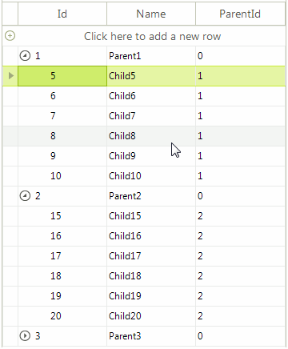

# Rows Reordering in Self-reference Hierarchy

Consider the case you have a bound **RadGridView** with self-reference hierarchical data. This help article demonstrates how to utilize the [RadGridViewDragDropService]() and implement rows reordering. 

>caption Figure 1: Rows reordering in self-reference hierarchy

1\. Populate **RadGridView** with self-reference hierarchical data:

<snippet id='gridview-rowsreorderinselfreference-filldata-cs' />
<snippet id='gridview-rowsreorderinselfreference-filldata-vb' />

2\. Register a custom [GridHierarchyRowBehavior]()	which starts the [RadGridViewDragDropService]() when you click with the left mouse button: 

#### Register the custom row behavior

<snippet id='gridview-rowsreorderinselfreference-registerrowbehavior-cs' />
<snippet id='gridview-rowsreorderinselfreference-registerrowbehavior-vb' />

Override the **OnMouseDownLeft** method of the **GridHierarchyRowBehavior** and start the service: 

<snippet id='gridview-rowsreorderinselfreference-startservice-cs' />
<snippet id='gridview-rowsreorderinselfreference-startservice-vb' />

3\. Handle the RadDragDropService.**PreviewDragStart** event in order to indicate that **RadGridView** can start the drag operation. In the RadDragDropService.**PreviewDragOver** event you can control on what targets the row being dragged can be dropped on. In the **PreviewDragDrop** event you can perform the actual reordering of the data bound records. Note that it is important to update the **ParentId** field of the affected record. Thus, you will indicate the new parent record to which the dragged record belongs.

<snippet id='gridview-rowsreorderinselfreference-dodragdrop-cs' />
<snippet id='gridview-rowsreorderinselfreference-dodragdrop-vb' />

# See Also
* [RadGridViewDragDropService]()	
* [RadDragDropService]()	
* [Rows >> Drag and Drop]()	
* [How to reorder rows in bound RadGridView]()
