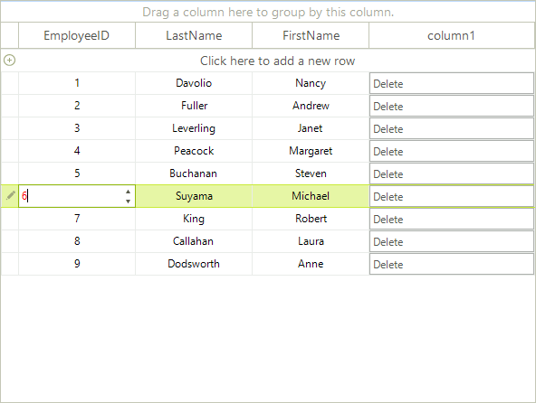

# Customizing editor behavior

The look and behavior of grid editors can be changed programmatically. This can be done either in __CellBeginEdit__ or in __CellEditorInitialized__ events. 

* __CellBeginEdit:__ Fired when the editor is created.

* __CellEditorInitialized:__ Fired when the editor is created and initialized with a predefined set of properties.

The following sample demonstrates how to change the default ForeColor of __GridSpinEditor__:

<snippet id='gridview-customizingeditorbehavior-customizingeditors-cs' />
<snippet id='gridview-customizingeditorbehavior-customizingeditors-vb' />

>caption Figure 1: Accessing the editor element.

## See Also
* [API]()

* [Data validation]()

* [Overview]()

* [Events]()

* [Handling Editors' events]()

* [Using custom editors]()

