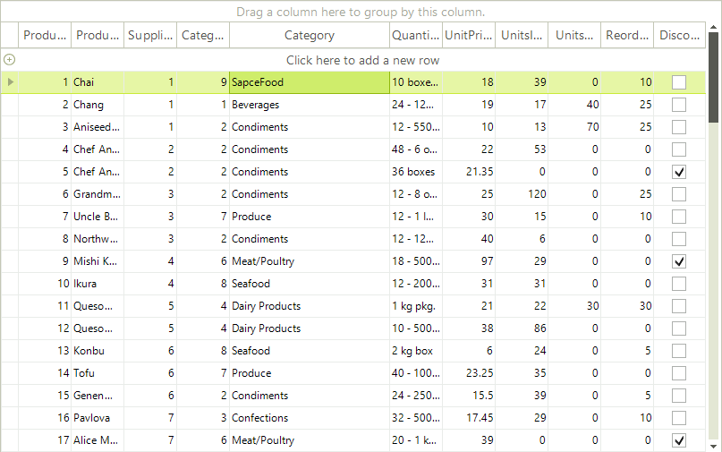

# Allow end-users to add items to DropDownListEditor

The purpose of this article is to demonstrate how you can implement a scenario in which the end-users are able not only to choose from a predefined list of values represented by `RadDropDownListEditor`, but to add their own values to that list.
      

In order to achieve this goal, you need to add the value typed by the end-user to the datasource of the GridViewComboBoxColumn. This will allow the end-user to use the typed value in his/her further operations with the RadComboBoxEditor of the GridViewComboBoxColumn.
      

## Implementing a custom RadDropDownListEditor

For the purposes for the example, we will build our custom RadComboBoxEditor in the context of a sample scenario where RadGridView is bound to the Products table of the popular Northwind database and where we have a GridViewComboBoxColumn bound to the Categories table of the same database.
        

Let's assume that:

* The name of the form on which the RadGridView instance lies is AllowEndUsersAddItemsComboBoxEditor.

* The appropriate instances of the `DataSet`, `BindingSources` and `TableAdapters` are created.

* RadGridView is bound to the binding source of the `Products` table.

* The __AutoIncrementStep__ of the __CategoryID__ field in the Category table is set to 1.

1\. First, we need to create a __GridViewComboBoxColumn__ that will later display our custom editor. This column should be bound to the binding source of the __Categories__ table. For additional information about __GridViewComboBoxColumn__ and its specifics, you can read [this article](). The following snippet shows how you can add the column:

<snippet id='gridview-allowend-usersadditemscomboboxeditor-combocolumn-cs' />
<snippet id='gridview-allowend-usersadditemscomboboxeditor-combocolumn-vb' />

2\. Since we will need to get the instances of the DataSet and the TableAdapters of the Category table outside the context of the main form, let's expose two properties in the body of the form:

<snippet id='gridview-allowend-usersadditemscomboboxeditor-properties-cs' />
<snippet id='gridview-allowend-usersadditemscomboboxeditor-properties-vb' />

3\. Now it is time to create our custom editor. For the purposes of our goal, we need to create a class that derives from __RadDropDownListEditor__ and override the __EndEdit__ method.

4\. In the __EndEdit__ method, we first need to check whether the value typed by the user exists or not in the datasource of the GridViewComboBoxColumn. If it exists, we should terminate the execution of the EndEdit method:

<snippet id='gridview-customdropdowneditor-checkvalue-cs' />
<snippet id='gridview-customdropdowneditor-checkvalue-vb' />

5\. If the typed value is not found in the datasource, we continue with the execution of our code in the EndEdit method. Since the typed value does not exist, we should add it to the data source. Here you can add it to the database as well:

<snippet id='gridview-customdropdowneditor-addvalue-cs' />
<snippet id='gridview-customdropdowneditor-addvalue-vb' />

6\. The Tag value saved in the previous code snippet is used in the CellEndEdit event handler of RadGridView. It helps us to set the ID of the newly created record to the cell that the end-user has just edited. As a consequence, the correct string value is displayed in the cell of RadGridView.

<snippet id='gridview-allowend-usersadditemscomboboxeditor-cellendedit-cs' />
<snippet id='gridview-allowend-usersadditemscomboboxeditor-cellendedit-vb' />

7\. Finally, we need to attach the custom editor to RadGridView. This is done in the EditorRequired event handler. Let's assume that the class of our custom editor is called CustomDropDownEditor:

<snippet id='gridview-allowend-usersadditemscomboboxeditor-editorrequired-cs' />
<snippet id='gridview-allowend-usersadditemscomboboxeditor-editorrequired-vb' />

## End-user experience

So, how should this implementation work? Let's say that we have a list of categories available at each product in RadGridView. However, we decide that this list does not cover the range of products, so we have to add the category 'SpaceFood'. We should just start editing the appropriate cell in the GridViewComboBoxColumn and type 'SpaceFood'. Then we can press Enter or we have press Tab to go to the next cell and the 'SpaceFood' value will be added. As you can see in the screenshot below, the record 'SpaceFood' receives a new CategoryID 9, which is saved in the appropriate RadGridView cell under the CategoryID column:

A complete solution which demonstrate the approach in this article is available in our [SDK repository](https://docs.telerik.com/devtools/winforms/controls/gridview/rows/how-to/autosize-entire-row).

# See Also
* [Change the Active Editor Depending on the Cell Value Type.]()

* [User-Defined Values in RadMultiColumnComboBox]()	

