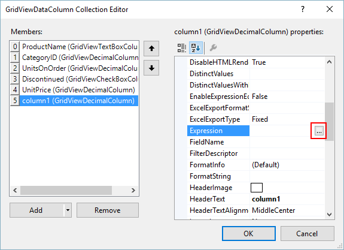

# Design-time

At design time you can open __RadExpressionEditor__ by clicking the ellipsis button of the columns' __Expression__ property:

>note At design time the "Result Preview" functionality is not working, because there is no real data to evaluate. In addition, the expression is checked for validity. However, it cannot be verified according to actual data and value types. Because of this, it is possible to save an invalid expression at design time. If an invalid expression is created, an exception message will be shown when the project is executed.
>

## See Also
* [Customizing RadExpressionEditor]()

* [End-user Support]()

* [Overview]()

* [Localization]()

