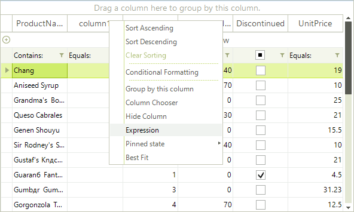

# End-user Support

End-users have two options for getting the __RadExpressionEditor__ shown at run time:

## Showing RadExpressionEditor from RadGridView User Interface

End-users can open the editor by navigating to a built-in menu item from the context menu of RadGridView. To enable this menu item, set the `EnableExpressionEditor` property to `true`. The expression column must be an unbound column.



{{source=..\SamplesCS\GridView\ExpressionEditor\CustomFunctions.cs region=enableExpressionEditor}} 
{{source=..\SamplesVB\GridView\ExpressionEditor\CustomFunctions.vb region=enableExpressionEditor}} 

````C#
GridViewTextBoxColumn col = new GridViewTextBoxColumn();
col.Name = "expression";
col.HeaderText = "My Expression";
col.Width = 150;
col.EnableExpressionEditor = true;
this.radGridView1.Columns.Add(col);

````
````VB.NET
Dim col As GridViewTextBoxColumn = New GridViewTextBoxColumn()
col.Name = "expression"
col.HeaderText = "My Expression"
col.Width = 150
col.EnableExpressionEditor = True
Me.RadGridView1.Columns.Add(col)

````

{{endregion}} 

## Showing RadExpressionEditor on a custom user action

You can show `RadExpressionEditor` on a custom user action, for example a button click, without using the standard RadGridView UI. Call the static `Show` method:

{{source=..\SamplesCS\GridView\ExpressionEditor\CustomFunctions.cs region=expressionFormShow}} 
{{source=..\SamplesVB\GridView\ExpressionEditor\CustomFunctions.vb region=expressionFormShow}} 

````C#
RadExpressionEditorForm.Show(this.radGridView1, this.radGridView1.Columns["expression"]);

````
````VB.NET
RadExpressionEditorForm.Show(Me.RadGridView1, Me.RadGridView1.Columns("expression"))

````

{{endregion}} 


## See Also

* [Functions Reference]()

* [Expression Syntax and Operators]()

* [Customizing RadExpressionEditor]()

* [Design-time]()

* [Overview]()

* [Localization]()

