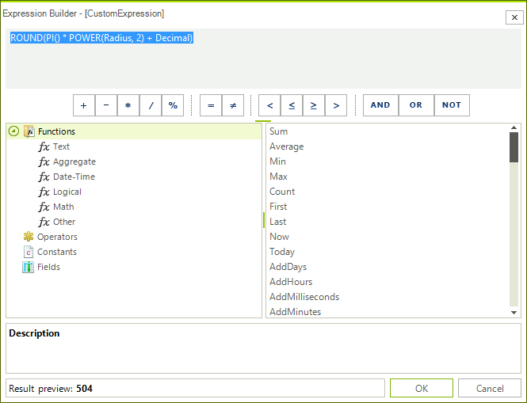
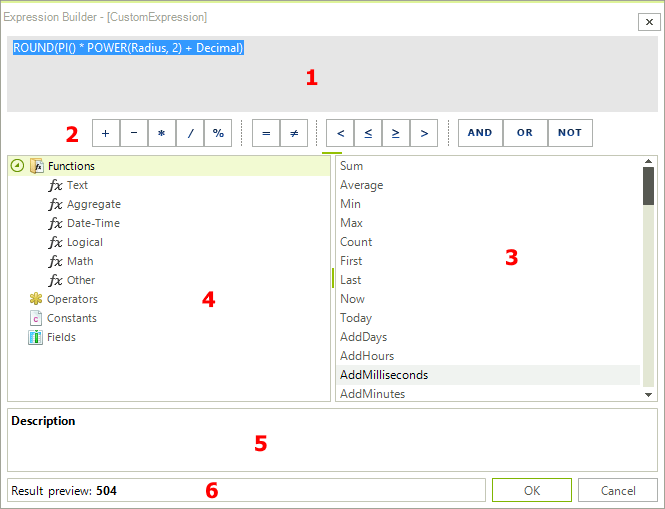

# Expression Editor

`RadExpressionEditor` is a powerful editor that allows you to build complex expressions using a simple Domain Specific Language, reminiscent of formulas in many popular spreadsheet applications. It provides access to a set of predefined functions, operators, and constants. You can also access all RadGridView fields.

Expressions consist of functions, operators, constants, and identifiers such as the names of fields and columns. The Expression Builder enables you to look up and insert these components, and enter expressions more quickly and accurately. You can start the expression editor from the context menu of a column, or initialize and show it from code. `RadExpressionEditor` can also be used at design time.

Once shown, `RadExpressionEditor` automatically loads all available functions, operators, and current grid fields (columns). Every entered expression is parsed and evaluated. A preview of the result is shown for the current row, and the confirmation button is enabled only if the expression is valid.

> The result preview is available only when at least one row exists at run time.

## Anatomy of RadExpressionEditor

1. __Expression Box:__ Type your expression here, or add expression elements by double-clicking or dragging items in the element lists below;

1. __Common Expression Operators:__ Use buttons as shortcuts to add the required operator;

1. __Expression Elements Tree:__ Navigate through the available categories of expression elements;

1. __Expression Values List:__ Scroll through the available expression functions, operators, constants or fields. Double-Click or drag-and-drop to add a chosen value into the expression box;

1. __Help and information about the selected expression value:__ If available, here you will see the description and the syntax of the chosen expression value;

1. __Result Preview:__ A preview of the calculated result of the entered expression will be shown. The preview is evaluated as you type, and is shown only if there is a valid expression. The result is calculated for the current row in the DataView.
            
## See Also

* [Functions Reference]()

* [Expression Syntax and Operators]()

* [Customizing RadExpressionEditor]()

* [Design-time]()

* [End-user Support]()

* [Localization]()

