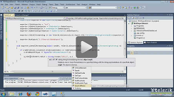

# Export to CSV

| RELATED VIDEOS |  |
| ------ | ------ |
|[Exporting to CSV with RadGridView for WinForms](http://tv.telerik.com/watch/winforms/exporting-to-csv-with-radgridview-for-winforms) In this video, you will learn how to export RadGridView for WinForms to the CSV file format.||

## Overview

This method offers excellent export performance. It creates a csv file and supports formatting events to allow customizing exported data.

>note The CSV export functionality is located in the __TelerikData.dll__ assembly. You need to include the following namespaces in order to access the types contained in TelerikData:
* Telerik.WinControls.Data
* Telerik.WinControls.UI.Export>
>

## Exporting Data

__Initialize ExportToCSV object__

Before running export to CSV, you have to initialize the ExportToCSV class. The constructor takes one parameter: the RadGridView that will be exported:

####  ExportToCSV initialization

<snippet id='gridview-exporttocsv1-exporttocsvinitialization-cs' />
<snippet id='gridview-exporttocsv1-exporttocsvinitialization-vb' />

### File Extension

This property allows for changing the default (*.csv) file extension of the exported result file:

####  Setting the file extension

<snippet id='gridview-exporttocsv1-settingthefileextention-cs' />
<snippet id='gridview-exporttocsv1-settingthefileextention-vb' />

### Hidden Columns and Rows Option

You can choose if the hidden columns and rows should be exported through __HiddenColumnOption__ and __HiddenRowOption__ properties. Please, note that these properties use the standard enums and include the *ExportAsHidden *option, which is not supported by CSV format. Setting that option will not affect the export at all.

* ExportAlways

* DoNotExport  (default)

* ExportAsHidden (not supported in csv)

### Summaries export option

You can use __SummariesExportOption__ property to specify how to export summary items. There are four options to choose from:

* ExportAll (default)

* ExportOnlyTop

* ExportOnlyBottom

* DoNotExport

####  Setting summaries to export

<snippet id='gridview-exporttocsv1-settingsummariestoexport-cs' />
<snippet id='gridview-exporttocsv1-settingsummariestoexport-vb' />

## RunExport method

Exporting data to CSV file is done through the RunExport method of the `ExportToCSV` object. The __RunExport__ method accepts the following parameter:

* fileName: the name of the exported file

####  Export to CVS format

<snippet id='gridview-exporttocsv1-exporttocsvformat-cs' />
<snippet id='gridview-exporttocsv1-exporttocsvformat-vb' />

## Events

__CSVCellFormating event__

It gives access to a single cell’s element that allows you to replace the actual value for every cell related to the exported RadGridView:

#### Handling the CSVCellFormatting event

<snippet id='gridview-exporttocsv1-handlingthecsvcellformattingevent-cs' />
<snippet id='gridview-exporttocsv1-handlingthecsvcellformattingevent-vb' />

__CSVTableCreated event__:

It can be used together with the public method __AddCustomCSVRow__. It allows for adding and formatting new custom rows on the top of the csv file :

#### Handling the CSVTableCreated event

<snippet id='gridview-exporttocsv1-handlingthecsvtablecreatedevent-cs' />
<snippet id='gridview-exporttocsv1-handlingthecsvtablecreatedevent-vb' />

## See Also
* [Export Data in a Group to Excel]()

* [Export to Excel via ExcelML Format]()

* [Export to PDF]()

* [Export to HTML]()

* [Overview]()

* [Export to Excel]()

* [Troubleshooting]()

