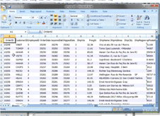

# Export to Excel via ExcelML Format

This method offers excellent performance and does not require MS Office installation on user machines. The __ExcelML__ format can be read by MS Excel 2002 (MS Office XP) and above. Direct export to the xlsx format is possible by utilizing our __RadSpreadProcessing__ libraries (see [Spread Export]() and Async Spread Export articles for detailed information and examples).

>note The export functionality is located in the __TelerikData.dll__ assembly. You need to include the following namespaces in order to access the types contained in TelerikData:
* Telerik.WinControls.Data
* Telerik.WinControls.UI.Export
>

## Exporting Data

### Initialize ExportToExcelML object

Before running export to **ExcelML**, you have to initialize the `ExportToExcelML` class. The constructor takes one parameter, the **RadGridView** that will be exported:

####  ExportToExcelIML initialization

<snippet id='gridview-exporttoexcelviaexcelimlformat-exporttoexcelmlinitialization-cs' />
<snippet id='gridview-exporttoexcelviaexcelimlformat-exporttoexcelmlinitialization-vb' />

__Hidden columns and rows option__

You can choose one of the three options below which will allow you to have different behavior for the hidden column/rows. You can choose these options by __HiddenColumnOption__ and __HiddenRowOption__ properties:

* ExportAlways

* DoNotExport

* ExportAsHidden (default)

MS Excel does not support other ways of hiding a column different from setting its width to zero. To avoid including hidden columns or rows in the exported excel file you could set __HiddenColumnOption__ or __HiddenRowOption__  property to *DoNotExport*:

####  Setting the hidden column option

<snippet id='gridview-exporttoexcelviaexcelimlformat-settingthehiddencolumnoption-cs' />
<snippet id='gridview-exporttoexcelviaexcelimlformat-settingthehiddencolumnoption-vb' />

__Exporting Visual Settings__

Using the **ExcelML** method allows you to export the visual settings (themes) to the Excel file. **ExcelML** has also a visual representation of the alternating row color. This feature works only if the __EnableAlternatingRow__ property is set to *true*. Note that it does not transfer the alternating row settings that come from control theme. **RadGridView** will also export all conditional formatting to the Excel file. The row height is exported with the default DPI transformation (60pixels = 72points).

You can enable exporting visual settings through the **ExportVisualSettings** property. By default, the value of this property is *false*.

#### Setting ExportVisualSettings

<snippet id='gridview-exporttoexcelviaexcelimlformat-exportvisualsettings-cs' />
<snippet id='gridview-exporttoexcelviaexcelimlformat-exportvisualsettings-vb' />

__MS Excel Max Rows Settings__

**RadGridView** splits data on separate sheets if the number of rows is greater than Excel maximum. You can control the maximum number of rows through the **SheetMaxRows** property:

* 1048576 (Max rows for Excel 2007)

* 65536 (Max rows for previous versions of Excel) (default)
 
#### Setting Maximum Number of Rows

<snippet id='gridview-exporttoexcelviaexcelimlformat-settingmaximumnumberofrows-cs' />
<snippet id='gridview-exporttoexcelviaexcelimlformat-settingmaximumnumberofrows-vb' />

__MS Excel Sheet Name__ 

You can specify the sheet name through __SheetName__ property. If your data is large enough to be split in more than one sheets, then the export method adds index to the names of the next sheets.

#### Setting the SheetName

<snippet id='gridview-exporttoexcelviaexcelimlformat-settingthesheetname-cs' />
<snippet id='gridview-exporttoexcelviaexcelimlformat-settingthesheetname-vb' />

__Summaries export option__

You can use the __SummariesExportOption__ property to specify how to export summary items. There are four option to chose:

* ExportAll (default)

* ExportOnlyTop

* ExportOnlyBottom

* DoNotExport

#### Setting SummariesExportOption

<snippet id='gridview-exporttoexcelviaexcelimlformat-settingsumariesexportoption-cs' />
<snippet id='gridview-exporttoexcelviaexcelimlformat-settingsumariesexportoption-vb' />

## RunExport method

Exporting data to Excel is done through the __RunExport__ method of __ExportToExcelML__ object. The **RunExport** method accepts the following parameter:

* __fileName__ - the name of the exported file

Consider the code sample below:

#### Export to Excel in ExcelML format

<snippet id='gridview-exporttoexcelviaexcelimlformat-runexport-cs' />
<snippet id='gridview-exporttoexcelviaexcelimlformat-runexport-vb' />

## Format Codes

There are two properties in **GridViewDataColumn** object: **ExcelExportType** and **ExcelExportFormatString**. You can use them to specify the format of the exported column in the result excel file. To get the desired formatting in Excel, the **ExcelExportFormatString** should be set to a valid Excel format code. A list of all format codes for Excel is available on the following link – [Microsoft Office Excel Format Codes](https://support.office.com/en-US/Article/Number-format-codes-5026bbd6-04bc-48cd-bf33-80f18b4eae68)

Here is an example for a date time formatting:

#### Fomatting dates

<snippet id='gridview-exporttoexcelviaexcelimlformat-formattingcodes-cs' />
<snippet id='gridview-exporttoexcelviaexcelimlformat-formattingcodes-vb' />

## Events

The __ExcelCellFormating__ event:
        
It gives you access to a single cell’s  __SingleStyleElement__ that allows you to make additional formatting (adding border, setting alignment, text font, colors, changing cell value, etc.) for every excel cell related to the exported **RadGridView**:

#### Handling the ExcelCellFormatting event

<snippet id='gridview-exporttoexcelviaexcelimlformat-excelcellformatting-cs' />
<snippet id='gridview-exporttoexcelviaexcelimlformat-excelcellformatting-vb' />

The __ExcelTableCreated event:__

It can be used together with the public method __AddCustomExcelRow__. It allows adding and formatting new custom rows on the top of the every sheet (it could be specified as a header in the excel sheet):

#### Handling the ExcelTableCreated event

<snippet id='gridview-exporttoexcelviaexcelimlformat-exceltablecreated-cs' />
<snippet id='gridview-exporttoexcelviaexcelimlformat-exceltablecreated-vb' />

## 

| RELATED VIDEOS |  |
| ------ | ------ |
|[Export to Excel with RadGridView for WinForms](http://www.telerik.com/videos/winforms/export-to-excel-with-radgridview-for-winforms) In this RadTip, John Kellar demonstrates how you can export data stored in a RadGridView for Windows Forms to Excel using the ExcelML export options. (Runtime: 08:52)||

## See Also
* [Export Data in a Group to Excel]()

* [Export to CSV]()

* [Export to PDF]()

* [Export to HTML]()

* [Overview]()

* [Export to Excel]()

* [Troubleshooting]()

