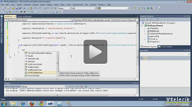

# Export to HTML

| RELATED VIDEOS |  |
| ------ | ------ |
|[Exporting to HTML with RadGridView for WinForms](http://tv.telerik.com/watch/winforms/exporting-to-html-with-radgridview-for-winforms) In this video, you will learn how to export RadGridView to the HTML file format.||

## Overview

This method offers excellent export performance and creates an HTML formatted file, which can be opened in a browser or MS Word.

>note The HTML export functionality is located in the __TelerikData.dll__ assembly. You need to include the following namespaces in order to access the types contained in TelerikData:
* Telerik.WinControls.Data
* Telerik.WinControls.UI.Export
>

## Exporting Data

### Initialize ExportToHTML object 

Before running export to HTML, you have to initialize the __ExportToHTML__ class. The constructor takes one parameter: the __RadGridView__ that will be exported:

#### ExportToHTML initialization

<snippet id='gridview-exporttohtml1-exporttohtmlinitialization-cs' />
<snippet id='gridview-exporttohtml1-exporttohtmlinitialization-vb' />

### File extension 

This property allows for changing the default (*.htm) file extension of the exported result file

#### Setting the file extension

<snippet id='gridview-exporttohtml1-settingthefileextention-cs' />
<snippet id='gridview-exporttohtml1-settingthefileextention-vb' />

### Hidden columns and rows option

You can choose one of the three options below which will allow you to have a different behavior for the hidden column/rows. You can choose these options by __HiddenColumnOption__ and __HiddenRowOption__ properties:

* ExportAlways

* DoNotExport (default)

* ExportAsHidden

Please note that some browsers do not support hidden columns and if you open exported file you could see the hidden columns. To make sure that the hidden columns or rows in the exported HTML file will not be included, you should set __HiddenColumnOption__ or __HiddenRowOption__  property to *DoNotExport*:

####  Setting the HiddenColumnOption

<snippet id='gridview-exporttohtml1-settingthehiddencolumnoption-cs' />
<snippet id='gridview-exporttohtml1-settingthehiddencolumnoption-vb' />

#### Columns Width options 

There are three options for the column widths. First option is to have columns with fixed width, dependent on the size of the columns in the actual RadGridView that is being exported. This is the default way the exporter works. Second option is to set a fixed width for all the columns. The columns will then take this width while keeping their aspect ratio. To set a fixed size for all columns use the __FitWidthSize__ option of the exporter.

#### Setting FitWidthSize

<snippet id='gridview-exporttohtml1-settingfixedcolumnswidth-cs' />
<snippet id='gridview-exporttohtml1-settingfixedcolumnswidth-vb' />

The third option is to set the column widths to be auto calculated depending on the content of the cells in the column. For this option you can use the __AutoSizeColumns__ property.

#### Setting AutoSizeColumns

<snippet id='gridview-exporttohtml1-settingautosizecolumns-cs' />
<snippet id='gridview-exporttohtml1-settingautosizecolumns-vb' />

If you use this option you need to control how the cells are sized. To do that you can use the __CellWhiteSpace__ option of the `HTMLCellElement` which controls how white spaces are handled. The possible values are. 

* Normal (Defalut)

* NoWrap

* Pre

* PreLine

* PreWrap

### Exporting Visual Settings

Using the __ExportToHTML__ class allows you to export the visual settings (themes) to the HTML file. ExportToHTML also provides a visual representation of the alternating row color. This feature works only if __EnableAlternatingRow__ property is set to *true*. Note that it does not transfer the alternating row settings that come from control theme. RadGridView will also export the conditional formatting to the HTML file. The row height is exported with the default DPI transformation (60pixels = 72points). You can enable exporting visual settings through the __ExportVisualSettings__ property. By default the value of this property is *false*.

####  Setting ExportVisualSettings

<snippet id='gridview-exporttohtml1-settingexportvisualsettings-cs' />
<snippet id='gridview-exporttohtml1-settingexportvisualsettings-vb' />

### HTML Table Caption

You can specify the table caption through __TableCaption__ property.

####  Setting the SheetName

<snippet id='gridview-exporttohtml1-settingthesheetname-cs' />
<snippet id='gridview-exporttohtml1-settingthesheetname-vb' />

### Summaries export option

You can use __SummariesExportOption__ property to specify how to export summary items. There are four options to choose from:

* ExportAll (default)

* ExportOnlyTop

* ExportOnlyBottom

* DoNotExport

#### Setting the SummariesExportOption

<snippet id='gridview-exporttohtml1-settingsummariesexportoptions-cs' />
<snippet id='gridview-exporttohtml1-settingsummariesexportoptions-vb' />

## RunExport method

Exporting data to HTML is done through the __RunExport__ method. This method accepts the following parameter:

* FileName - the name of the exported file.

Consider the code sample below:

#### Export to HTML format

<snippet id='gridview-exporttohtml1-exporttohtmlformat-cs' />
<snippet id='gridview-exporttohtml1-exporttohtmlformat-vb' />

## Events

1\. __HTMLCellFormating:__ It gives access to a single cell’s HTML element that allows you to make additional formatting for every HTML cell related to the exported RadGridView: 

####  Handling the HTMLCellFormatting event

<snippet id='gridview-exporttohtml1-handlinghtmlcellformattingevent-cs' />
<snippet id='gridview-exporttohtml1-handlinghtmlcellformattingevent-vb' />

2\. __HTMLTableCaptionFormatting:__ this event can be used to make an additional formatting on the HTML table caption element. You can access __TableCaptionElement__ through event’s arguments and apply a valid HTML format.

####  Handling the HTMLTableCaptionFormatting event

<snippet id='gridview-exporttohtml1-handlinghtmltablecaptionformattingevent-cs' />
<snippet id='gridview-exporttohtml1-handlinghtmltablecaptionformattingevent-vb' />

# See Also
* [Export Data in a Group to Excel]()

* [Export to CSV]()

* [Export to Excel via ExcelML Format]()

* [Export to PDF]()

* [Overview]()

* [Export to Excel]()

* [Troubleshooting]()

