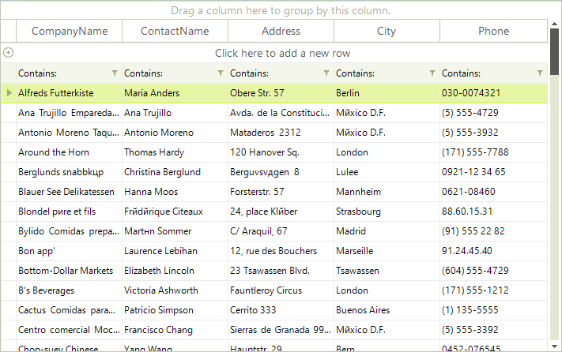
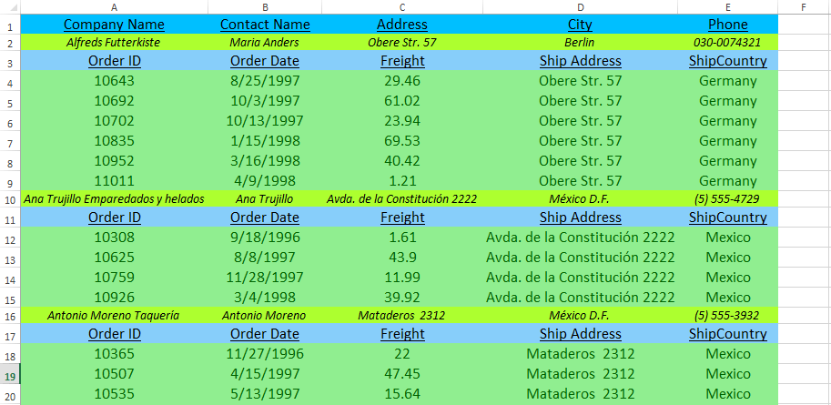
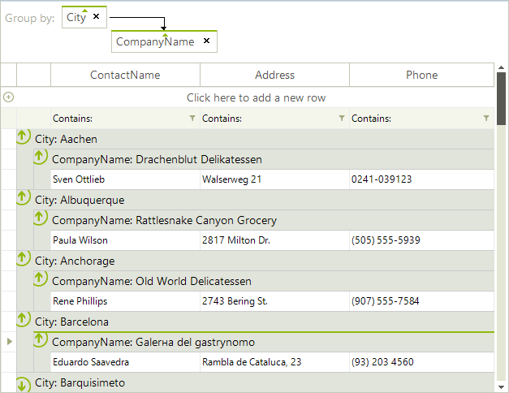
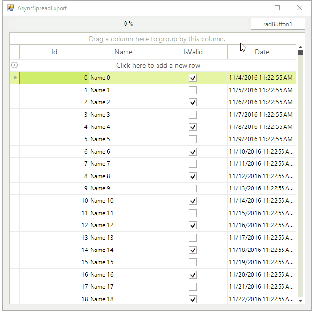

# Spread export 

__GridViewSpreadExport__ utilizes our [RadSpreadProcessing](http://docs.telerik.com/devtools/document-processing/libraries/radspreadprocessing/overview) library to export the content of __RadGridView__ to *xlsx, csv, pdf* and *txt* formats. 

>note As of **R3 2020 SP1** GridViewSpreadExport also supports exporting to *xls*.

This article explains in detail the **SpreadExport** abilities and demonstrates how to use it for:

* [Exporting Data](#exporting)

* [Exporting Grouped Data](#exporting-grouped-data)

* [Async Spread Export](#async-spread-export)

The following images show how a grid looks when you export it:<br>

>note The spread export functionality requires the __TelerikExport.dll__ assembly. To access the types in TelerikExport, you must include the assembly in your project and reference the __Telerik.WinControls.Export__ namespace.

The spread export functionality also requires the [RadSpreadProcessing Library](http://docs.telerik.com/devtools/document-processing/libraries/radspreadprocessing/overview). To use this Library, you must reference the following assemblies:

* TelerikExport

* Telerik.Windows.Documents.Core

* Telerik.Windows.Documents.Fixed

* Telerik.Windows.Documents.Spreadsheet

* Telerik.Windows.Documents.Spreadsheet.FormatProviders.OpenXml

* Telerik.Windows.Documents.Spreadsheet.FormatProviders.Pdf

* Telerik.Windows.Zip

## Exporting

To use the spread export functionality:

1. Create an instance of the __GridViewSpreadExport__ object.

1. Pass the __RadGridView__ instance that you want to export as a parameter.

1. Use the __RunExport__ method to trigger the export process. __RunExport__ accepts a filename as a parameter for the exported file.

{{source=..\SamplesCS\GridView\ExportingData\SpreadExport1.cs region=Export}} 
{{source=..\SamplesVB\GridView\ExportingData\SpreadExport1.vb region=Export}} 

````C#
            
GridViewSpreadExport spreadExporter = new GridViewSpreadExport(this.radGridView1);
SpreadExportRenderer exportRenderer = new SpreadExportRenderer();
spreadExporter.RunExport("D:\\exportedFile.xlsx", exportRenderer);

````
````VB.NET
Dim spreadExporter As GridViewSpreadExport = New GridViewSpreadExport(radGridView1)
Dim exportRenderer As New SpreadExportRenderer()
spreadExporter.RunExport("D:\exportedFile.xlsx", exportRenderer)

````

{{endregion}} 

### Running export synchronously using a stream

The __RunExport__ method has several overloads that allow the user to export using a stream as well:

{{source=..\SamplesCS\GridView\ExportingData\SpreadExport1.cs region=StreamRunExport}} 
{{source=..\SamplesVB\GridView\ExportingData\SpreadExport1.vb region=StreamRunExport}} 

````C#
            
string exportFile = @"..\..\exportedData.xlsx";
using (System.IO.MemoryStream ms = new System.IO.MemoryStream())
{
    Telerik.WinControls.Export.GridViewSpreadExport exporter = new Telerik.WinControls.Export.GridViewSpreadExport(this.radGridView1);
    Telerik.WinControls.Export.SpreadExportRenderer renderer = new Telerik.WinControls.Export.SpreadExportRenderer();
    exporter.RunExport(ms, renderer);
    
    using (System.IO.FileStream fileStream = new System.IO.FileStream(exportFile, FileMode.Create, FileAccess.Write))
    {
        ms.WriteTo(fileStream);
    }
}

````
````VB.NET
Dim exportFile As String = "..\..\exportedData.xlsx"
Using ms As New System.IO.MemoryStream()
    Dim exporter As New Telerik.WinControls.Export.GridViewSpreadExport(Me.radGridView1)
    Dim renderer As New Telerik.WinControls.Export.SpreadExportRenderer()
    exporter.RunExport(ms, renderer)
    
    Using fileStream As New System.IO.FileStream(exportFile, FileMode.Create, FileAccess.Write)
        ms.WriteTo(fileStream)
    End Using
End Using

````

{{endregion}} 

### Image exporting

**GridViewSpreadExport** allows you to export images. Observe the following specifics when you use **GridViewSpreadExport**:

* Image exporting requires __GridViewSpreadExport R1 2018 SP1__ or later.

* The **ImageAlignment** property of the column is respected. 

* ImageLayout.*Tile* is not supported.

>important Image export is not available in the XLS format provider. See the [Xls Features](https://docs.telerik.com/devtools/document-processing/libraries/radspreadprocessing/formats-and-conversion/import-and-export-to-excel-file-formats/xls/features) article for a list of all supported features.
>


>caption Figure: Image Export


## Properties

* __ExportFormat__: Defines the format the grid will be exported to. The available values are __Xslx, Xls, Pdf, Csv, Txt__. The default value of the property is __Xslx__, hence if not other specified, the exporter will export to __Xslx__.

* __ExportVisualSettings:__ Allows you to export the visual settings (themes) to the exported file. **RadGridView** will also export all formatting to the Excel file. The column width and row height will also be matched in the exported file.

* __ExportHierarchy:__ Defines whether the exporter will export hierarchical data or not.

* __ChildViewExportMode:__ Defines which child view of a hierarchy row to be exported. Available modes are:

    - *ExportFirstView*: The exporter exports the first view.
                

    - *ExportCurrentlyActiveView*: The exporter exports the view that is actived in the grid.
                

    - *SelectViewToExport*: In this mode the __ChildViewExporing__ event is fired. The event allows to choose the view to export in row by row basis.

    - *ExportAllViews*: In this mode all child views are exported. Available in GridViewSpreadExport and GridViewPdfExport.   

>caution You can either export all child views or just one. You can't export some specific child views.      

* __HiddenColumnOption:__ Defines whether hidden columns will be exported. Available options are:
    - *ExportAlways*: The exporter will export hidden columns as well.
                
    - *DoNotExport*: The exporter will not export hidden columns.
                
    - *ExportAsHidden*: The exporter will export hidden columns as hidden in excel.

* __HiddenRowOption:__ Defines whether hidden rows will be exported. Available options are:

    - *ExportAlways*: The exporter will export hidden rows as well.
                
    - *DoNotExport*: The exporter will not export hidden rows.
                
    - *ExportAsHidden*: The exporter will export hidden rows as hidden in excel.

    >note MS Excel does not support other ways of hiding a column/row different from setting its width to zero. To avoid including hidden columns or rows in the exported excel file you could set __HiddenColumnOption__ or __HiddenRowOption__ property to *DoNotExport*.
    

* __PagingExportOption:__ Defines which pages to be exported, when paging is used in **RadGridView**.

    - *CurrentPageOnly*: The exporter will export only the data on the current page.

    - *AllPages*: The exporter will export the data from all pages.

* __SummariesExportOption:__ Allows to specify how to export summary items. There are four options to choose:

    - *ExportAll (default)*: The exporter will export all summary rows. This is the default setting.

    - *ExportOnlyTop*: The exporter will export only the top summary rows.

    - *ExportOnlyBottom*: The exporter will export only the bottom summary rows.

    - *DoNotExport*: The exporter will not export any summary rows.

* __RadGridViewToExport:__ This property is used to set the instance of **RadGridView** to export.

* __SheetMaxRows:__ Тhe exporter splits the data on separate sheets if the number of rows is greater than the Excel maximum. You can control the maximum number of rows through this **SheetMaxRows** property. Available options are:

    - *1048576*: Max rows for Excel 2007 and above

    - *65536 (default)*: Max rows for previous versions of Excel. This is the default setting.

* __SheetName:__ Defines the sheet name of the sheet to export to. If your data is large enough to be split on more than one sheets, then the export method adds index to the names of the next sheets.

* __FileExportMode:__ This property determines whether the data will be exported into an existing or a new file. If new is chosen and such exists it will be overridden. Available options are:

    - *NewSheetInExistingFile*: This option will create a new sheet in an already existing file.

    - *CreateOrOverrideFile*: Creates new or overrides an existing file.

__ExportViewDefinition:__  Gets or sets a value indicating whether to export the [view definition.]()

>caution View definition is currently exported only for the master level. It is not supported for child templates in a hierarchical grid.


### Exported Cells Data Type

Each column in **RadGridView** has an __ExcelExportType__ property that you can use to explicitly set the data type of the cells in the exported document. To change the format of the exported data:

1. Set the __ExcelExportType__ property of the specific column to *Custom*.

1. Specify the __ExcelExportFormatString__ property with the desired format.

For more details on specifying the desired format, see [Format Codes](http://docs.telerik.com/devtools/document-processing/libraries/radspreadprocessing/features/format-codes).

## Events

### CellFormatting 

This event is used to format the cells to be exported. The event arguments provide:

* *CellSelection*:  After casting to the __CellSelection__ class, it provides access to the excel cells selection. More information about the abilities this object introduces, can be found here: [Get, Set and Clear Cell Properties](http://docs.telerik.com/devtools/document-processing/libraries/radspreadprocessing/working-with-cells/get-set-clear-properties).

* *CellStyleInfo*: This object is a wrapper of the **CellSelection** object, and allows to easier modification of the most common appearance settings.

* *GridCellInfo*: Provides access to the grid cell to be exported.

* *GridColumnIndex*: Returns the index of the column to be exported.

* *GridRowIndex*: Returns the index of the row to be exported.

* *GridRowInfoType*: Returns the type of the row to be exported.

Here is an example of formatting the exported grid:

{{source=..\SamplesCS\GridView\ExportingData\SpreadExport1.cs region=CellFormatting}} 
{{source=..\SamplesVB\GridView\ExportingData\SpreadExport1.vb region=CellFormatting}} 

````C#
    
void spreadExporter_CellFormatting(object sender, Telerik.WinControls.Export.CellFormattingEventArgs e)
{
    if (e.GridRowInfoType == typeof(GridViewTableHeaderRowInfo))
    {
        e.CellStyleInfo.Underline = true;
        
        if (e.GridCellInfo.RowInfo.HierarchyLevel == 0)
        {
            e.CellStyleInfo.BackColor = Color.DeepSkyBlue;
        }
        else if (e.GridCellInfo.RowInfo.HierarchyLevel == 1)
        {
            e.CellStyleInfo.BackColor = Color.LightSkyBlue;
        }
    }
        
    if (e.GridRowInfoType == typeof(GridViewHierarchyRowInfo))
    {
        if (e.GridCellInfo.RowInfo.HierarchyLevel == 0)
        {
            e.CellStyleInfo.IsItalic = true;
            e.CellStyleInfo.FontSize = 12;
            e.CellStyleInfo.BackColor = Color.GreenYellow;
        }
        else if (e.GridCellInfo.RowInfo.HierarchyLevel == 1)
        {
            e.CellStyleInfo.ForeColor = Color.DarkGreen;
            e.CellStyleInfo.BackColor = Color.LightGreen;
        }
    }
}

````
````VB.NET
Private Sub spreadExporter_CellFormatting(ByVal sender As Object, ByVal e As Telerik.WinControls.Export.CellFormattingEventArgs)
    If e.GridRowInfoType Is GetType(GridViewTableHeaderRowInfo) Then
        e.CellStyleInfo.Underline = True
        If e.GridCellInfo.RowInfo.HierarchyLevel = 0 Then
            e.CellStyleInfo.BackColor = Color.DeepSkyBlue
        ElseIf e.GridCellInfo.RowInfo.HierarchyLevel = 1 Then
            e.CellStyleInfo.BackColor = Color.LightSkyBlue
        End If
    End If
    If e.GridRowInfoType Is GetType(GridViewHierarchyRowInfo) Then
        If e.GridCellInfo.RowInfo.HierarchyLevel = 0 Then
            e.CellStyleInfo.IsItalic = True
            e.CellStyleInfo.FontSize = 12
            e.CellStyleInfo.BackColor = Color.GreenYellow
        ElseIf e.GridCellInfo.RowInfo.HierarchyLevel = 1 Then
            e.CellStyleInfo.ForeColor = Color.DarkGreen
            e.CellStyleInfo.BackColor = Color.LightGreen
        End If
    End If
End Sub

````

{{endregion}} 



### WorkbookCreated 

This event is triggered on the __SpreadExportRenderer__ object when the workbook is ready to be exported. Allows to introduce final customizations (for example you can add [header and footer]()). More information on how to work with Workbook is available here: [Working with Workbooks](http://docs.telerik.com/devtools/document-processing/libraries/radspreadprocessing/working-with-workbooks/create-open-and-save-workbooks).

### ChildViewExporting

This event is used to specify which child view to be exported, for each exported row, during the export. It will be triggered only when the __ChildViewExportMode__ is set to *SelectViewToExport*. The event arguments provide the __ParentRow__ which active view should be set via the __ActiveViewIndex__ property.

### ExportCompleted

This event is triggered when the export operation completes.

## Exporting Grouped Data

__RadGridView__ can export its grouped content by simply setting the __ExportChildRowsGrouped__ property of the __GridViewSpreadExport__ object to *true*.

>caption Figure: Exporting Grouped Data



#### Exporting Grouped Data

{{source=..\SamplesCS\GridView\ExportingData\SpreadExport1.cs region=ExportingGroupedData}} 
{{source=..\SamplesVB\GridView\ExportingData\SpreadExport1.vb region=ExportingGroupedData}} 

````C#
            
GridViewSpreadExport spreadExporter = new GridViewSpreadExport(this.radGridView1);
spreadExporter.ExportChildRowsGrouped = true;
SpreadExportRenderer exportRenderer = new SpreadExportRenderer();
spreadExporter.RunExport(@"..\..\exportedFile.xlsx", exportRenderer);

````
````VB.NET
Dim spreadExporter As New GridViewSpreadExport(Me.radGridView1)
spreadExporter.ExportChildRowsGrouped = True
Dim exportRenderer As New SpreadExportRenderer()
spreadExporter.RunExport("..\..\exportedFile.xlsx", exportRenderer)

````

{{endregion}} 

## Async Spread Export

__RadGridView__ can export its content asynchronously. This feature can be utilized by calling the  __RunExportAsync__ method on the __GridViewSpreadExport__ object.

>important To achieve optimal performance and to decrease the consumed memory, the visual settings and view definitions in __RadGridView__ are not exported when the operation is run asynchronously.
>

## Methods

The following methods of the __GridViewSpreadExport__ class are responsible for exporting the data:

* __RunExportAsync__: Starts an export operation which runs in a background thread.

* __CancelExportAsync__: Cancels an export operation.

## Events

The following events provide information about the state of the export operation:

* __AsyncExportProgressChanged__: Occurs when the progress of an asynchronous export operation changes.

* __AsyncExportCompleted__: Occurs when an async export operation is completed.

## Exporting Data Asynchronously

This example demonstrates how to combine the async spread export feature with a __RadProgressBar__ control to deliver better user experience.
        
>caption Figure: Exporting Data Asynchronously



1\. Bind __RadGridView__ and define the initial settings.

{{source=..\SamplesCS\GridView\ExportingData\AsyncSpreadExport.cs region=BindAndDefineSettings}} 
{{source=..\SamplesVB\GridView\ExportingData\AsyncSpreadExport.vb region=BindAndDefineSettings}} 

````C#
public AsyncSpreadExport()
{
    InitializeComponent();
    this.BindGrid();
    this.radProgressBar1.Minimum = 0;
    this.radProgressBar1.Maximum = 100;
    this.radProgressBar1.ShowProgressIndicators = true;
    this.radGridView1.AutoSizeColumnsMode = GridViewAutoSizeColumnsMode.Fill;
    this.btnExportAsync.Click += btnExportAsync_Click; 
}
private void BindGrid()
{
    DataTable dataTable = new DataTable();
    dataTable.Columns.Add("Id", typeof(int));
    dataTable.Columns.Add("Name", typeof(string));
    dataTable.Columns.Add("IsValid", typeof(bool));
    dataTable.Columns.Add("Date", typeof(DateTime));
    for (int i = 0; i < 50000; i++)
    {
        dataTable.Rows.Add(i, "Name " + i, i % 2 == 0, DateTime.Now.AddDays(i));
    }
    this.radGridView1.DataSource = dataTable;
}

````
````VB.NET
Public Sub New()
    InitializeComponent()
    Me.BindGrid()
    Me.RadProgressBar1.Minimum = 0
    Me.RadProgressBar1.Maximum = 100
    Me.RadProgressBar1.ShowProgressIndicators = True
    Me.RadGridView1.AutoSizeColumnsMode = GridViewAutoSizeColumnsMode.Fill
    AddHandler Me.BtnExportAsync.Click, AddressOf BtnExportAsync_Click
End Sub
Private Sub BindGrid()
    Dim dataTable As New DataTable()
    dataTable.Columns.Add("Id", GetType(Integer))
    dataTable.Columns.Add("Name", GetType(String))
    dataTable.Columns.Add("IsValid", GetType(Boolean))
    dataTable.Columns.Add("Date", GetType(DateTime))
    For i As Integer = 0 To 49999
        dataTable.Rows.Add(i, "Name " & i, i Mod 2 = 0, DateTime.Now.AddDays(i))
    Next
    Me.RadGridView1.DataSource = dataTable
End Sub

````

{{endregion}} 

2\. Start export and subscribe to the progress notification events.

{{source=..\SamplesCS\GridView\ExportingData\AsyncSpreadExport.cs region=ExportData}} 
{{source=..\SamplesVB\GridView\ExportingData\AsyncSpreadExport.vb region=ExportData}} 

````C#
private void btnExportAsync_Click(object sender, EventArgs e)
{
    GridViewSpreadExport spreadExporter = new GridViewSpreadExport(this.radGridView1);
    spreadExporter.AsyncExportProgressChanged += spreadExporter_AsyncExportProgressChanged;
    spreadExporter.AsyncExportCompleted += spreadExporter_AsyncExportCompleted;
    SpreadExportRenderer exportRenderer = new SpreadExportRenderer();
    spreadExporter.RunExportAsync(@"..\..\exportedFile.xlsx",exportRenderer);
}

````
````VB.NET
Private Sub BtnExportAsync_Click(sender As Object, e As EventArgs)
    Dim spreadExporter As New GridViewSpreadExport(Me.RadGridView1)
    AddHandler spreadExporter.AsyncExportProgressChanged, AddressOf spreadExporter_AsyncExportProgressChanged
    AddHandler spreadExporter.AsyncExportCompleted, AddressOf spreadExporter_AsyncExportCompleted
    Dim exportRenderer As New SpreadExportRenderer()
    spreadExporter.RunExportAsync("..\..\exportedFile.xlsx", exportRenderer)
End Sub

````

{{endregion}}  

3\. Handle the notification events and report progress.

{{source=..\SamplesCS\GridView\ExportingData\AsyncSpreadExport.cs region=ReportProgress}} 
{{source=..\SamplesVB\GridView\ExportingData\AsyncSpreadExport.vb region=ReportProgress}} 

````C#
private void spreadExporter_AsyncExportProgressChanged(object sender, ProgressChangedEventArgs e)
{
    this.radProgressBar1.Value1 = e.ProgressPercentage;
}
private void spreadExporter_AsyncExportCompleted(object sender, AsyncCompletedEventArgs e)
{
    RadMessageBox.Show("Async Spread Export Completed!");
    this.radProgressBar1.Value1 = 0;
}

````
````VB.NET
Private Sub spreadExporter_AsyncExportProgressChanged(sender As Object, e As ProgressChangedEventArgs)
    Me.RadProgressBar1.Value1 = e.ProgressPercentage
End Sub
Private Sub spreadExporter_AsyncExportCompleted(sender As Object, e As AsyncCompletedEventArgs)
    RadMessageBox.Show("Async Spread Export Completed!")
    Me.RadProgressBar1.Value1 = 0
End Sub

````

{{endregion}} 

The __RunExportAsync__ method has several overloads allowing the user to export using a stream as well:

{{source=..\SamplesCS\GridView\ExportingData\SpreadExport1.cs region=StreamRunExportAsync}} 
{{source=..\SamplesVB\GridView\ExportingData\SpreadExport1.vb region=StreamRunExportAsync}} 

````C#
    
private void button1_Click(object sender, EventArgs e)
{
    System.IO.MemoryStream ms = new System.IO.MemoryStream();         
    Telerik.WinControls.Export.GridViewSpreadExport exporter = new Telerik.WinControls.Export.GridViewSpreadExport(this.radGridView1);
    Telerik.WinControls.Export.SpreadExportRenderer renderer = new Telerik.WinControls.Export.SpreadExportRenderer();
    exporter.AsyncExportCompleted += exporter_AsyncExportCompleted;
    exporter.RunExportAsync(ms, renderer);
}
    
private void exporter_AsyncExportCompleted(object sender, AsyncCompletedEventArgs e)
{
    RunWorkerCompletedEventArgs args = e as RunWorkerCompletedEventArgs;
    string exportFile = @"..\..\exportedAsyncData.xlsx";
    using (System.IO.FileStream fileStream = new System.IO.FileStream(exportFile, FileMode.Create, FileAccess.Write))
    { 
        MemoryStream ms = args.Result as MemoryStream;
        ms.WriteTo(fileStream);
        ms.Close();
    }
}

````
````VB.NET
Private Sub button1_Click(sender As Object, e As EventArgs)
    Dim ms As New System.IO.MemoryStream()
    Dim exporter As New Telerik.WinControls.Export.GridViewSpreadExport(Me.radGridView1)
    Dim renderer As New Telerik.WinControls.Export.SpreadExportRenderer()
    AddHandler exporter.AsyncExportCompleted, AddressOf exporter_AsyncExportCompleted
    exporter.RunExportAsync(ms, renderer)
End Sub
Private Sub exporter_AsyncExportCompleted(sender As Object, e As AsyncCompletedEventArgs)
    Dim args As RunWorkerCompletedEventArgs = TryCast(e, RunWorkerCompletedEventArgs)
    Dim exportFile As String = "..\..\exportedAsyncData.xlsx"
    Using fileStream As New System.IO.FileStream(exportFile, FileMode.Create, FileAccess.Write)
        Dim ms As MemoryStream = TryCast(args.Result, MemoryStream)
        ms.WriteTo(fileStream)
        ms.Close()
    End Using
End Sub

````

{{endregion}} 


## See Also
* [Export Data in a Group to Excel]()

* [Export to CSV]()

* [Export to Excel via ExcelML Format]()

* [Export to PDF]()

* [Export to HTML]()

* [Overview]()

* [Troubleshooting]()

