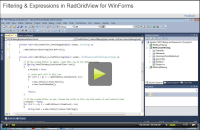
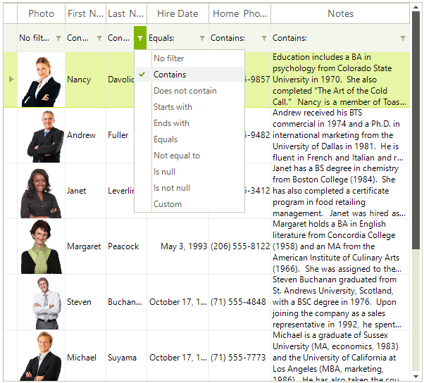

# Basic Filtering

| RELATED VIDEOS |  |
| ------ | ------ |
|[Filtering and Expressions in RadGridView for WinForms](http://www.telerik.com/videos/winforms/filtering-and-expressions-in-radgridview-for-winforms) In this video, you will learn how to enable three different types of filtering on RadGridView for WinForms.||

User filtering in RadGridView is enabled by the __EnableFiltering__ property. By default, filtering is disabled at all levels.

#### Enable filtering

<snippet id='gridview-filtering-enablefiltering-cs' />
<snippet id='gridview-filtering-enablefiltering-vb' />

__GridViewDataColumn__

When filtering is enabled, each __GridViewDataColumn__ column displays a filter box beneath the corresponding header.

**RadGridView filter boxes displayed beneath the column headers**

>note The __AutoFilterDelay__ property gets or sets a value in milliseconds that indicates the delay between the last key press and the filtering operation (available since R1 2019 SP1).

See [End-User capabilities - Filtering]() for more information about how the end-user experiences filtering.

**RadGridView** allows you to prevent the built-in data filtering operation but keep the filtering life cycle as it is, e.g. UI indication, **FilterDescriptors** and events remain. This is controlled by the MasterTemplate.DataView.**BypassFilter** property which default value is *false*. This means that **RadGridView** won't perform the filtering. This may be suitable for cases in which you bound the grid to a DataTable and you want to apply the filter to the DataTable, not to the grid itself. You can find below a sample code snippet:

#### Bypass default filtering

<snippet id='gridview-filtering-bypassfiltering-cs' />
<snippet id='gridview-filtering-bypassfiltering-vb' />

## See Also
* [Customizing composite filter dialog]()

* [Custom Filtering]()

* [Events]()

* [Excel-like filtering]()

* [FilterExpressionChanged Event]()

* [Filtering Row]()

* [Put a filter cell into edit mode programmatically]()

* [Setting Filters Programmatically (composite descriptors)]()

* [How to Filter GridViewCommandColumn in RadGridView]()
