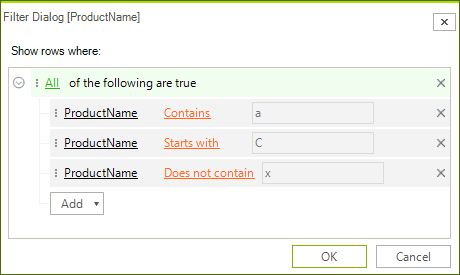

# Customizing composite filter dialog

When you select the *Custom* item from the filter menu (*Available Filter* menu in Excel-like filtering), an appropriate dialog for creating a custom filter is shown. 

>caption Figure 1: Custom filter


Since *R1 2017 SP*, a **CompositeDataFilterForm** is shown. This dialog uses a [RadDataFilter]() allowing the user to compose a complex filter expression.

>caption Figure 2: CompositeDataFilterForm



 In the previous versions a __CompositeFilterForm__ is displayed. The __CreateCompositeFilterDialog__ event is fired before the custom filter dialog is created. It allows you to create the default dialog and customize it or initialize your own implementation of the composite filter dialog.

#### Specify default filter dialog

{{source=..\SamplesCS\GridView\Filtering\Filtering.cs region=DefaultFilterDialog}} 
{{source=..\SamplesVB\GridView\Filtering\Filtering.vb region=DefaultFilterDialog}} 

````C#
Font f = new Font("Arial", 12, FontStyle.Italic);
private void radGridView1_CreateCompositeFilterDialog(object sender, GridViewCreateCompositeFilterDialogEventArgs e)
{
    CompositeFilterForm filterDialog = new CompositeFilterForm();
    filterDialog.Font = f;
    e.Dialog = filterDialog;
}

````
````VB.NET
Private f As New Font("Arial", 12, FontStyle.Italic)
Private Sub radGridView1_CreateCompositeFilterDialog(sender As Object, e As GridViewCreateCompositeFilterDialogEventArgs)
    Dim filterDialog As New CompositeFilterForm()
    filterDialog.Font = f
    e.Dialog = filterDialog
End Sub

````

{{endregion}} 


>caption Figure 3: CompositeFilterForm


## See Also
* [Basic Filtering]()

* [Custom Filtering]()

* [Events]()

* [Excel-like filtering]()

* [FilterExpressionChanged Event]()

* [Filtering Row]()

* [Put a filter cell into edit mode programmatically]()

* [Setting Filters Programmatically (composite descriptors)]()

