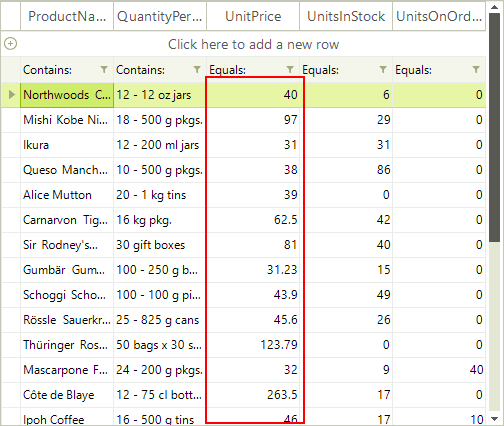
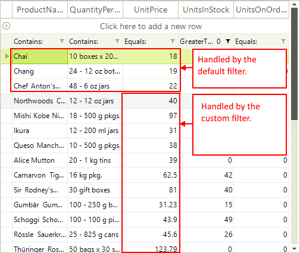

# Custom Filtering

Custom filtering is a flexible mechanism for filtering **RadGridView** rows by using custom logic. It has a higher priority than the applied **FilterDescriptors** (added either by code or using the filtering row).

Custom filtering is applied if user filtering is enabled using __EnableFiltering__ or GridViewTemplate.__EnableFiltering__ properties. By default, filtering is disabled at all levels.

**RadGridView** provides two mechanisms for custom filtering:

* Handling the **CustomFiltering** event.

* Replacing the **RadGridView** filtering mechanism by providing a custom __FilterPredicate__.

## Using the CustomFiltering event

The **CustomFiltering** event is fired when the custom filtering is enabled. It allows you to control whether a row is visible or not when the filtering is handled.

The arguments of the **CustomFiltering** event provide the following properties:        

* __Template__ – the template that holds the rows where filtering is applied

* __Row__ – the row to be filtered

* __Visible__ – defines if the row is visible or hidden from the filtering results

* __Handled__ – defines whether the row is processed by the custom algorithm or by the applied filter descriptors

The following example demonstrates how to hide all **RadGridView** rows that contain a value less than 30 for the `UnitPrice` column. The added __FilterDescriptor__ for the **UnitPrice** column in this example is not considered when defining which rows to hide. All **RadGridView** rows are processed from the custom logic in the __CustomFiltering__ event handler.

<snippet id='gridview-customfiltering-usingcustomfiltering-cs' />
<snippet id='gridview-customfiltering-usingcustomfiltering-vb' />
<snippet id='gridview-customfiltering-usingcustomfiltering1-cs' />
<snippet id='gridview-customfiltering-usingcustomfiltering1-vb' />

The following example demonstrates how you can use the __Handled__ property of the __CustomFiltering__ event arguments. We will hide all rows that have their **UnitPrice** less than "30" and **ProductName** not starting with "Ch". In addition, there is a __FilterDescriptor__  that will hide rows containing values less than "1" in the `UnitsInStock` column.

<snippet id='gridview-customfiltering1-usingcustomfilteringplushandled-cs' />
<snippet id='gridview-customfiltering1-usingcustomfilteringplushandled-vb' />
<snippet id='gridview-customfiltering1-usingcustomfilteringplushandled1-cs' />
<snippet id='gridview-customfiltering1-usingcustomfilteringplushandled1-vb' />

>important In order to determine more easily whether a row is visible or not in the **CustomFiltering** event when the grid is filtered by several columns, you can use the MasterTemplate.DataView.**FilterEvaluate** method. This method accepts a **FilterDescriptor** and a row as parameters and returns a boolean value indicating whether the row will be visible or not according to the passed **FilterDescriptor**. Thus, you can combine the custom logic for a certain column and evaluate the default one for the rest of the column's filters.

## Implementing filtering mechanism using FilterPredicate

You can replace the filtering mechanism in RadGridView with a custom one, by setting the __FilterPredicate__  of the GridViewTemplate.

The following example demonstrates how to use a custom filtering mechanism in RadGridView to hide all RadGridView rows which that have UnitPrice less than 30:

<snippet id='gridview-customfiltering-usingfilterpredicate-cs' />
<snippet id='gridview-customfiltering-usingfilterpredicate-vb' />
<snippet id='gridview-customfiltering-usingfilterpredicate1-cs' />
<snippet id='gridview-customfiltering-usingfilterpredicate1-vb' />

## See Also
* [Basic Filtering]()

* [Customizing composite filter dialog]()

* [Events]()

* [Excel-like filtering]()

* [FilterExpressionChanged Event]()

* [Filtering Row]()

* [Put a filter cell into edit mode programmatically]()

* [Setting Filters Programmatically (composite descriptors)]()

