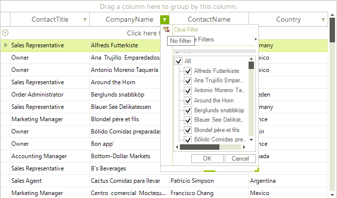
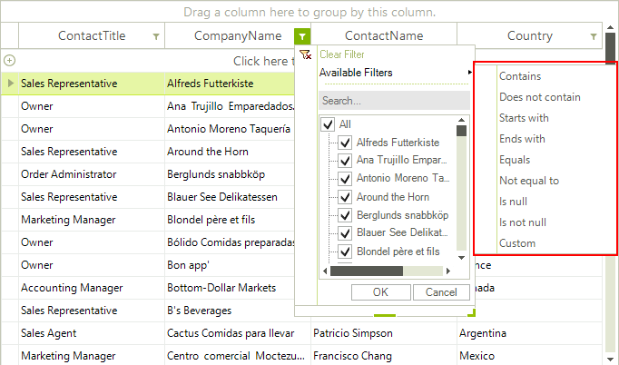
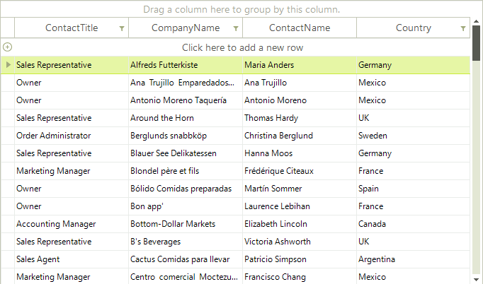
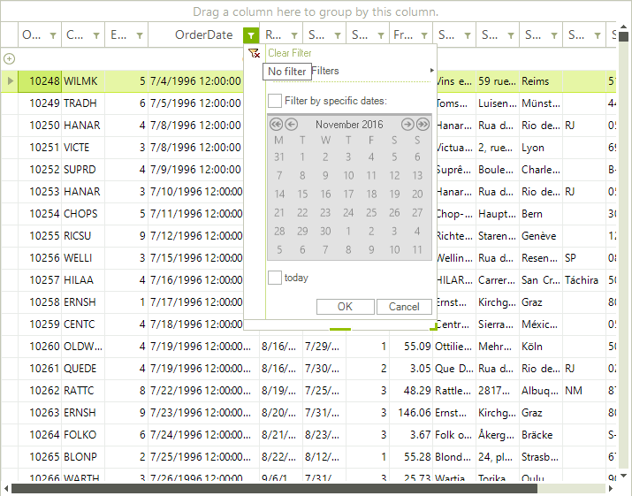
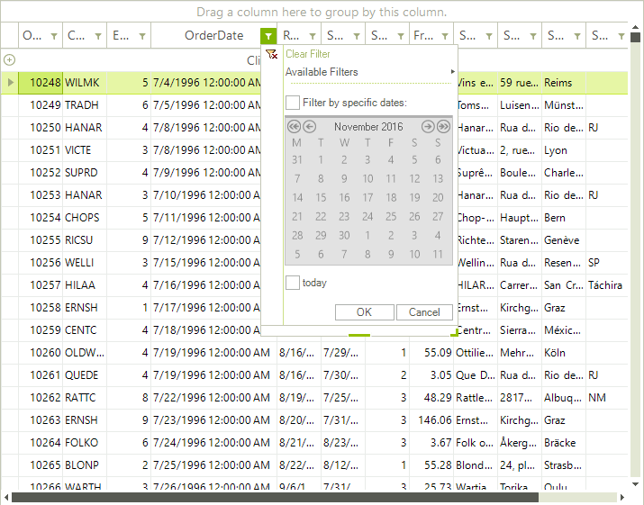
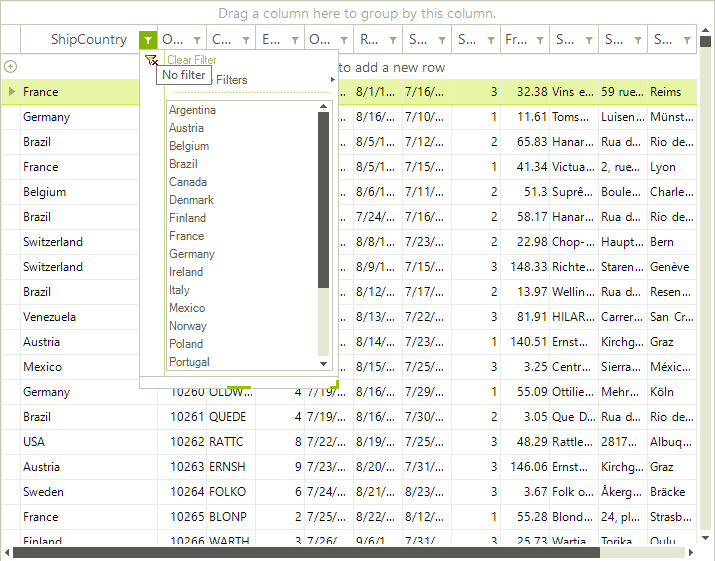
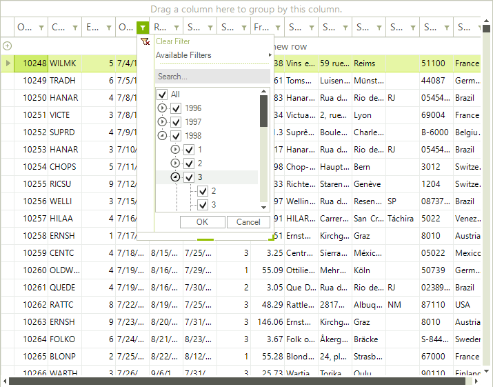

# Excel-like filtering

Excel-Like filtering offers another way for filtering data in RadGridView by the end user. It is built in a way to mimic the standard excel filtering functionality and offers a dialog, which contains a list with distinct column values, from which the end user can chose.

In addition Excel-Like filtering supports the default filters available thorough "Available Filter" menu item and custom filter form.

Enabling the excel-like filtering is quite easy. You have to set the grid's properties __EnableFiltering__ and __ShowHeaderCellButtons__:

#### Enabling Excel-like filtering

<snippet id='gridview-excel-likefiltering-allowfiltering-cs' />
<snippet id='gridview-excel-likefiltering-allowfiltering-vb' />

## Customizing Excel-like filtering popup

The __FilterPopupRequired__ event is thrown just before filter popup showing. It gives access to current filter popup through __FilterPopup__ argument and also allows setting up any custom made popup, which implements __IGridFilterPopup__ interface.

__Calendar filter popup__

This popup allows convenient selection of specific date, or period. It will be shown for DateTime columns automatically  and by default it contains three custom menu items – *Today*, *Yestarday* and *During last 7 days*. A customization of the custom items is possible through following methods: __ClearCustomMenuItems__, __AddCustomMenuItem__ and __RemoveCustomMenuItem__. Here is how the default popup for DateTime column looks like:

The following code demonstrates how to clear the default custom items, and how to add your own item to this popup:

<snippet id='gridview-excel-likefiltering2-calendarfilterpopup-cs' />
<snippet id='gridview-excel-likefiltering2-calendarfilterpopup-vb' />

Here is how the customized popup looks like

### Simple list filter popup

This popup allows easy and fast filtering based on simple list and one-click filter apply. It can be set up through __FilterPopupRequired__ event:

<snippet id='gridview-excel-likefiltering2-simplelistpopup-cs' />
<snippet id='gridview-excel-likefiltering2-simplelistpopup-vb' />

>note As of R1 2021 **RadSimpleListFilterPopup** can filter the time part more precisely. It is possible through GridViewDateTimeColumn.**FilteringTimePrecision** property that allows to specify how the time part of the DateTime value will be evaluated while filtering. The possible values are *Hour*, *Minute*, *Second*, and *All*. **FilteringTimePrecision** property works with **FilteringMode** property of the column set to GridViewTimeFilteringMode.**DateTime** or GridViewTimeFilteringMode.**Time**.
>

### Grouped Dates Popup

This pop allows representation of date values grouped by year and month in a list. This simplifies the process of selecting more than one filtering criteria based on month or year.

>note Note that if there are a lot of values, there will be performance impact of selecting items on higher level (as month and year) because a lot of FilterDescriptors will be applied simultaneously.
>

<snippet id='gridview-excel-likefiltering2-groupeddatespopup-cs' />
<snippet id='gridview-excel-likefiltering2-groupeddatespopup-vb' />

## See Also
* [Basic Filtering]()

* [Customizing composite filter dialog]()

* [Custom Filtering]()

* [Events]()

* [FilterExpressionChanged Event]()

* [Filtering Row]()

* [Put a filter cell into edit mode programmatically]()

* [Setting Filters Programmatically (composite descriptors)]()

