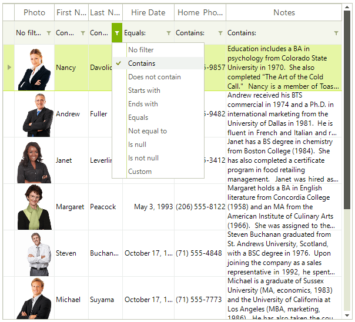

# Filtering Row

Use the WinForms GridView filtering row to let users enter filter values directly in the grid. This article explains when the row appears, how to simplify its UI, and how to keep filtering available when you hide the row.

## How the Filtering Row Works

The filtering row is the `GridFilterRowElement` that hosts the filter editors for each column. It appears automatically when `EnableFiltering` is `true`, and it can be pinned at the top or bottom of the grid or made scrollable with the data rows.

Use the filtering row when users need fast, column-based filtering without opening a separate dialog. If your grid has narrow columns or a custom filtering workflow, you can reduce or hide parts of the row without disabling filtering.

**Default filtering row in a WinForms RadGridView.**

## Hide the Filter Operator Text

Hide the filter operator text when you need more room inside the filter cells but still want users to choose operators from the filter menu. This approach keeps the filtering row visible and works well when the grid contains narrow columns.

<snippet id='gridview-filtering-filteroperatortext-cs' />
<snippet id='gridview-filtering-filteroperatortext-vb' />

**Compact filter cells after the operator text is hidden.**

## Hide the Filtering Row

Hide the entire `GridFilterRowElement` when filtering is driven by another part of the UI, such as toolbar buttons, preset views, or saved criteria. When the row is hidden, users can no longer type filter values directly into the grid, so expose another filtering mechanism if they still need interactive filtering.

<snippet id='gridview-filtering-hidingthefilterrow-cs' />
<snippet id='gridview-filtering-hidingthefilterrow-vb' />

>important
>
> Hiding the `GridFilterRowElement` removes the in-grid filter editors, but it does not disable filtering. You can still apply filters programmatically with [simple filter descriptors]().

## Customize the Filter Menu

The filter operator menu is a context menu. Handle the `ContextMenuOpening` event when you need to add, remove, or reorder filter operators for a column.

Use this approach when you want to limit users to a smaller set of valid operators, align the menu with business rules, or match a custom filtering experience. For implementation details, see [customizing the default GridView context menu]().

## Choose the Right Filtering Experience

Choose an approach based on how users filter data in your application:

* Use the visible filtering row when users need to enter ad hoc filters directly in the grid.
* Hide the operator text when columns are narrow and the operator labels take too much space.
* Hide the filtering row when your application applies filters from code or from a separate filtering UI.

## See Also

* [Basic GridView filtering]()
* [Customize the composite filter dialog]()
* [Create custom filtering logic]()
* [Handle GridView filtering events]()
* [Use Excel-like filtering]()
* [Respond to the FilterExpressionChanged event]()
* [Put a filter cell in edit mode programmatically]()
* [Apply composite filter descriptors programmatically]()

