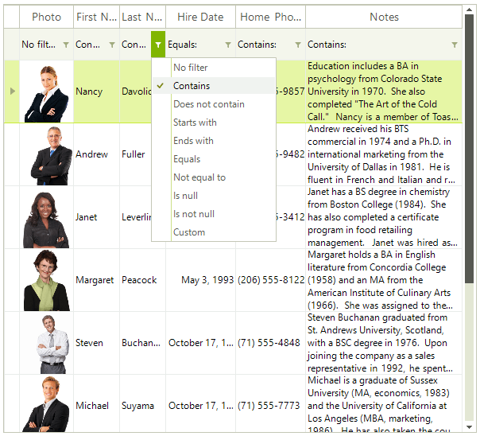
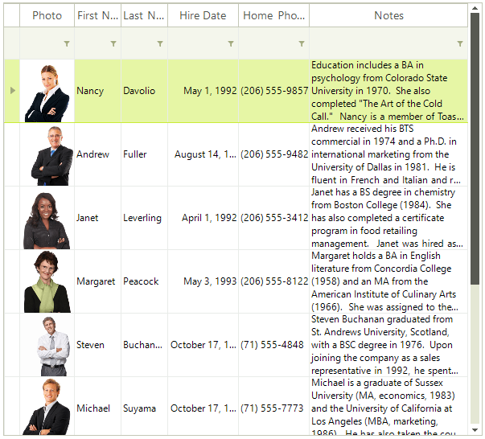

# Filtering Row

The __GridFilterRowElement__ is the row that holds the filtering boxes. It appears automatically when you enable filtering (__EnableFiltering__ is __true__). __GridFilterRowElement__ could be pinned at the top or bottom as well as made scrollable.



You can hide the operator text of the filter cells by setting the __ShowFilterCellOperator__ property to *false*:

## Hide Operator Text

{{source=..\SamplesCS\GridView\Filtering\Filtering.cs region=filterOperatorText}} 
{{source=..\SamplesVB\GridView\Filtering\Filtering.vb region=filterOperatorText}} 

````C#
this.radGridView1.MasterTemplate.ShowFilterCellOperatorText = false;

````
````VB.NET
Me.RadGridView1.MasterTemplate.ShowFilterCellOperatorText = False

````

{{endregion}} 



You can also hide the entire __GridFilterRowElement__: 

## Hide filter row

{{source=..\SamplesCS\GridView\Filtering\Filtering.cs region=hidingTheFilterRow}} 
{{source=..\SamplesVB\GridView\Filtering\Filtering.vb region=hidingTheFilterRow}} 

````C#
this.radGridView1.ShowFilteringRow = false;

````
````VB.NET
Me.RadGridView1.ShowFilteringRow = False

````

{{endregion}} 

You can still add [FilterDescriptors]() programmatically when the __GridFilterRowElement__ is hidden.


## Filter Menu

The menu with the filter operators is actually a context menu. So if you want to modify it you need to use the __ContextMenuOpening__ event. Detailed information is available here: [Modifying the Default Context Menu]()

## See Also

* [Basic Filtering]()

* [Customizing composite filter dialog]()

* [Custom Filtering]()

* [Events]()

* [Excel-like filtering]()

* [FilterExpressionChanged Event]()

* [Put a filter cell into edit mode programmatically]()

* [Setting Filters Programmatically (composite descriptors)]()

