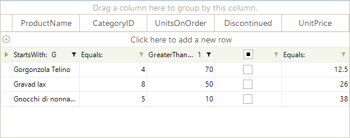
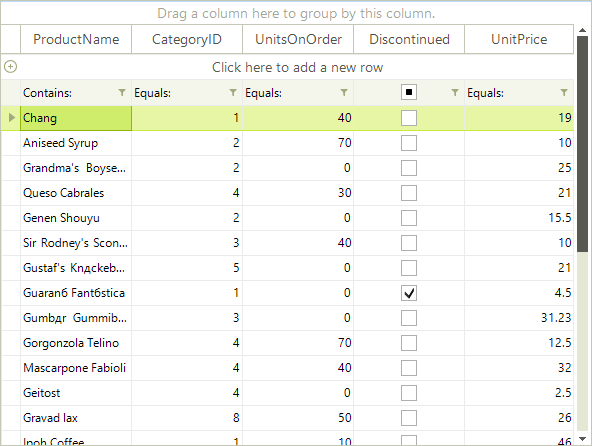

# Setting Filters Programmatically (composite descriptors)

## Using CompositeFilterDescriptor

To filter a single data field by multiple values, you have to use the __CompositeFilterDescriptor__ object. It contains a collection of filter descriptors objects and the logical operator for that filters.

#### Setting composite filter descriptors

<snippet id='gridview-filtering-settingcompositefilterdescriptors-cs' />
<snippet id='gridview-filtering-settingcompositefilterdescriptors-vb' />

The __CompositeFilterDescriptors__ supports *__And__* and *__Or__* logical operators. Result of the above example using *__And__* logical operator:

Result of the above example using *__Or__* logical operator:

## More Complex Composite Filters

The composite filters allow you to create more complex filtering expressions. Such a complex filtering expression might include filters for multiple fields combined with different logical operators, like __(UnitsOnOrder= 0 AND (UnitsInStock> 100 OR ProductName.StartsWith(“G”)))__.

#### Setting complex composite filter descriptors

<snippet id='gridview-filtering-settingcomplexcompositefilterdescriptors-cs' />
<snippet id='gridview-filtering-settingcomplexcompositefilterdescriptors-vb' />

## Setting Filters for Excel-like filtering

The following example shows how you can add descriptors that will be reflected in the [Excel-like]() filter popup.

#### Setting filters for Excel-like filtering

<snippet id='gridview-filtering-excel-cs' />
<snippet id='gridview-filtering-excel-vb' />

## See Also
* [Basic Filtering]()

* [Customizing composite filter dialog]()

* [Custom Filtering]()

* [Events]()

* [Excel-like filtering]()

* [FilterExpressionChanged Event]()

* [Filtering Row]()

* [Put a filter cell into edit mode programmatically]()

