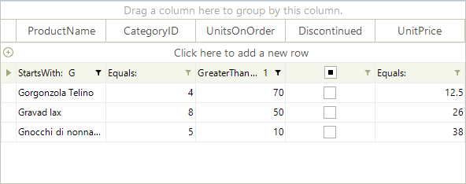
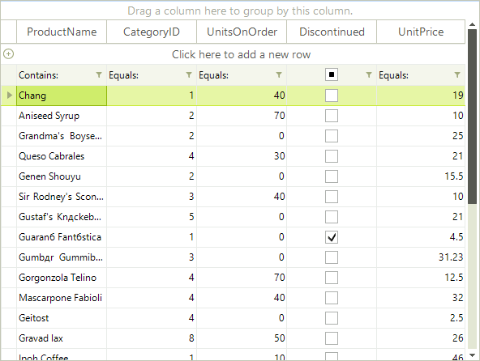

# Setting Filters Programmatically (composite descriptors)

## Using CompositeFilterDescriptor

To filter a single data field by multiple values, you have to use the __CompositeFilterDescriptor__ object. It contains a collection of filter descriptors objects and the logical operator for that filters.

#### Setting composite filter descriptors

{{source=..\SamplesCS\GridView\Filtering\Filtering.cs region=settingCompositeFilterDescriptors}} 
{{source=..\SamplesVB\GridView\Filtering\Filtering.vb region=settingCompositeFilterDescriptors}} 

````C#
CompositeFilterDescriptor compositeFilter = new CompositeFilterDescriptor();
compositeFilter.FilterDescriptors.Add(new FilterDescriptor("UnitsInStock", FilterOperator.IsGreaterThan, 100));
compositeFilter.FilterDescriptors.Add(new FilterDescriptor("ProductName", FilterOperator.StartsWith, "G"));
compositeFilter.LogicalOperator = FilterLogicalOperator.And;
this.radGridView1.FilterDescriptors.Add(compositeFilter);

````
````VB.NET
Dim compositeFilter As New CompositeFilterDescriptor()
compositeFilter.FilterDescriptors.Add(New FilterDescriptor("UnitsInStock", FilterOperator.IsGreaterThan, 100))
compositeFilter.FilterDescriptors.Add(New FilterDescriptor("ProductName", FilterOperator.StartsWith, "G"))
compositeFilter.LogicalOperator = FilterLogicalOperator.[And]
Me.RadGridView1.FilterDescriptors.Add(compositeFilter)

````

{{endregion}} 

The __CompositeFilterDescriptors__ supports *__And__* and *__Or__* logical operators. Result of the above example using *__And__* logical operator:



Result of the above example using *__Or__* logical operator:



## More Complex Composite Filters

The composite filters allow you to create more complex filtering expressions. Such a complex filtering expression might include filters for multiple fields combined with different logical operators, like __(UnitsOnOrder= 0 AND (UnitsInStock> 100 OR ProductName.StartsWith(“G”)))__.

#### Setting complex composite filter descriptors

{{source=..\SamplesCS\GridView\Filtering\Filtering.cs region=settingComplexCompositeFilterDescriptors}} 
{{source=..\SamplesVB\GridView\Filtering\Filtering.vb region=settingComplexCompositeFilterDescriptors}} 

````C#
CompositeFilterDescriptor compositeFilter1 = new CompositeFilterDescriptor();
compositeFilter1.FilterDescriptors.Add(new FilterDescriptor("UnitsInStock", FilterOperator.IsGreaterThan, 100));
compositeFilter1.FilterDescriptors.Add(new FilterDescriptor("ProductName", FilterOperator.StartsWith, "G"));
compositeFilter1.LogicalOperator = FilterLogicalOperator.Or;
FilterDescriptor filter2 = new FilterDescriptor("UnitsOnOrder", FilterOperator.IsEqualTo, 0);
CompositeFilterDescriptor filterDescriptor2 = new CompositeFilterDescriptor();
filterDescriptor2.FilterDescriptors.Add(compositeFilter1);
filterDescriptor2.FilterDescriptors.Add(filter2);
filterDescriptor2.LogicalOperator = FilterLogicalOperator.And;
this.radGridView1.FilterDescriptors.Add(filterDescriptor2);

````
````VB.NET
Dim compositeFilter1 As New CompositeFilterDescriptor()
compositeFilter1.FilterDescriptors.Add(New FilterDescriptor("UnitsInStock", FilterOperator.IsGreaterThan, 100))
compositeFilter1.FilterDescriptors.Add(New FilterDescriptor("ProductName", FilterOperator.StartsWith, "G"))
compositeFilter1.LogicalOperator = FilterLogicalOperator.[Or]
Dim filter2 As New FilterDescriptor("UnitsOnOrder", FilterOperator.IsEqualTo, 0)
Dim filterDescriptor2 As New CompositeFilterDescriptor()
filterDescriptor2.FilterDescriptors.Add(compositeFilter1)
filterDescriptor2.FilterDescriptors.Add(filter2)
filterDescriptor2.LogicalOperator = FilterLogicalOperator.[And]
Me.RadGridView1.FilterDescriptors.Add(filterDescriptor2)

````

{{endregion}} 

## Setting Filters for Excel-like filtering

The following example shows how you can add descriptors that will be reflected in the [Excel-like]() filter popup.

#### Setting filters for Excel-like filtering

{{source=..\SamplesCS\GridView\Filtering\Filtering.cs region=Excel}} 
{{source=..\SamplesVB\GridView\Filtering\Filtering.vb region=Excel}}
````C#
var filterDescriptor = new FilterDescriptor();
filterDescriptor.PropertyName = "Title";
filterDescriptor.Value = "Sales Representative";
filterDescriptor.Operator = FilterOperator.IsNotEqualTo;
var cfd = new CompositeFilterDescriptor();
cfd.LogicalOperator = FilterLogicalOperator.And;
cfd.FilterDescriptors.Add(filterDescriptor);
cfd.IsFilterEditor = true;
this.radGridView1.FilterDescriptors.Add(cfd);
this.radGridView1.MasterTemplate.ExcelFilteredColumns.Add(this.radGridView1.Columns["Title"]);

````
````VB.NET
Dim filterDescriptor As New FilterDescriptor()
filterDescriptor.PropertyName = "Title"
filterDescriptor.Value = "Sales Representative"
filterDescriptor.Operator = FilterOperator.IsNotEqualTo
Dim cfd As New CompositeFilterDescriptor()
cfd.LogicalOperator = FilterLogicalOperator.And
cfd.FilterDescriptors.Add(filterDescriptor)
cfd.IsFilterEditor = True
Me.RadGridView1.FilterDescriptors.Add(cfd)
Me.RadGridView1.MasterTemplate.ExcelFilteredColumns.Add(Me.RadGridView1.Columns("Title"))

```` 


{{endregion}} 

## See Also
* [Basic Filtering]()

* [Customizing composite filter dialog]()

* [Custom Filtering]()

* [Events]()

* [Excel-like filtering]()

* [FilterExpressionChanged Event]()

* [Filtering Row]()

* [Put a filter cell into edit mode programmatically]()

