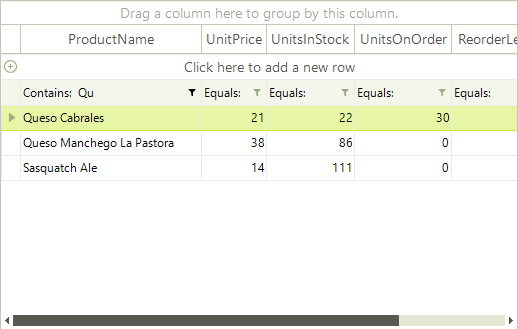
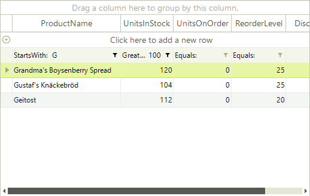

# Setting Filters Programmatically (simple descriptors)

## RadGridView FilterDescriptors

The **RadGridView** control includes __FilterDescriptors__ property of the **GridViewTemplate** which is exposed in the **RadGridView** class. This collection stores filter descriptors used for the filtering operation. The most important classes are:        

* __FilterDescriptor:__ implements filtering property (field) name, filtering operator and value. Used to define simple filtering expressions like __Country = "Germany"__.

* __CompositeFilterDescriptor:__ a collection of multiple filter descriptors with logical operator. Used to define complex filtering expressions like __(Country = "Germany" AND (City = "Berlin" OR City = "Aachen"))__.

>caution Filtering strings not allowed are: " LIKE ", " AND ", " OR ", "\"", ">", "<", "<>", "%", " NULL ", " IS ". Note: the spaces are important (e.g. " LIKE " compared to "LIKE").
>

## Using simple FilterDescriptor:

#### Using simple filter descriptor

<snippet id='gridview-filtering-usingsimplefilterdescriptor-cs' />
<snippet id='gridview-filtering-usingsimplefilterdescriptor-vb' />

### FilterDescriptor Properties

|Property|Description|
|----|----|
|**PropertyName**|Defines the property, which values will be filtered.|
|**Operator**|Allows you to define the type of operator. The possible values are: __IsLike, IsNotLike, IsLessThan, IsLessThanOrEqualTo, IsEqualTo, IsNotEqualTo, IsGreaterThanOrEqualTo, IsGreaterThan, StartsWith, EndsWith, Contains, NotContains, IsNull, IsNotNull, IsContainedIn, IsNotContainedIn.__|
|**Value**|The value your data will be compared against.|
|**Expression**|Gets the filter expression.|
|**IsFilterEditor**|Gets a value indicating whether this instance is default filter descriptor of the column.|

When you add a new descriptor to the collection, the data is automatically filtered according to it.

Each data column (represented by [GridViewDataColumn](http://www.telerik.com/help/winforms/grid_gridviewdatacolumn.html)) has a __FilterDescriptor__  property that can be assigned a __FilterDescriptor__ object:

#### Assigning a filter descriptor object

<snippet id='gridview-filtering-assingingafilterdescriptorobject-cs' />
<snippet id='gridview-filtering-assingingafilterdescriptorobject-vb' />

### Setting Multiple Filters

You can add filters to multiple columns by adding a __FilterDescriptor__ for each one of them: 

#### Setting multiple filters

<snippet id='gridview-filtering-settingmultiplefilters-cs' />
<snippet id='gridview-filtering-settingmultiplefilters-vb' />

## See Also
* [Basic Filtering]()

* [Customizing composite filter dialog]()

* [Custom Filtering]()

* [Events]()

* [Excel-like filtering]()

* [FilterExpressionChanged Event]()

* [Filtering Row]()

* [Put a filter cell into edit mode programmatically]()

