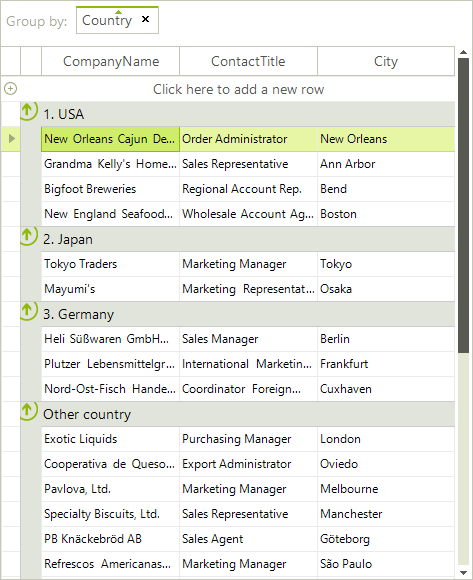
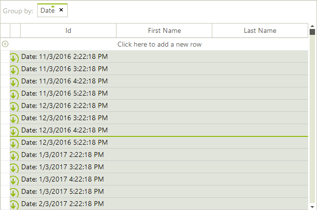
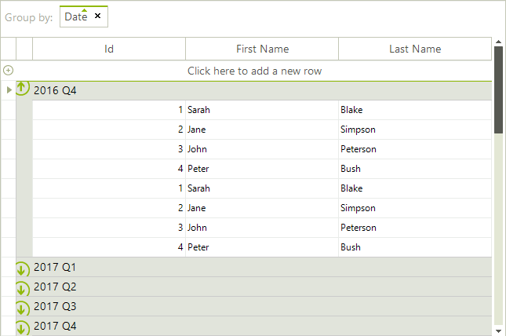
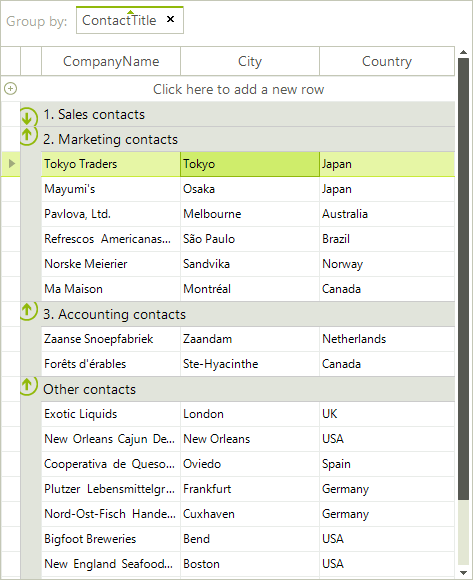

# Custom Grouping

Custom grouping is a flexible mechanism for creating groups by using  custom logic. It has a higher priority than the applied __GroupDescriptors__ (added either by code or by dragging columns to the group panel).

Custom grouping is applied if user grouping is enabled through the __EnableGrouping__ or __GridViewTemplate.EnableGrouping__ properties. By default, grouping is enabled at all levels.

RadGridView provides two mechanisms for custom grouping:

* Handling the __CustomGrouping__ event

* Replacing the RadGridView grouping mechanism by providing a custom __GroupPredicate__

You can use the __GroupSummaryEvaluate__ event to format the group header row text of the created custom groups.

## Using the CustomGrouping event

The __CustomGrouping__ event is fired if custom grouping is enabled through the __EnableCustomGrouping__ or __GridViewTemplate.EnableCustomGrouping__ properties. By default, custom grouping is disabled at all levels.

* __Template:__ The template that holds the rows that will be grouped.

* __Row:__ The row which group is defined.

* __Level:__ The level of the current group, represents zero-based depth of the group.

* __GroupKey:__ Identifier of the group.

* __Handled:__ Defines whether the row is processed by the custom algorithm or by the applied group descriptors.

The following example demonstrates how to handle the __CustomGrouping__ event to group  by the values of the `Country` column creating groups only for predefined countries:

>caption Figure 1 Custom Grouping



<snippet id='gridview-customgrouping-usingcustomgrouping-cs' />
<snippet id='gridview-customgrouping-usingcustomgrouping-vb' />
<snippet id='gridview-customgrouping-usingcustomgrouping1-cs' />
<snippet id='gridview-customgrouping-usingcustomgrouping1-vb' />

When __RadGridView__ is displaying date columns, it is a common requirement to perform grouping by certain part of the DateTime value. The example below will handle a scenario in which the date fields are grouped in year quarters.

>caption Figure: 2 DateTime Grouping Default Behavior



>caption Figure: 3 DateTime Grouping Custom Behavior



<snippet id='gridview-customgroupingdatefields-customgrouping-cs' />
<snippet id='gridview-customgroupingdatefields-customgrouping-vb' />

## Implementing grouping mechanism by using GroupPredicate

You can replace the grouping mechanism in RadGridView with a custom one by setting the __GroupPredicate__ of the __GridViewTemplate__.
        

The following example demonstrates how to use a custom grouping mechanism to group the rows by the values of the `ContactTitle` column, creating groups only for the desired contact title categories:

>caption Figure: 4 Implementing GroupPredicate




````C#

private object PerformGrouping(GridViewRowInfo row, int level)
{
    string title = row.Cells["ContactTitle"].Value.ToString();
    string groupKey;
    if (title.StartsWith("Sales"))
    {
        groupKey = "1. Sales contacts";
    }
    else if (title.StartsWith("Marketing"))
    {
        groupKey = "2. Marketing contacts";
    }
    else if (title.StartsWith("Accounting"))
    {
        groupKey = "3. Accounting contacts";
    }
    else
    {
        groupKey = "Other contacts";
    }
    return groupKey;
}
private void radGridView1_GroupSummaryEvaluate(object sender, GroupSummaryEvaluationEventArgs e)
{
    if (e.Value == null)
    {
        e.FormatString = e.Group.Key.ToString();
    }
}

````
````VB.NET

Private Function PerformGrouping(ByVal row As GridViewRowInfo, ByVal level As Integer) As Object
    Dim title As String = row.Cells("ContactTitle").Value.ToString()
    Dim groupKey As String
    If title.StartsWith("Sales") Then
        groupKey = "1. Sales contacts"
    ElseIf title.StartsWith("Marketing") Then
        groupKey = "2. Marketing contacts"
    ElseIf title.StartsWith("Accounting") Then
        groupKey = "3. Accounting contacts"
    Else
        groupKey = "Other contacts"
    End If
    Return groupKey
End Function
Private Sub RadGridView1_GroupSummaryEvaluate(ByVal sender As Object, ByVal e As Telerik.WinControls.UI.GroupSummaryEvaluationEventArgs) Handles RadGridView1.GroupSummaryEvaluate
    If e.Value Is Nothing Then
        e.FormatString = e.Group.Key.ToString()
    End If
End Sub

````
 


You can apply the predicate as it is demonstrated in the following code snippet:


````C#

GroupDescriptor descriptor = new GroupDescriptor("ContactTitle");
this.radGridView1.GroupDescriptors.Add(descriptor);

this.radGridView1.MasterTemplate.GroupPredicate = new GroupPredicate<GridViewRowInfo>(PerformGrouping);
this.radGridView1.GroupSummaryEvaluate += new GroupSummaryEvaluateEventHandler(radGridView1_GroupSummaryEvaluate);


````
````VB.NET

Dim descriptor As New GroupDescriptor("ContactTitle")
Me.RadGridView1.GroupDescriptors.Add(descriptor)
Me.RadGridView1.MasterTemplate.GroupPredicate = New GroupPredicate(Of GridViewRowInfo)(AddressOf PerformGrouping)


````


# See Also
* [Basic Grouping]()

* [Events]()

* [Formatting Group Header Row]()

* [Group Aggregates]()

* [Groups Collection]()

* [Setting Groups Programmatically]()

* [Sorting group rows]()

* [Using Grouping Expressions]()

