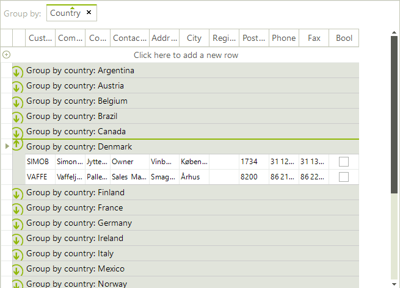
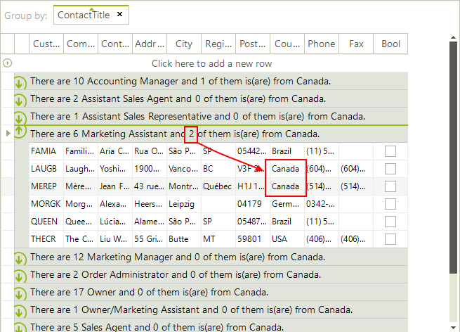

# Formatting Group Header Row

__GroupSummaryEvaluate__ allows to modify the header text of the group rows. The event is fired when the group header row text is needed. So if you want to modify the group’s text, first you have to subscribe to the __GroupSummaryEvaluate__ event and then perform the actual grouping, because when the __GroupContentCellElement__ (the group header row) is being displayed, the event is fired and if you are  not subscribed for it, it will apply its default settings.

The example below demonstrates how you can change the group header text of each group if grouping is based on some specific column:

#### Change group header text

<snippet id='gridview-formattinggroupheaderrow-groupheadertext-cs' />
<snippet id='gridview-formattinggroupheaderrow-groupheadertext-vb' />

The following example demonstrates formatting of group header which uses data from the group rows:

#### Formatting group header by using data from data rows

<snippet id='gridview-formattinggroupheaderrow-formatgroupheaderwhichusersdatafromgrouprows-cs' />
<snippet id='gridview-formattinggroupheaderrow-formatgroupheaderwhichusersdatafromgrouprows-vb' />

# See Also
* [Basic Grouping]()

* [Custom Grouping]()

* [Events]()

* [Group Aggregates]()

* [Groups Collection]()

* [Setting Groups Programmatically]()

* [Sorting group rows]()

* [Using Grouping Expressions]()

