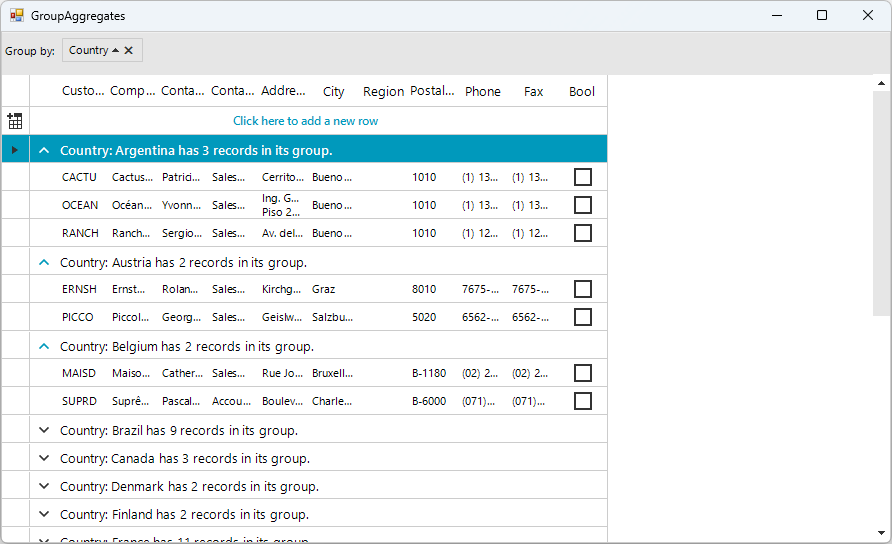
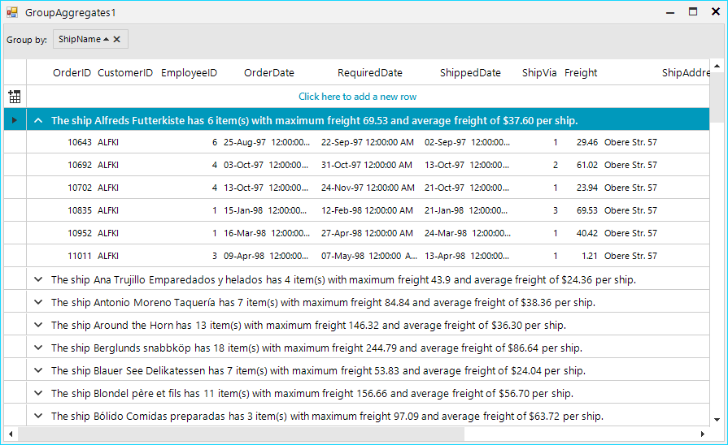

# Group Aggregates

The text of the group header row is a formatted string with the following parameters:

* __{0}__ – __Property name__ –the name of the RadGridView column by which the grouping is performed;

* __{1}__ – __Group value__

* __{2}, {3} …__ - __Aggregates values__

You can define the format of the group header row by using the __GroupDescriptor Format__ property. Its default value is __“{0}: {1}”__. The following two examples demonstrate how you can use the group aggregates. Full list of the available expressions can be found here:[http://msdn.microsoft.com/en-us/library/system.data.datacolumn.expression.aspx](http://msdn.microsoft.com/en-us/library/system.data.datacolumn.expression.aspx)

#### Example 1: Adding the Count Aggregate

<snippet id='gridview-groupaggregates-groupaggregates-cs' />
<snippet id='gridview-groupaggregates-groupaggregates-vb' />

#### Example 2: Adding and Formatting Several Aggregates
 
<snippet id='gridview-groupaggregates1-groupaggregates1-cs' />
<snippet id='gridview-groupaggregates1-groupaggregates1-vb' />

# See Also
* [Basic Grouping]()

* [Custom Grouping]()

* [Events]()

* [Formatting Group Header Row]()

* [Groups Collection]()

* [Setting Groups Programmatically]()

* [Sorting group rows]()

* [Using Grouping Expressions]()

