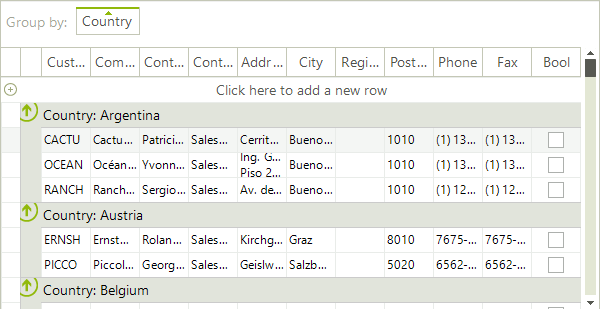
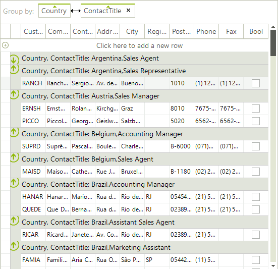
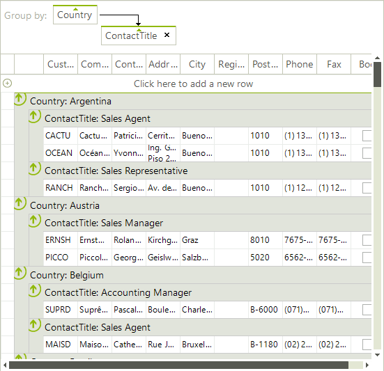

# Setting Groups Programmatically

## Overview

**RadGridView** has a __GroupDescriptors__ property at the **GridViewTemplate** level which is exposed in **RadGridView** class for **MasterTemplate** instance. This collection allows you to use descriptors which define the grouping criteria and the group's sorting direction for the data that is bound to the **RadGridView**.

As this is a collection, you are able not only to add, but to remove or clear its entries as well. Adding descriptors to the collection makes the current view display the items sorted and divided into groups. 

## Using GroupDescriptors

#### Using simple group descriptor

<snippet id='gridview-grouping-usingsimplegroupdescriptor-cs' />
<snippet id='gridview-grouping-usingsimplegroupdescriptor-vb' />

The __GroupNames__ property defines the property, by which the data will be grouped. The __GroupNames__ is a __SortDescriptorCollection__ and defines group names for one grouping criteria.

**RadGridView** supports grouping using one or more property names. The following example demonstrates how you can group by two properties:

#### Grouping by more than one column name

<snippet id='gridview-grouping-groupingbymorethanonecolumnname-cs' />
<snippet id='gridview-grouping-groupingbymorethanonecolumnname-vb' />

**RadGridView** supports grouping on one or more levels. The following example demonstrates how you can group on two levels:

#### Grouping on one or more levels

<snippet id='gridview-grouping-groupingononeormorelevels-cs' />
<snippet id='gridview-grouping-groupingononeormorelevels-vb' />

# See Also
* [Basic Grouping]()

* [Custom Grouping]()

* [Events]()

* [Formatting Group Header Row]()

* [Group Aggregates]()

* [Groups Collection]()

* [Sorting group rows]()

* [Using Grouping Expressions]()

