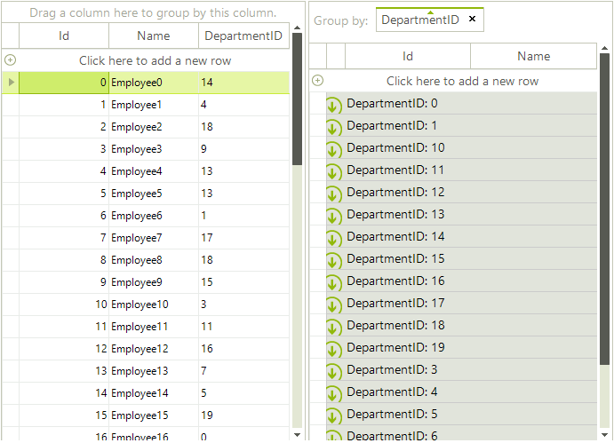
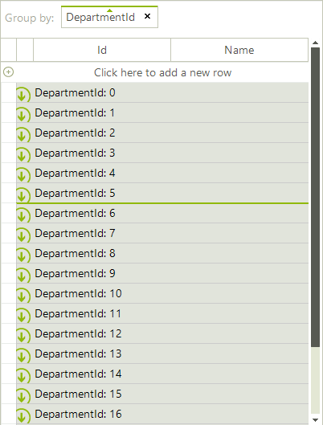

# Sorting group rows

By default, when you perform grouping, __RadGridView__ sorts the created group rows alphabetically. This article demonstrates how to customize the groups sort order.

Consider the __RadGridView__ is [bound]() to a list of custom objects. If you group by __DepartmentId__ you will notice that the group rows are sorted alphabetically as this property is *typeof(string)*.
        
>caption Figure 1: Alphabetical sort order

However, you can change this sort order by using a group comparer. It is necessary to create a class that implements the  __IComparer&lt;Group&lt;GridViewRowInfo&gt;&gt;__ interface where you should return an integer number in the implemented __Compare__ method. The following code snippet illustrates how to order the group rows considering the integer value, not the string:

#### Custom group comparer

<snippet id='gridview-sortinggrouprows-groupcomparer-cs' />
<snippet id='gridview-sortinggrouprows-groupcomparer-vb' />

The last thing you need to do is to replace the default MasterTemplate.__GroupComparer__ with your custom one:

#### Custom group comparer

<snippet id='gridview-sortinggrouprows-replace-cs' />
<snippet id='gridview-sortinggrouprows-replace-vb' />

>caption Figure 2: Custom Sort Order of Group Rows

# See Also
* [Basic Grouping]()

* [Custom Grouping]()

* [Events]()

* [Formatting Group Header Row]()

* [Group Aggregates]()

* [Groups Collection]()

* [Setting Groups Programmatically]()

* [Using Grouping Expressions]()

