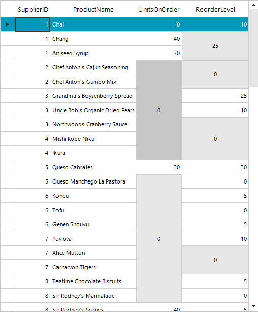
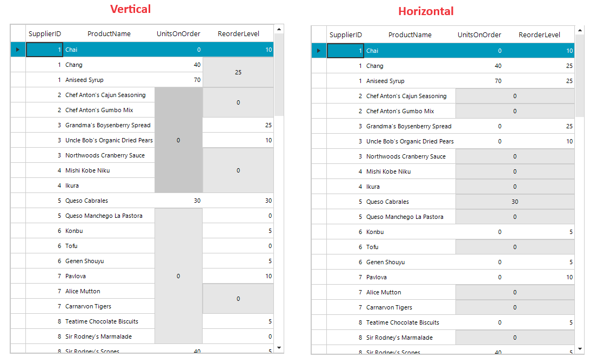
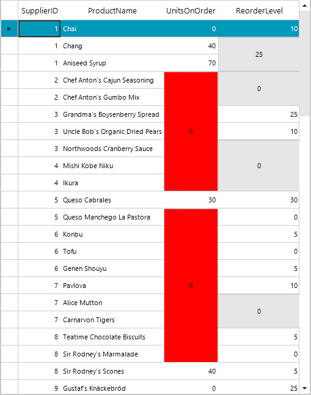

# Merged Cells

As of Q3 2024 we have introduced support for merged cells in __RadGridView__ control. As a result consecutive/serial cells with equal values can be merged vertically or horizontally.



## Merged Cells Direction

When the RadGridView is setup, you can configure it to display the merged cells by specifying a proper value for the __MergeCellsMode__ property. It accepts the following values:

* None
* Vertical
* Horizontal

{{source=..\SamplesCS\GridView\Cells\MergeCells.cs region=mergeCellsMode}} 
{{source=..\SamplesVB\GridView\Cells\MergeCells.vb region=mergeCellsMode}} 

````C#

this.radGridView1.MergeCellsMode = Telerik.WinControls.UI.MergeCellsMode.None;

````
````VB.NET

Me.RadGridView1.MergeCellsMode = Telerik.WinControls.UI.MergeCellsMode.None

````

{{endregion}} 

>caption Figure 1: Merge Cells Direction



## Merge Cells Edit Mode

The merge cell mechanism exposes two ways to edit the cells that are currently merged: Editing only the current cell or editing all merge cells at once. This behavior is controlled by the __MergeCellsEditMode__ property. This enumeration property exposes the following values:

* CurrentCell (default value): While this option is set, clicking on a merged cell will enable the edit mode only for the data cell under the mouse click position. Changing the value to a different one from the rest in the merge cells will remove the cells from the merge cells' bounds.

* VisibleCells: When this option is set, double-clicking on the merge cells will enable the edit mode of the merge cell only. Editing the value of the merged cell will change all the values of the data cells that the merged cell is covering.

## Merge Cells Event

When the merge cells functionality is enabled for the RadGridView, the control exposes a __CellMerging__ event which will be triggered when two cells are going to be merged. This event can be used to determine when two cells can be merged or not. Using this event we could merge specific cells on a custom condition. To do that we can first subscribe to the __CellMerging__ event, handle the event by setting the __Handle__ property to true, and set the __Result__ property from the event arguments to whether the incoming cells can be merged or not based on some condition.

In the following example, we will merge the cells in one column depending on the value in the other column:

{{source=..\SamplesCS\GridView\Cells\MergeCells.cs region=cellMergingEvent}} 
{{source=..\SamplesVB\GridView\Cells\MergeCells.vb region=cellMergingEvent}} 

````C#

private void RadGridView1_CellMerging(object sender, Telerik.WinControls.UI.GridViewCellMergingEventArgs e)
{
    if (e.Cell1.ColumnInfo.FieldName == "FirstName") // first column
    {
        e.Handled = true;
        // Get next cell and compare them by family name
        var familyNameValue1 = e.Cell1.RowInfo.Cells["LastName"].Value; // second column
        var familyNameValue2 = e.Cell2.RowInfo.Cells["LastName"].Value; // second column
        e.Result = object.Equals(familyNameValue1, familyNameValue2);
    }
}

````
````VB.NET

Private Sub RadGridView1_CellMerging(ByVal sender As Object, ByVal e As Telerik.WinControls.UI.GridViewCellMergingEventArgs)
    If e.Cell1.ColumnInfo.FieldName = "FirstName" Then
        e.Handled = True
        ' Get next cell and compare them by family name
        Dim familyNameValue1 = e.Cell1.RowInfo.Cells("LastName").Value
        Dim familyNameValue2 = e.Cell2.RowInfo.Cells("LastName").Value
        e.Result = Object.Equals(familyNameValue1, familyNameValue2)
    End If
End Sub


````

{{endregion}} 

## Merge Cell Formatting

__RadGridView__ offers customization options for merged cells, similar to its regular cells. Customizing the merge cells is possible by handling the __ViewCellFormatting__ event of the control. The following example demonstrates how to change the color of a merged cell spanning more than five underlying cells.

{{source=..\SamplesCS\GridView\Cells\MergeCells.cs region=mergeCellFormatting}} 
{{source=..\SamplesVB\GridView\Cells\MergeCells.vb region=mergeCellFormatting}} 

````C#

private void RadGridView1_ViewCellFormatting(object sender, CellFormattingEventArgs e)
{
    if (e.CellElement is GridMergeCellElement)
    {
        var mergeCell = e.CellElement as GridMergeCellElement;
        if (mergeCell.Cells.Count > 5)
        {
            mergeCell.BackColor = Color.Red;
        }
    }
}

````
````VB.NET

Private Sub RadGridView1_ViewCellFormatting(ByVal sender As Object, ByVal e As CellFormattingEventArgs)
    If TypeOf e.CellElement Is GridMergeCellElement Then
        Dim mergeCell = TryCast(e.CellElement, GridMergeCellElement)

        If mergeCell.Cells.Count > 5 Then
            mergeCell.BackColor = Color.Red
        End If
    End If
End Sub


````

{{endregion}} 



## Enable Merge Cell per Column or Template

__RadGridView__ provides flexibility in merging cells by enabling you to define merge cell rules at the column or template level.

* __Column__: You can exclude a column from the merge cell algorithm by setting the __AllowCellMerging__ property to false.


{{source=..\SamplesCS\GridView\Cells\MergeCells.cs region=allowCellMerging}} 
{{source=..\SamplesVB\GridView\Cells\MergeCells.vb region=allowCellMerging}}

````C#

this.radGridView1.Columns[0].AllowCellMerging = false;

````
````VB.NET

Me.RadGridView1.Columns(0).AllowCellMerging = False


````

{{endregion}}

* __Template__: When working with hierarchical data and multiple templates in RadGridView, the cell merging behavior can be disabled or enabled independently for each template. 

{{source=..\SamplesCS\GridView\Cells\MergeCells.cs region=mergeCellTemplate}} 
{{source=..\SamplesVB\GridView\Cells\MergeCells.vb region=mergeCellTemplate}}

````C#

GridViewTemplate template = new GridViewTemplate();           
template.MergeCellsMode = MergeCellsMode.None;
// template settings
radGridView1.MasterTemplate.Templates.Add(template);

````
````VB.NET

Dim template As GridViewTemplate = New GridViewTemplate()
template.MergeCellsMode = MergeCellsMode.None
' template settings
radGridView1.MasterTemplate.Templates.Add(template)

````

{{endregion}}


## Known Limitations

* Currently, merge cells functionality ignores pinned columns and rows.

* Selection is currently not supported for the merged cells. When selecting a row, all the cells except for the merged one will show as selected.

* Printing and exporting functionalities of the RadGridView do not support merge cells.

* Copy, paste, and cut operations do not support merge cells.


## See Also
* [Accessing and Setting the CurrentCell]()

* [Conditional Formatting Cells]()

* [Creating Custom Cells]()

* [Formatting Cells]()

* [GridViewCellInfo]()

* [Iterating Cells]()

