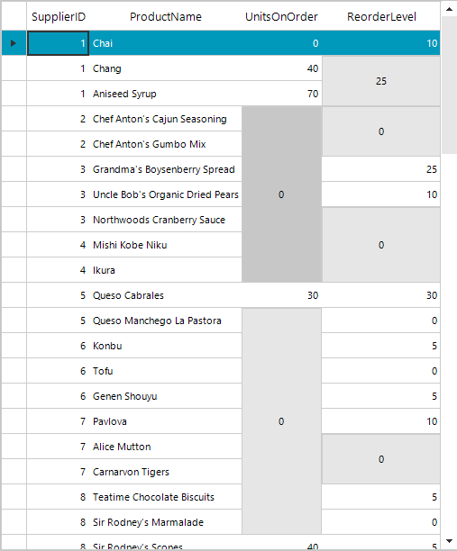
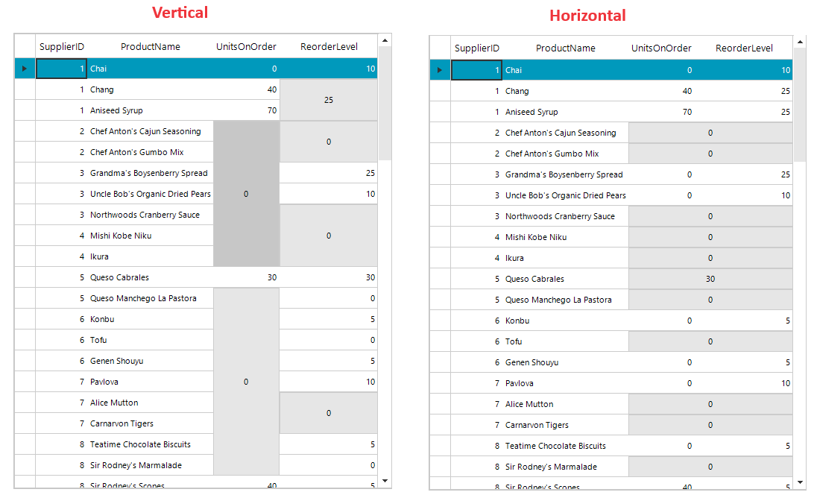
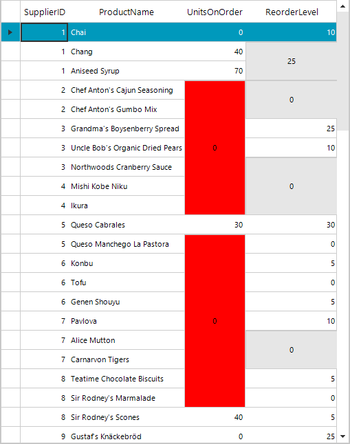

# Merged Cells

As of Q3 2024 we have introduced support for merged cells in __RadGridView__ control. As a result consecutive/serial cells with equal values can be merged vertically or horizontally.

## Merged Cells Direction

When the RadGridView is setup, you can configure it to display the merged cells by specifying a proper value for the __MergeCellsMode__ property. It accepts the following values:

* None
* Vertical
* Horizontal

<snippet id='gridview-mergecells-mergecellsmode-cs' />
<snippet id='gridview-mergecells-mergecellsmode-vb' />

>caption Figure 1: Merge Cells Direction

## Merge Cells Edit Mode

The merge cell mechanism exposes two ways to edit the cells that are currently merged: Editing only the current cell or editing all merge cells at once. This behavior is controlled by the __MergeCellsEditMode__ property. This enumeration property exposes the following values:

* CurrentCell (default value): While this option is set, clicking on a merged cell will enable the edit mode only for the data cell under the mouse click position. Changing the value to a different one from the rest in the merge cells will remove the cells from the merge cells' bounds.

* VisibleCells: When this option is set, double-clicking on the merge cells will enable the edit mode of the merge cell only. Editing the value of the merged cell will change all the values of the data cells that the merged cell is covering.

## Merge Cells Event

When the merge cells functionality is enabled for the RadGridView, the control exposes a __CellMerging__ event which will be triggered when two cells are going to be merged. This event can be used to determine when two cells can be merged or not. Using this event we could merge specific cells on a custom condition. To do that we can first subscribe to the __CellMerging__ event, handle the event by setting the __Handle__ property to true, and set the __Result__ property from the event arguments to whether the incoming cells can be merged or not based on some condition.

In the following example, we will merge the cells in one column depending on the value in the other column:

<snippet id='gridview-mergecells-cellmergingevent-cs' />
<snippet id='gridview-mergecells-cellmergingevent-vb' />

## Merge Cell Formatting

__RadGridView__ offers customization options for merged cells, similar to its regular cells. Customizing the merge cells is possible by handling the __ViewCellFormatting__ event of the control. The following example demonstrates how to change the color of a merged cell spanning more than five underlying cells.

<snippet id='gridview-mergecells-mergecellformatting-cs' />
<snippet id='gridview-mergecells-mergecellformatting-vb' />

## Enable Merge Cell per Column or Template

__RadGridView__ provides flexibility in merging cells by enabling you to define merge cell rules at the column or template level.

* __Column__: You can exclude a column from the merge cell algorithm by setting the __AllowCellMerging__ property to false.

<snippet id='gridview-mergecells-allowcellmerging-cs' />
<snippet id='gridview-mergecells-allowcellmerging-vb' />

* __Template__: When working with hierarchical data and multiple templates in RadGridView, the cell merging behavior can be disabled or enabled independently for each template. 

<snippet id='gridview-mergecells-mergecelltemplate-cs' />
<snippet id='gridview-mergecells-mergecelltemplate-vb' />

## Known Limitations

* Currently, merge cells functionality ignores pinned columns and rows.

* Selection is currently not supported for the merged cells. When selecting a row, all the cells except for the merged one will show as selected.

* Printing and exporting functionalities of the RadGridView do not support merge cells.

* Copy, paste, and cut operations do not support merge cells.

* Merge Cell functionality only works with __Table View Definition__.

* Merge Cell functionality is only applicable to the data cells. Column header cells won't be merged.

## See Also
* [Accessing and Setting the CurrentCell]()

* [Conditional Formatting Cells]()

* [Creating Custom Cells]()

* [Formatting Cells]()

* [GridViewCellInfo]()

* [Iterating Cells]()

