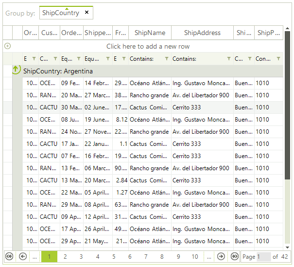

# WinForms GridView Overview

The data layer of __RadGridView__ supports pagination of data natively as of **R1 2014 (version 2014.1.226)**. You can still bind __RadGridView__ to the same [data providers]() as before with the addition of the paging option. There is a number of features, which will allow you to easily configure and manage the paging of the data.



To access the public API for paging you need to use the RadGridView.__MasterTemplate__ property exposing the __MasterGridViewTemplate__ object. Here are the more important properties and methods:

* __EnablePaging:__ Gets or sets a value indicating whether paging is enabled.

* __PageSize:__ Gets or sets the number of items shown per page.

* __TotalPages:__ Gets the total number of pages.

* __PageIndex:__ Gets the zero-based index of the current page.

* __CanChangePage:__ Gets a value indicating whether page change is possible.

* __IsPageChanging:__ Gets a value indicating whether a page change operation is underway.

* __MoveToFirstPage:__ Moves RadGridView to its first page.

* __MoveToPreviousPage:__ Moves RadGridView to the previous page.

* __MoveToPage(int pageIndex):__ Moves RadGridView to a specific page.

* __MoveToNextPage:__ Moves RadGridView to the next page.

* __MoveToLastPage:__ Moves RadGridView to its last page.

* __PagingBeforeGrouping:__ Gets or sets a value indicating whether paging is performed before grouping or vice versa.

## Setting Up Paging

The following example shows how to enable paging, set the page size, and use the navigation methods:

````C#
this.radGridView1.EnablePaging = true;
this.radGridView1.PageSize = 10;

// Navigate to a specific page by zero-based index.
this.radGridView1.MasterTemplate.MoveToPage(3);

// Navigate sequentially.
this.radGridView1.MasterTemplate.MoveToFirstPage();
this.radGridView1.MasterTemplate.MoveToNextPage();
this.radGridView1.MasterTemplate.MoveToPreviousPage();
this.radGridView1.MasterTemplate.MoveToLastPage();

// Read paging state.
int currentPage = this.radGridView1.MasterTemplate.PageIndex;
int totalPages = this.radGridView1.MasterTemplate.TotalPages;

````
````VB.NET
Me.RadGridView1.EnablePaging = True
Me.RadGridView1.PageSize = 10

' Navigate to a specific page by zero-based index.
Me.RadGridView1.MasterTemplate.MoveToPage(3)

' Navigate sequentially.
Me.RadGridView1.MasterTemplate.MoveToFirstPage()
Me.RadGridView1.MasterTemplate.MoveToNextPage()
Me.RadGridView1.MasterTemplate.MoveToPreviousPage()
Me.RadGridView1.MasterTemplate.MoveToLastPage()

' Read paging state.
Dim currentPage As Integer = Me.RadGridView1.MasterTemplate.PageIndex
Dim totalPages As Integer = Me.RadGridView1.MasterTemplate.TotalPages

````

## Handling Paging Events

**RadGridView** exposes the **PageChanging** and **PageChanged** events. The **PageChanging** event allows you to cancel a page change. The **PageChanged** event fires after the page has changed.

````C#
private void radGridView1_PageChanging(object sender, PageChangingEventArgs e)
{
    // Cancel navigation to the last page.
    if (e.NewPageIndex == this.radGridView1.MasterTemplate.TotalPages - 1)
    {
        e.Cancel = true;
    }
}

private void radGridView1_PageChanged(object sender, EventArgs e)
{
    string message = string.Format("Page {0} of {1}",
        this.radGridView1.MasterTemplate.PageIndex + 1,
        this.radGridView1.MasterTemplate.TotalPages);
}

````
````VB.NET
Private Sub RadGridView1_PageChanging(ByVal sender As Object, ByVal e As PageChangingEventArgs)
    ' Cancel navigation to the last page.
    If e.NewPageIndex = Me.RadGridView1.MasterTemplate.TotalPages - 1 Then
        e.Cancel = True
    End If
End Sub

Private Sub RadGridView1_PageChanged(ByVal sender As Object, ByVal e As EventArgs)
    Dim message As String = String.Format("Page {0} of {1}",
        Me.RadGridView1.MasterTemplate.PageIndex + 1,
        Me.RadGridView1.MasterTemplate.TotalPages)
End Sub

````
            
# See Also
* [Paging panel]()

