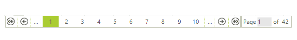
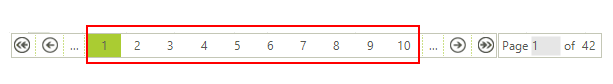
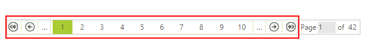
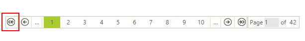
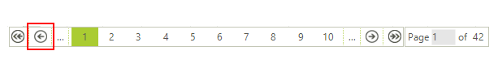
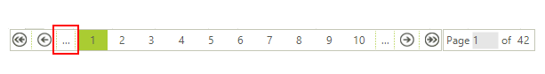
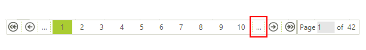
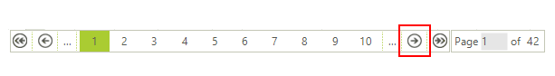
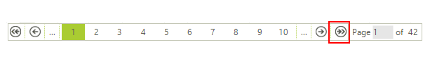
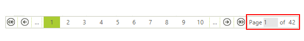

# Paging Panel

When paging is enabled in __RadGridView__, a panel is added to the bottom of the grid view element. It allows users to navigate back and forth over the pages or jump directly to a desired page.

>note Paging functionality in RadGridView was introduced in **R1 2014 (version 2014.1.226)**. To enable it, the **EnablePaging** property of the control needs to be set to **true**.

There are a number of properties, which allow you to customize the paging panel to your specific needs. You can access these properties through the __RadGridView.GridViewElement.PagingPanelElement__. Here is what options you have:

* __NumericButtonsCount:__ Controls how many buttons for navigation to concrete pages there are on the panel.

    

* __ShowButtonsStripElement:__ Controls whether the buttons panel is visible.

    

* __ShowFirstButton:__ Controls whether the button navigating to the first page is visible.

    

* __ShowPreviousButton:__ Controls whether the button navigating to the previous page is visible.

    

* __ShowFastBackButton:__ Controls whether the button with three dots is visible. This button moves the grid back X number of pages, where X equals the number of numeric buttons.

    

* __ShowFastForwardButton:__ Controls whether the button with three dots is visible. This button moves the grid forth X number of pages, where X equals the number of numeric buttons.

    

* __ShowNextButton:__  Controls whether the button navigating to the next page is visible.

    

* __ShowLastButton:__ Controls whether the button navigating to the last page is visible.
 
    

* __ShowNumericalButtons:__ Controls whether the buttons navigating to concrete pages are visible.

    

* __ShowTextBoxStripElement:__ Controls whether the panel allowing users to jump to a concrete page is visible.

    

# See Also
* [Paging]()

