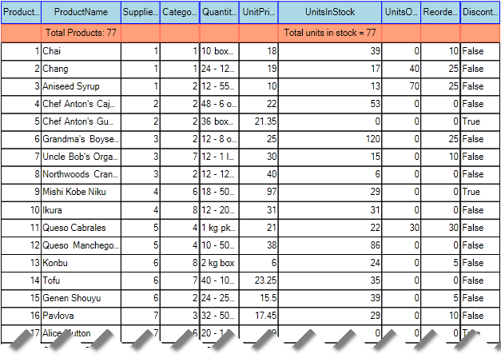
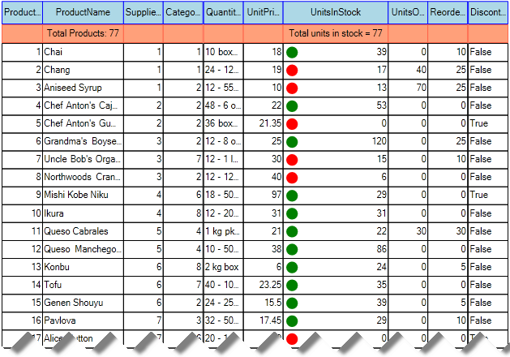

# Events and Customization

The print events in RadGridView allow the developer to customize the print output for each individual cell. There are two events namely __PrintCellFormatting__ and __PrintCellPaint__.

## PrintCellFormatting

Just like the other formatting events of RadGridView, this event allows you to format the appearance of the cells in the printed document. Here is a very simple example, which demonstrates how to customize the appearance of the header and the summary rows:

<snippet id='gridview-eventsandcustomization-printcellformatting-cs' />
<snippet id='gridview-eventsandcustomization-printcellformatting-vb' />

## PrintCellPaint

This event allow you to access the cell and to paint in it whatever you need. Here is a sample, where we will paint a green dot when the product quantity is more than 20 and a red dot if it is less:

<snippet id='gridview-eventsandcustomization-printcellpaint-cs' />
<snippet id='gridview-eventsandcustomization-printcellpaint-vb' />

# See Also
* [GridPrintStyle]()

* [Printing Hierarchical Grid]()

* [Overview]()

