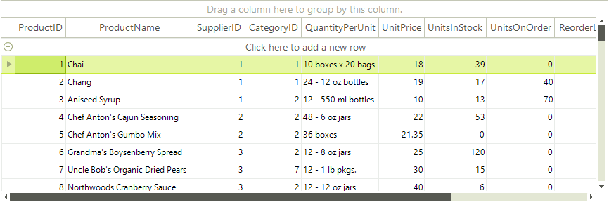

# Events

There are a vertical and a horizontal scroll bar objects for the vertical and horizontal scroll bars respectively. 

They can be accessed via the TableElement.**VScrollBar** and TableElement.**HScrollBar** properties. You can detect when one of the scroll bar's value changes by handling the **ValueChanged** event of the respective **RadScrollBarElement**.

For instance, to subscribe to **ValueChanged** event of the vertical scroll bar use the following code:

<snippet id='gridview-scrolling-subscribe-cs' />
<snippet id='gridview-scrolling-subscribe-vb' />

#### ScrollBar value changed event

<snippet id='gridview-scrolling-scrollbarvaluechanged-cs' />
<snippet id='gridview-scrolling-scrollbarvaluechanged-vb' />

>caution Please note that **RadGridView** **Scroll** event is NOT used.
>

# See Also
* [Scrolling Programmatically]()

