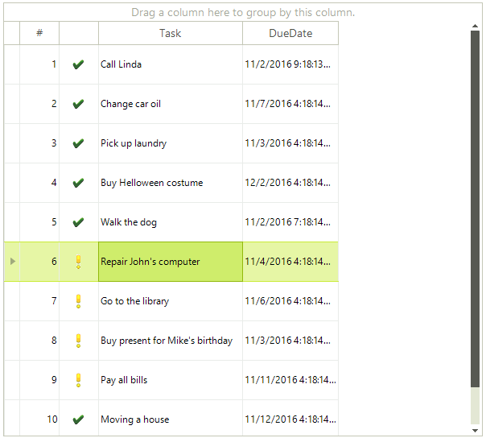
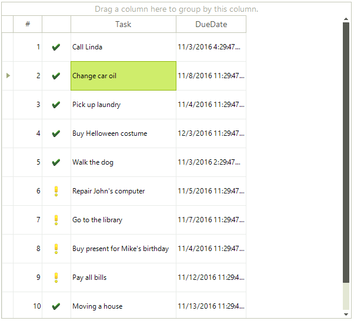

# Basic Selection

RadGridView provides you with a selection functionality, which allows the user to select one or more items (rows or cells) from the data displayed by the control.    

>tip The selection mechanism can be controlled programmatically as well. For more information, take a look at the topic [Selecting Rows and Cells Programmatically]().
>

## Basic row selection

By default RadGridView allows the user to select only one row. In this case the default property settings are:

<snippet id='gridview-selection1-basicrowselection-cs' />
<snippet id='gridview-selection1-basicrowselection-vb' />

To select an item in RadGridView click in the rectangle area of the desired row.

## Basic Cell Selection

You can modify RadGridView to select single cells instead of rows by setting its __SelectionMode__ property to *CellSelect* from the `GridViewSelectionMode` enumeration:

<snippet id='gridview-selection1-basiccellselection-cs' />
<snippet id='gridview-selection1-basiccellselection-vb' />

After setting these properties, to select a cell in RadGridView, click the desired cell.

## Selected items

Once an item is selected (row or cell), you can find this item in the __SelectedRows__ and __SelectedCells__ collections respectively. The following code describes how to access those collections:

<snippet id='gridview-selection1-collections-cs' />
<snippet id='gridview-selection1-collections-vb' />

## Events

There are two events relevant to the selection: __SelectionChanged__, __CurrentCellChanged__. The sequence of the is as follows – the __CurrentCellChanged__ is fired first and after that the __SelectionChangedEvent__ event fires.     
        

## CurrentRow/CurrentCell

Once an item is selected, it automatically becomes current (when basic selection is used). This means that if you select the first row (cell) of RadGridView, its __IsCurrent__ property will be automatically set to *true* and __CurrentRow__ (__CurrentCell__) property of RadGridView will hold an instance of this row (respectively cell). The following example demonstrates how to access the __CurrentRow__ and __CurrentCell__ properties and additionally the __IsCurrent__ property of a row or a cell:

<snippet id='gridview-selection1-currentrowcell-cs' />
<snippet id='gridview-selection1-currentrowcell-vb' />

When basic selection is used, the opposite is also valid – if you set the __CurrentRow__ or __CurrentCell__ (or the __IsCurrent__ property to true for a cell or row) in RadGridView and only if  basic selection is used (MultiSelect = false ), the selected row(cell) will be the same as the current row(cell).
      
# See Also
* [Multiple Selection]()

* [Selecting Rows and Cells Programmatically]()

