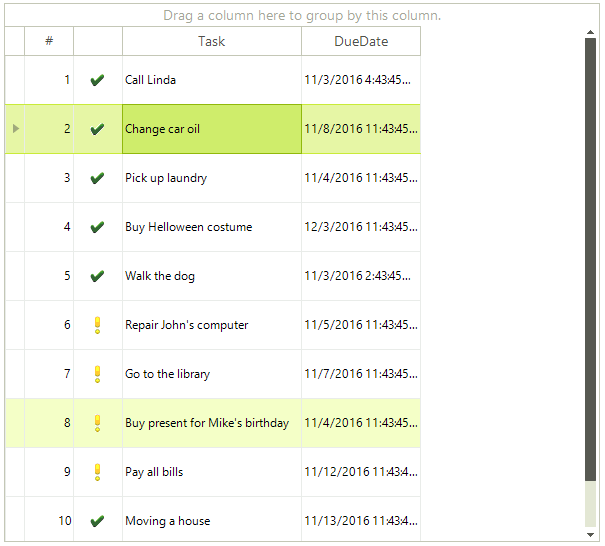
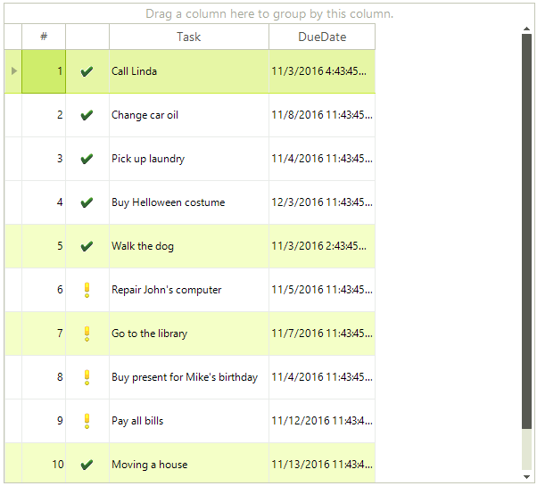
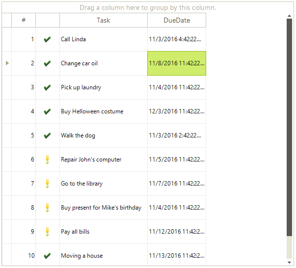
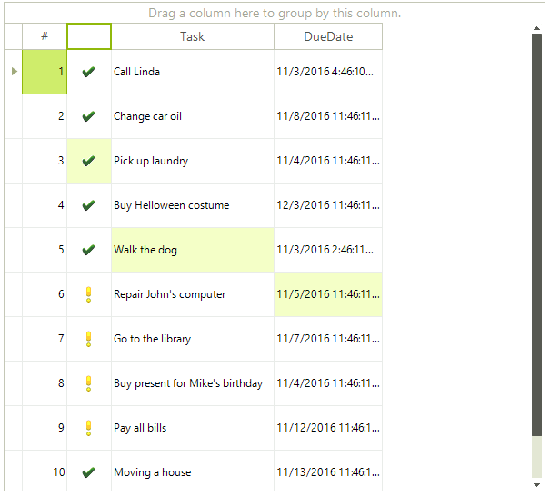

# Selecting Rows and Cells Programmatically

This article describes the methods to select rows and cells through code.

## Selecting a single row

To select a single row programmatically:

* You can set its __IsSelected__ property to `true`:

<snippet id='gridview-selection1-isrowselected-cs' />
<snippet id='gridview-selection1-isrowselected-vb' />

* You can make the row current:

<snippet id='gridview-selection1-isrowcurrent-cs' />
<snippet id='gridview-selection1-isrowcurrent-vb' />

Both ways to select a single row result in adding this row into the RadGridView.__SelectedRows__ collection.

## Selecting Multiple Rows

To select multiple rows programmatically, set their __IsSelected__ property to `true`:

<snippet id='gridview-selection1-selectmultiplerows-cs' />
<snippet id='gridview-selection1-selectmultiplerows-vb' />

In this scenario all, four rows are added to the __SelectedRows__ collection of **RadGridView**. You can access the instances of the selected rows in the __SelectedRows__ collection by their index:

<snippet id='gridview-selection1-gettingselectedrow-cs' />
<snippet id='gridview-selection1-gettingselectedrow-vb' />

>note The rows are added to the __SelectedRows__ collection in the same order as the order in which you have set the selected rows.

## Selecting a Single Cell

You can select cells the same way you select rows – by setting their __IsSelected__ property to `true`:

<snippet id='gridview-selection1-selectingcell-cs' />
<snippet id='gridview-selection1-selectingcell-vb' />

Selecting a single cell will result in adding this cell into the RadGridView.**SelectedCells** collection.

## Selecting Multiple Cells

To select multiple cells programmatically, set the __IsSelected__ property of the desired cells to `true`.

<snippet id='gridview-selection1-selectmultiplecells-cs' />
<snippet id='gridview-selection1-selectmultiplecells-vb' />

In this scenario, all four cells are added to the __SelectedCells__ collection of **RadGridView**. You can access the instances of the selected cells in the __SelectedCells__ collection by their index:

<snippet id='gridview-selection1-gettingselectedcell-cs' />
<snippet id='gridview-selection1-gettingselectedcell-vb' />

Note that the cells are added to the collection in the same order as the order in which you have set the selected cells.

## BaseGridNavigator's Selection API 

**BaseGridNavigator** provides a suitable API for selecting rows and columns programmatically. You can access it through the RadGridView.**GridNavigator** property. The following table lists the available public methods:

|Method|Description|
|----|----|
|**SelectAll**|Select all rows and cells.|
|**ClearSelection**|Clears the selection.|
|**BeginSelection**|Begins grid selection.|
|**EndSelection**|Ends selection.|
|**Select(GridViewRowInfo row, GridViewColumn column)**|Selects the specified row as current and specified column as current.|
|**SelectFirstRow**|Selects the first row as current column in grid. The method returns *true* if the operation is successful.|
|**SelectLastRow**|Selects the last row as current row in grid. The method returns *true* if the operation is successful.|
|**SelectRow(GridViewRowInfo row)**|Selects the specified row as current row in grid. The method returns *true* if the operation is successful.|
|**SelectNextRow(int step)**| Selects the row at specified distance after the current position as current row in grid. The method returns *true* if the operation is successful.|
|**SelectPreviousRow(int step)**|Selects the row at specified distance before the current position as current row in grid. The method returns *true* if the operation is successful.|
        
# See Also
* [Basic Selection]()

* [Multiple Selection]()

