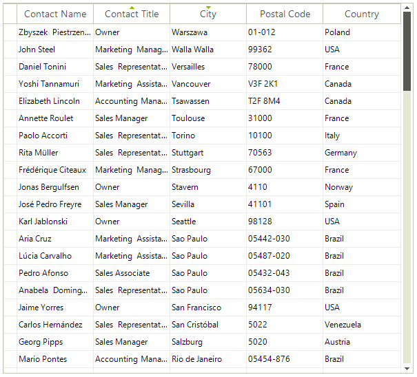

# Basic Sorting

**RadGridView** supports data sorting. Set the __EnableSorting__ or GridViewTemplate.__EnableSorting__ properties to *true* which will enable the *user sorting* feature:

#### Enabling the user sorting

<snippet id='gridview-sorting-enablesorting-cs' />
<snippet id='gridview-sorting-enablesorting-vb' />

When sorting is enabled, the user can click on the column headers to control the sorting order. **RadGridView** supports three orders: __Ascending__, __Descending__, and __None__ (no sort). Since R1 2017 columns have a property called **AllowNaturalSort** that defines whether the user will cycle through *no sort* when clicking on the header cell or whether once sorted the column cannot be "unsorted".



>important By default if the rows count is less than 10 000 we use quick sort to order the items. If there are more items we use Red-Black tree. This is controlled by the __UseHybridIndex__ property.

#### Change UseHybridIndex

````C#
(radGridView.MasterTemplate.ListSource.CollectionView as GridDataView).UseHybridIndex = false;
````
````VB
TryCast(radGridView.MasterTemplate.ListSource.CollectionView, GridDataView).UseHybridIndex = False
````

**RadGridView** allows you to prevent the built-in data sorting operation but keep the sorting life cycle as it is, e.g. UI indication, **SortDescriptors** and events remain. This is controlled by the MasterTemplate.DataView.**BypassSort** property which default value is *false*. This means that **RadGridView** won't perform the sorting if you set it to *true*. This may be suitable for cases in which you bound the grid to a **DataTable** and you want to apply the sort direction to the **DataTable**, not to the grid itself. You can find below a sample code snippet:

>caution In case you set the **BypassSort** property to **true** please ensure that the **BypassFilter** property is also set to the same value.

#### Bypass default sorting

<snippet id='gridview-sorting-bypasssorting-cs' />
<snippet id='gridview-sorting-bypasssorting-vb' />

See [End-user Capabilities Sorting]() topic about more information on the sorting behavior of RadGridView from the users' perspective.
# See Also
* [Custom Sorting]()

* [Events]()

* [Setting Sorting Programmatically]()

* [Sorting Expressions]()

* [GridView Cells In Sorted Columns Jumps To a New Position After Editing Its Value]()

* [Use Custom Comparer to Speed up the Sorting in RadGridView]()

* [Improve GridView Sorting for Columns with Similar Values]()


