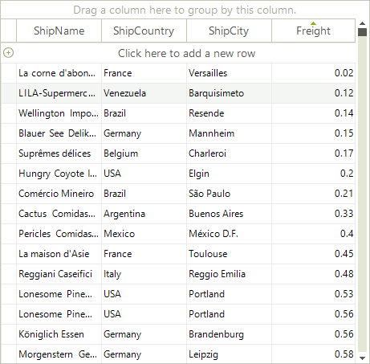
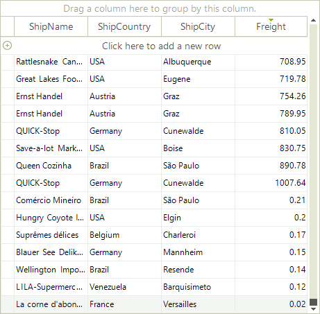
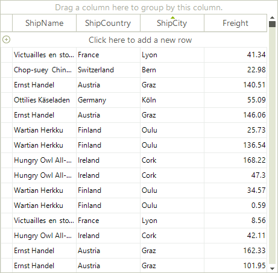
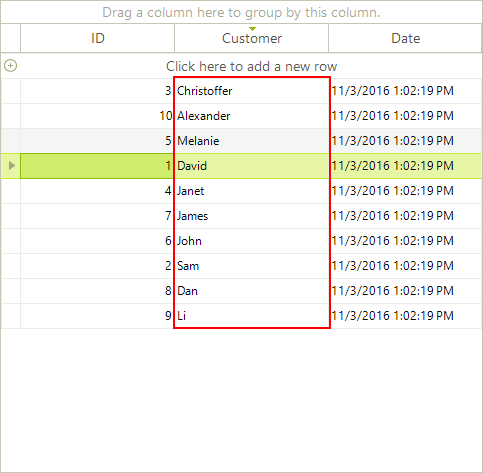

# Custom Sorting

Custom sorting is a flexible mechanism for sorting RadGridView rows using custom logic. It has a higher priority than the applied __SortDescriptors__ (added either by code or by clicking the header row).

Custom sorting is applied if user sorting is enabled by the __EnableSorting__ or  __GridViewTemplate.EnableSorting__ properties. By default, sorting is enabled at all levels.

RadGridView provides two mechanisms for custom sorting:

* Handling the CustomSorting event

* Replacing the RadGridView sorting mechanism by providing a custom __SortComparer__

## Using the CustomSorting event

>note Use __EnableCustomSorting__ property to enable the custom sorting functionality.

The __CustomSorting__ event is fired if custom sorting is enabled. It requires the __EnableCustomSorting__ property to be *true*. The arguments of the event, provide the following properties:

* __Template:__ The template that holds the rows that are going to be sorted.

* __Row1, Row2:__ The rows to be compared.

* __SortResult:__ returns a negative value when `Row1` is before `Row2`, a positive value if `Row1` is after `Row2`, and zero if the rows have equal values in a specified column.

* __Handled:__ defines if the comparison of the two rows is processed by the custom algorithm or by the applied sort descriptors.

The following example demonstrates how to handle the __CustomSorting__ event sorting the RadGridView rows ascending by the values of the `Freight` column. The defined __SortOrder__ for the `Freight` column in this example assumes that row sorting is not applied. All RadGridView rows are processed by the custom logic.

<snippet id='gridview-customsorting-usingcustomsorting-cs' />
<snippet id='gridview-customsorting-usingcustomsorting-vb' />
<snippet id='gridview-customsorting-usingcustomsorting1-cs' />
<snippet id='gridview-customsorting-usingcustomsorting1-vb' />

The following example demonstrates the usage of the __Handled__ property of the __CustomSorting__ event arguments. It uses custom sorting to sort the rows ascending by the values of the `Freight` column. This sorting is applied to the rows that have a value in the `Freight` column greater than "0.33". The rest are handled by the defined __SortDescriptor__ and sorted descending by the values of the `Freight` column.

<snippet id='gridview-customsorting1-usingcustomsortingplushandled-cs' />
<snippet id='gridview-customsorting1-usingcustomsortingplushandled-vb' />
<snippet id='gridview-customsorting1-usingcustomsortingplushandled1-cs' />
<snippet id='gridview-customsorting1-usingcustomsortingplushandled1-vb' />

## Implementing sorting mechanism by using SortComparer

You can replace the sorting mechanism in RadGridView with a custom one by setting the __SortComparer__ of the __GridViewTemplate__.

The following example demonstrates how to use a custom sorting mechanism in RadGridView to sort the RadGridView rows ascending by the length of the `ShipCity` column:

<snippet id='gridview-customsorting-usingsortcomparer-cs' />
<snippet id='gridview-customsorting-usingsortcomparer-vb' />

## Create Custom Sort Order Criteria for a Particular Column.

You can use the custom sorting functionality to change the default sorting behavior for a particular column. This will leave the sorting functionality for the other columns intact and the user will be able to sort them in the usual way. However, when the user presses the column header cell for the column that we have changed the sort criteria, it will be sorted by the custom criteria. To achieve this we can use the __SortDescriptors__ collection of __RadGridView__. For example, you can order the rows by the text length in the *Customer* column with the following code:

<snippet id='gridview-customsorting2-sortbycustomcriteria-cs' />
<snippet id='gridview-customsorting2-sortbycustomcriteria-vb' />

## See Also
* [Basic Sorting]()

* [Events]()

* [Setting Sorting Programmatically]()

* [Sorting Expressions]()

