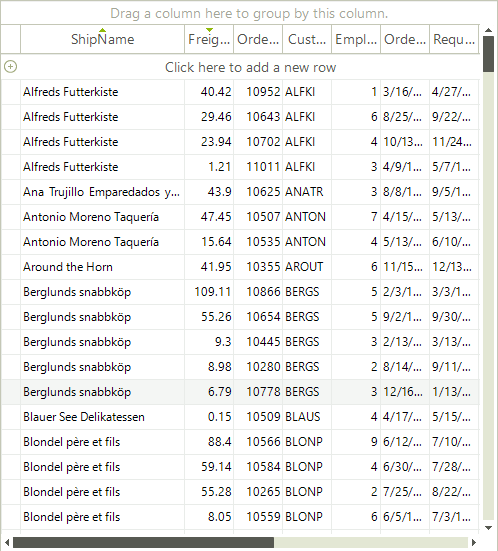

# Setting Sorting Programmatically

Sorting can be performed programmatically by adding descriptors to the RadGridView.**SortDescriptors** collection. 

## Overview

**RadGridView** includes __SortDescriptors__ property at the __GridViewTemplate__ level which is exposed in the RadGridView class for __MasterTemplate__ instance. This collection allows you to use descriptors which define the sorting property and the sorting direction for the data that is bound to the RadGridView. As this is a collection, you are able not only to add, but to remove or clear its entries as well. When you add a new descriptor to the collection, the data is automatically sorted according to it.

## Using SortDescriptor 

To enable sorting you need to set the __EnableSorting__ property of the desired template.

#### Enable Sorting

<snippet id='gridview-sorting-enablesorting-cs' />
<snippet id='gridview-sorting-enablesorting-vb' />

Here is how to create and add new __SortDescriptor__.

#### Using SortDescriptor

<snippet id='gridview-sorting-usingsortdescriptor-cs' />
<snippet id='gridview-sorting-usingsortdescriptor-vb' />

The __PropertyName__ property defines the property, by which the data will be sorted, and the __SortDirection__ property allows you to define the sort direction.

## Sorting by Two or More Columns

**RadGridView** supports sorting by one or more columns. The bellow example shows how you can sort by 2 columns.

#### Sorting by Two Columns

<snippet id='gridview-sorting-sortingbytwoormorecolumns-cs' />
<snippet id='gridview-sorting-sortingbytwoormorecolumns-vb' />

>caption Figure 1: Sorting by Two Columns

>note The order of adding the sort expressions to the SortDescriptors collections matters. In the example above, the grid will be first sorted by the `ShipName` column and then each group will be sorted according to the `Freight` column.
>

# See Also

* [Basic Sorting]()

* [Custom Sorting]()

* [Events]()

* [Sorting Expressions]()

