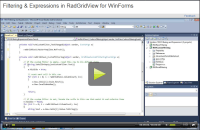

# Basic Filtering

| RELATED VIDEOS |  |
| ------ | ------ |
|[Filtering and Expressions in RadGridView for WinForms](http://www.telerik.com/videos/winforms/filtering-and-expressions-in-radgridview-for-winforms)<br>In this video, you will learn how to enable three different types of filtering on RadGridView for WinForms.||

User filtering in RadGridView is enabled by the __EnableFiltering__ property. By default, filtering is disabled at all levels.

#### Enable filtering

{{source=..\SamplesCS\GridView\Filtering\Filtering.cs region=enableFiltering}} 
{{source=..\SamplesVB\GridView\Filtering\Filtering.vb region=enableFiltering}} 

````C#
this.radGridView1.EnableFiltering = true;
this.radGridView1.MasterTemplate.EnableFiltering = true;

````
````VB.NET
Me.RadGridView1.EnableFiltering = True
Me.RadGridView1.MasterTemplate.EnableFiltering = True

````

{{endregion}} 

__GridViewDataColumn__

When filtering is enabled, each __GridViewDataColumn__ column displays a filter box beneath the corresponding header.


>note The __AutoFilterDelay__ property gets or sets a value in milliseconds that indicates the delay between the last key press and the filtering operation (available since R1 2019 SP1).

See [End-User capabilities - Filtering]() for more information about how the end-user experiences filtering.

**RadGridView** allows you to prevent the built-in data filtering operation but keep the filtering life cycle as it is, e.g. UI indication, **FilterDescriptors** and events remain. This is controlled by the MasterTemplate.DataView.**BypassFilter** property which default value is *false*. This means that **RadGridView** won't perform the filtering. This may be suitable for cases in which you bound the grid to a DataTable and you want to apply the filter to the DataTable, not to the grid itself. You can find below a sample code snippet:

#### Bypass default filtering

{{source=..\SamplesCS\GridView\Filtering\Filtering.cs region=BypassFiltering}} 
{{source=..\SamplesVB\GridView\Filtering\Filtering.vb region=BypassFiltering}} 

````C#
DataTable dt = new DataTable();
public void FillData()
{
    dt.Columns.Add("Id", typeof(int));
    dt.Columns.Add("Name", typeof(string));
    for (int i = 0; i < 30; i++)
    {
        dt.Rows.Add(i, "Item" + i);
    }
    this.radGridView1.DataSource = dt;
    this.radGridView1.EnableFiltering = true;
    this.radGridView1.MasterTemplate.DataView.BypassFilter = true;
    this.radGridView1.FilterChanged += radGridView1_FilterChanged;
}
private void radGridView1_FilterChanged(object sender, GridViewCollectionChangedEventArgs e)
{
    if (e.Action == NotifyCollectionChangedAction.Add || e.Action == NotifyCollectionChangedAction.ItemChanged)
    {
        dt.DefaultView.RowFilter = this.radGridView1.FilterDescriptors.Expression;
    }
    if (e.Action == NotifyCollectionChangedAction.Remove)
    {
        dt.DefaultView.RowFilter = "";
    }
}

````
````VB.NET
Private dt As New DataTable()
Public Sub FillData()
    dt.Columns.Add("Id", GetType(Integer))
    dt.Columns.Add("Name", GetType(String))
    For i As Integer = 0 To 29
        dt.Rows.Add(i, "Item" & i)
    Next
    Me.RadGridView1.DataSource = dt
    Me.RadGridView1.EnableFiltering = True
    Me.RadGridView1.MasterTemplate.DataView.BypassFilter = True
    AddHandler Me.RadGridView1.FilterChanged, AddressOf radGridView1_FilterChanged
End Sub
Private Sub radGridView1_FilterChanged(sender As Object, e As GridViewCollectionChangedEventArgs)
    If e.Action = NotifyCollectionChangedAction.Add OrElse e.Action = NotifyCollectionChangedAction.ItemChanged Then
        dt.DefaultView.RowFilter = Me.RadGridView1.FilterDescriptors.Expression
    End If
    If e.Action = NotifyCollectionChangedAction.Remove Then
        dt.DefaultView.RowFilter = ""
    End If
End Sub

````

{{endregion}} 

# See Also
* [Customizing composite filter dialog]()

* [Custom Filtering]()

* [Events]()

* [Excel-like filtering]()

* [FilterExpressionChanged Event]()

* [Filtering Row]()

* [Put a filter cell into edit mode programmatically]()

* [Setting Filters Programmatically (composite descriptors)]()

