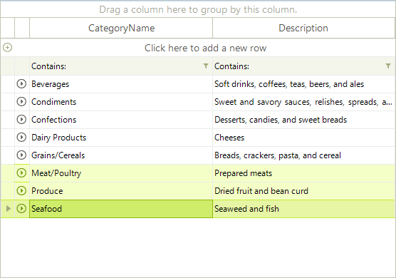
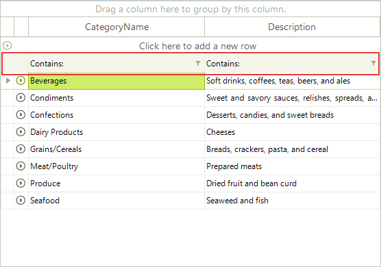
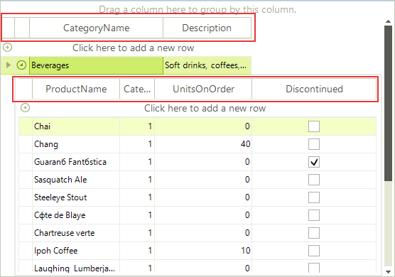
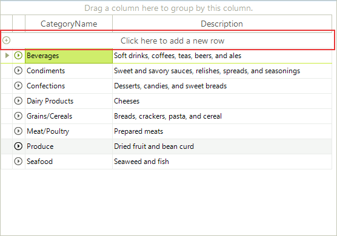

# Rows

There are two main row types in RadGridView: 

* [Data rows](#data-rows)

* [Structure rows](#structure-rows)

## Data Rows

Each data row in the grid represents a record from the specified __DataSource__. Each __RadGridView__ has a row collection of type [GridViewRowInfo](). The collection provides methods to add or remove items.
      	

>note Note that only Rows bound to the data source are kept in the Rows collection. The header, search, filter and new rows are not included in this collection.

__Selected row__

You can check if a grid row is in selected state using __GridRowElement.IsSelected__ property. Multiple rows can be selected if the RadGridView __MultiSelect__ property is set to *True*.

## Structure Rows

__FilteringRow__

Filtering row will appear automatically when you have [Filtering]() enabled either by __EnableFiltering__ or __GridViewTemplate.EnableFiltering__ properties.

__HeaderRow__

The header element is represented by __GridHeaderRowElement__ object.

__Add New Row__

Depending of the value of the __GridViewTemplate.AddNewRowPosition__ property the new row element appears below the header row or after the data rows.

# See Also
* [Binding the Grid]()

* [Columns]()

* [Creating Hierarchical Grids]()

* [Editing]()

* [Element Hierarchy]()

* [Key Features]()

* [Keyboard Support]()

* [Logical vs. Visual Grid Structure]()

