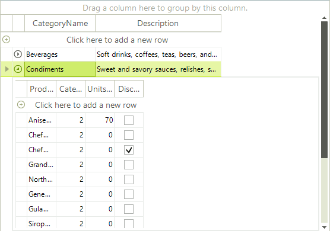
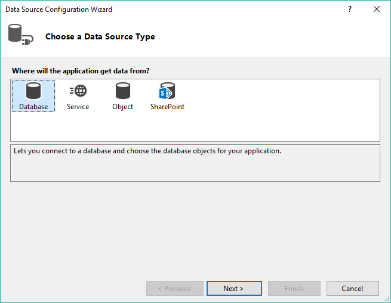
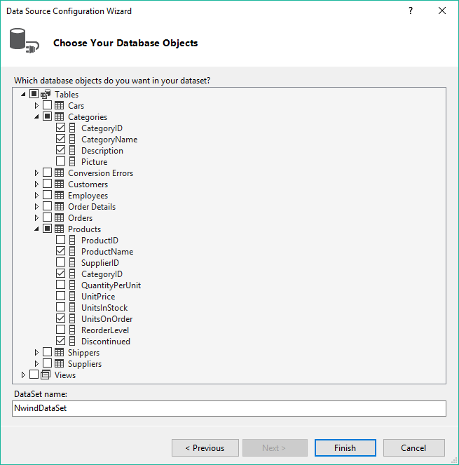
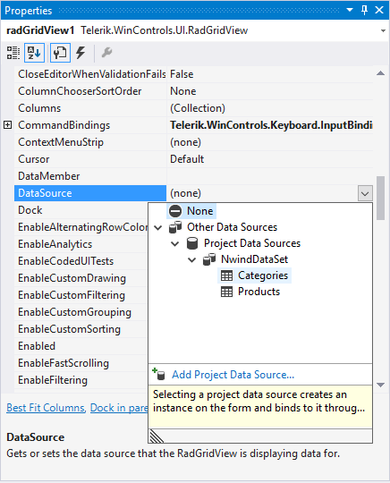
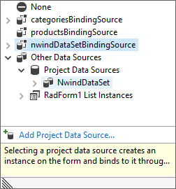

# Getting Started with WinForms GridView

| RELATED VIDEOS |  
| ------ |
|[RadGridView for WinForms Webinar](https://www.telerik.com/videos/winforms/radgridview-for-winforms-webinar) Lino Tadros from Falalel provides an in-depth overview of Telerik's RadGridView for WinForms (Runtime: 01:45:11)|

The following tutorial demonstrates how to create a hierarchical grid that presents two tables: *Product Category* and *Product Information*.

>caption Figure 1: The final result

## Setting up the Form

1. Create a new __Windows Forms Application__ project.

1. Drop a __RadGridView__ control on the form.

1. In the __Properties__ window for __RadGridView__, set the `RadGridView.Dock` property to *Fill*.

## Connecting to Data

1. In the __Properties__ window for __RadGridView__, locate the `DataSource` property drop-down.

1. Select __Add Project Data Source__. This step will open the __Data Source Configuration Wizard__.

1. On the __Choose a Data Source Type__ page, select __Database__ and click __Next__.

1. On the __Choose a Database Model__ page, select __Dataset__.

1. On the __Choose Your Data Connection__ page, select __New Connection...__. This page displays the __Choose Data Source__ dialog.

1. In the __Choose Data Source__ dialog, select __Microsoft Access Data Base File__.

1. Click __Continue__.

1. In the __Add Connection__ dialog, click the __Browse...__ button. This step will display the __Select Microsoft Access Database File__ dialog.

1. In the __Select Microsoft Access Database File__ dialog, navigate to the Telerik UI for WinForms installation directory and locate the `Nwind.mdb` file within the `\Examples\QuickStart\Datasources` directory. Select `Nwind.mdb` and click __OK__.

1. Click __OK__ again to close the __Add Connection__ dialog.

1. On the  __Choose Your Data Connection__ page, click __Next__. Visual Studio shows a dialog that asks if you want to copy the file to your project.

1. Click __Yes__ to close the Visual Studio dialog.

1. On the __Save the Connection String to the Application Configuration File__ page, click __Next__.

1. On the __Choose Your Database Objects__ page, expand the `Categories` table.

1. Select the following columns in the `Categories` table: `CategoryID`, `CategoryName` and `Description`.

1. Expand the `Products` table and select the following columns: `ProductName`, `CategoryID`, `UnitsOnOrder` and `Discontinued`.

    

1. Click __Finish__ to close the __Data Source Configuration Wizard__.

1. In the __Properties__ window for __RadGridView__, select the `DataSource` property drop-down.

1. Locate the `NwindDataSet` data source.

1. Select `Categories` from the `NwindDataSet` data source. This step will create the `categoriesBindingSource` and `categoriesTableAdapter` components.

    

1. Select the `DataSource` property drop-down for a second time.

1. Select `Products` from the `NwindDataSet` data source. This step will create the `productsBindingSource` and `productsTableAdapter` components.

1. Select the `DataSource` property drop-down for a third time.

1. Select `NwindDataSet`. This step will assign the entire data set to the grid.

    

## Setting Properties

1. In the __Properties__ window for __RadGridView__, select the `DataMember` property.

1. Select `Categories` from the drop-down list. This step will assign `Categories` as a top level table for the grid.

1. In the __Properties__ window for __RadGridView__, select the `AutoGenerateHierarchy` property.

1. Select `True` from the drop-down list.

1. Click the __RadGridView__ smart tag in the form.

1. Select __Open Property Builder__ from the smart tag menu.

1. Select the `CategoryID` column in the navigation tree and clear the checkbox.

1. Click __OK__ to close the __Property Builder__.

1. Press __F5__ to run the application. Notice that the grid displays the product categories first. Each category has an icon that you can click to expand that category and show a child template with the corresponding products.

## See Also

* [Property Builder]()

* [Smart tag]()
