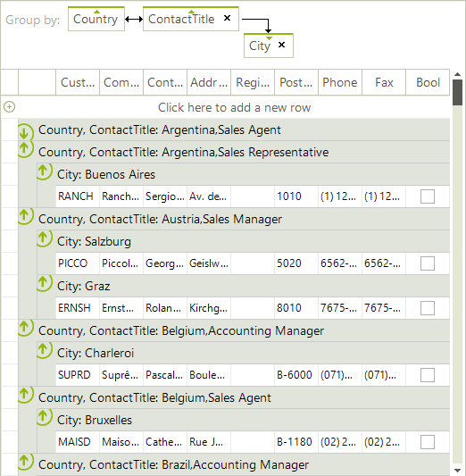

# Basic Grouping

There is a special area at the top of the grid where grouping options are displayed. This is the __GridGroupingPanel__. When the grid is grouped, all group fields appear in this GroupPanel as elements along with the sort order, e.g. Country, Order Date. You can add or rearrange sorting fields by dragging and dropping the header of the column you wish to use for grouping. See the [End-user Capabilities Grouping]() topic for more on basic grouping behavior from the user perspective.

The __GridViewTemplate__ properties that govern grouping behavior are:

* __EnableGrouping:__ Allows grouping to occur programmatically or by user drag and drop. By default this property is __True__.

* __AllowDragToGroup:__ Allows the end-user to drag column headers to the grouping panel. By default this property is __True__.

* __AutoExpandGroups:__ Groups are automatically expanded as grouping expressions are added either programmatically or by drag-and-drop. This property value is __False__ by default.

* __GroupExpandAnimationType:__ Gets or set a value indicating the animation effect that will be used when expanding/collapsing groups.

Once grouped, you can additionally sort the grid data, using the default sorting mechanism.

The example below allows GroupDescriptors to be added programmatically, but does not allow the user to group via drag and drop. The groups are automatically expanded.

>note When there are more that one groups on the same level the information in the group header row is separated by the "," character. This character is taken for the current culture settings: `Thread.CurrentThread.CurrentCulture.TextInfo.ListSeparator`.

>caption Figure 1: The grid is grouped by several fields.
 



#### Setting grouping properties

{{source=..\SamplesCS\GridView\Grouping\Grouping.cs region=settingGroupingProperties}} 
{{source=..\SamplesVB\GridView\Grouping\Grouping.vb region=settingGroupingProperties}} 

````C#
this.radGridView1.MasterTemplate.EnableGrouping = true;
this.radGridView1.MasterTemplate.AllowDragToGroup = false;
this.radGridView1.MasterTemplate.AutoExpandGroups = true;

````
````VB.NET
Me.RadGridView1.MasterTemplate.EnableGrouping = True
Me.RadGridView1.MasterTemplate.AllowDragToGroup = False
Me.RadGridView1.MasterTemplate.AutoExpandGroups = True

````

{{endregion}} 

## GroupPanel

You can hide the __GroupPanel__ using the following code:

#### Hide the group panel

{{source=..\SamplesCS\GridView\Grouping\Grouping.cs region=hideTheGroupPanel}} 
{{source=..\SamplesVB\GridView\Grouping\Grouping.vb region=hideTheGroupPanel}} 

````C#
this.radGridView1.ShowGroupPanel = false;

````
````VB.NET
Me.RadGridView1.ShowGroupPanel = False

````

{{endregion}} 

The __ShowGroupPanelScrollbars__ property indicates whether the group panel will show scroll-bars or it will expand to show all group headers.  

#### Show the group panel scroll-bar

{{source=..\SamplesCS\GridView\Grouping\Grouping.cs region=ShowGroupPanelScrollbars}} 
{{source=..\SamplesVB\GridView\Grouping\Grouping.vb region=ShowGroupPanelScrollbars}} 

````C#
this.radGridView1.ShowGroupPanelScrollbars = true;

````
````VB.NET
Me.RadGridView1.ShowGroupPanelScrollbars = True

````

{{endregion}} 
|ShowGroupPanelScrollbars = *false* |ShowGroupPanelScrollbars = *true* |
| ------ | ------ |
|||
# See Also
* [Custom Grouping]()

* [Events]()

* [Formatting Group Header Row]()

* [Group Aggregates]()

* [Groups Collection]()

* [Setting Groups Programmatically]()

* [Sorting group rows]()

* [Using Grouping Expressions]()

* [Show Summary Values for Collapsed Groups in RadGridView ]()

