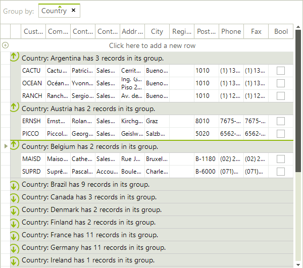

# Group Aggregates

The text of the group header row is a formatted string with the following parameters:

* __{0}__ – __Property name__ –the name of the RadGridView column by which the grouping is performed;

* __{1}__ – __Group value__

* __{2}, {3} …__ - __Aggregates values__

You can define the format of the group header row by using the __GroupDescriptor Format__ property. Its default value is __“{0}: {1}”__. The following two examples demonstrate how you can use the group aggregates. Full list of the available expressions can be found here:[http://msdn.microsoft.com/en-us/library/system.data.datacolumn.expression.aspx](http://msdn.microsoft.com/en-us/library/system.data.datacolumn.expression.aspx)

#### Example 1: adding the count aggregate.

{{source=..\SamplesCS\GridView\Grouping\GroupAggregates.cs region=GroupAggregates}} 
{{source=..\SamplesVB\GridView\Grouping\GroupAggregates.vb region=GroupAggregates}} 

````C#
GroupDescriptor descriptor = new GroupDescriptor();
descriptor.GroupNames.Add("Country", ListSortDirection.Ascending);
descriptor.Aggregates.Add("Count(Country)");
descriptor.Format = "{0}: {1} has {2} records in its group.";
this.radGridView1.GroupDescriptors.Add(descriptor);

````
````VB.NET
Dim descriptor As New GroupDescriptor()
descriptor.GroupNames.Add("Country", ListSortDirection.Ascending)
descriptor.Aggregates.Add("Count(Country)")
descriptor.Format = "{0}: {1} has {2} records in its group."
Me.RadGridView1.GroupDescriptors.Add(descriptor)

````

{{endregion}} 




#### Example 2: Adding and formatting several aggregates.
 
{{source=..\SamplesCS\GridView\Grouping\GroupAggregates1.cs region=GroupAggregates1}} 
{{source=..\SamplesVB\GridView\Grouping\GroupAggregates1.vb region=GroupAggregates1}} 

````C#
GroupDescriptor descriptor = new GroupDescriptor();
descriptor.GroupNames.Add("ShipName", ListSortDirection.Ascending);
descriptor.Aggregates.Add("Count(ShipName)");
descriptor.Aggregates.Add("Max(Freight)");
descriptor.Aggregates.Add("Avg(Freight)");
descriptor.Format = "The ship {1} has {2} item(s) with maximum freight {3} and avarage freight of {4:c2} per ship.";
this.radGridView1.GroupDescriptors.Add(descriptor);

````
````VB.NET
Dim descriptor As New GroupDescriptor()
descriptor.GroupNames.Add("ShipName", ListSortDirection.Ascending)
descriptor.Aggregates.Add("Count(ShipName)")
descriptor.Aggregates.Add("Max(Freight)")
descriptor.Aggregates.Add("Avg(Freight)")
descriptor.Format = "The ship {1} has {2} item(s) with maximum freight {3} and avarage freight of {4:c2} per ship."
Me.RadGridView1.GroupDescriptors.Add(descriptor)

````

{{endregion}} 


# See Also
* [Basic Grouping]()

* [Custom Grouping]()

* [Events]()

* [Formatting Group Header Row]()

* [Groups Collection]()

* [Setting Groups Programmatically]()

* [Sorting group rows]()

* [Using Grouping Expressions]()

