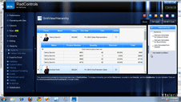
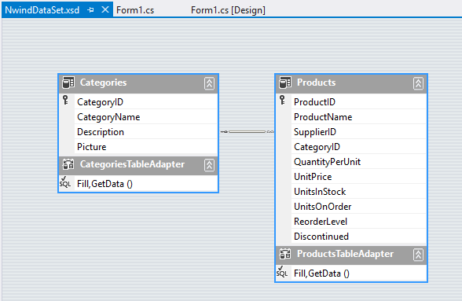
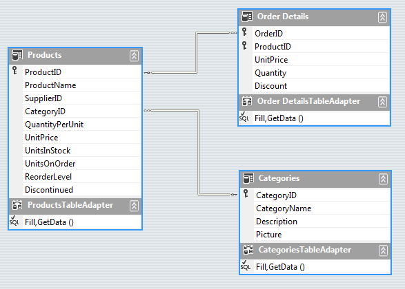

# Binding to Hierarchical Data Automatically

## Generating Two-Level Hierarchy

| RELATED VIDEOS |  |
| ------ | ------ |
|[RadGridView for WinForms Hierarchy Overview](https://www.youtube.com/watch?v=t3cR7A5VjdY&index=11&list=PLvmaC-XMqeBaRgdM2nVNSM-0SSG_xbjSN) In this video you will learn the various ways you can display hierarchical data in a RadGridView. (Runtime: 12:13)||

At runtime, if the data source for the grid is a __System.Data.DataSet__ type and there are relations defined in it, the hierarchy can be created automatically. Set the __AutoGenerateHierarchy__ property	*true* to get this behavior. In the example below, the Northwind dataset has `Categories` and `Products` joined by `CategoryID`.

 

The run-time code fills the categories and products data tables, sets the __AutoGenerateHierarchy__ to *true*, assigns the data set containing both tables to the grid __DataSource__ and the __DataMember__ is the name of the parent table. The last three lines of code below can be configured at design time.

<snippet id='gridview-bindingtohierarchicalgridautomatically-bindingtohierarchicalgridautomatically-cs' />
<snippet id='gridview-bindingtohierarchicalgridautomatically-bindingtohierarchicalgridautomatically-vb' />

## Generating Multi-Level Hierarchy

It is possible to auto generate Multi-level hierarchy as well. You should again set the __DataSource__ and __AutoGenerateHierarachy__ properties. Here are the three data tables from the Northwind database, used in the code snippet to generate the three-level hierarchy:

<snippet id='gridview-bindingtohierarchicalgridautomatically-bindingtomultilevelhierarchicalgridautomatically-cs' />
<snippet id='gridview-bindingtohierarchicalgridautomatically-bindingtomultilevelhierarchicalgridautomatically-vb' />

## See Also
* [Binding to Hierarchical Data Programmatically]()

* [Binding to Hierarchical Data]()

* [Creating hierarchy using an XML data source]()

* [Hierarchy of one to many relations]()

* [Load-On-Demand Hierarchy]()

* [Object Relational Hierarchy Mode]()

* [Self-Referencing Hierarchy]()

* [Tutorial Binding to Hierarchical Data]()

