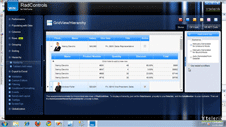
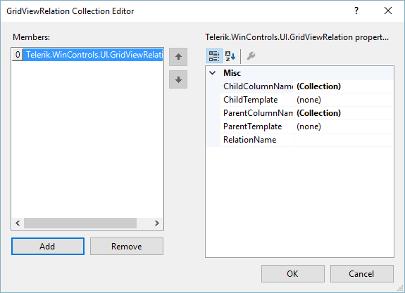
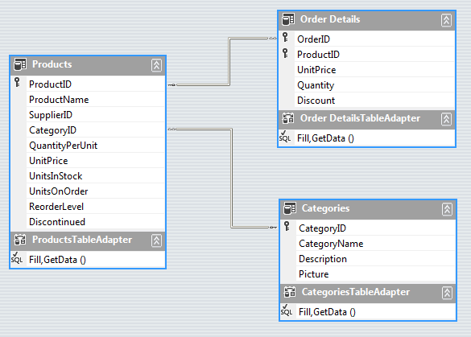
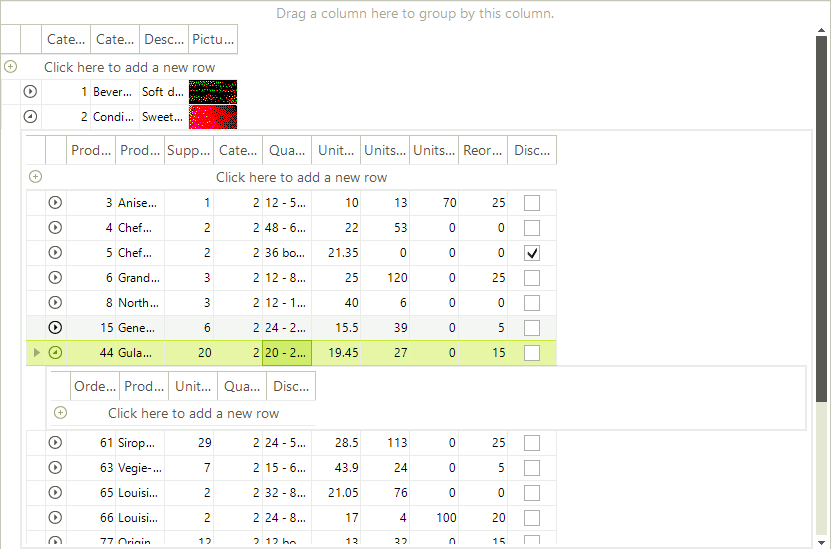
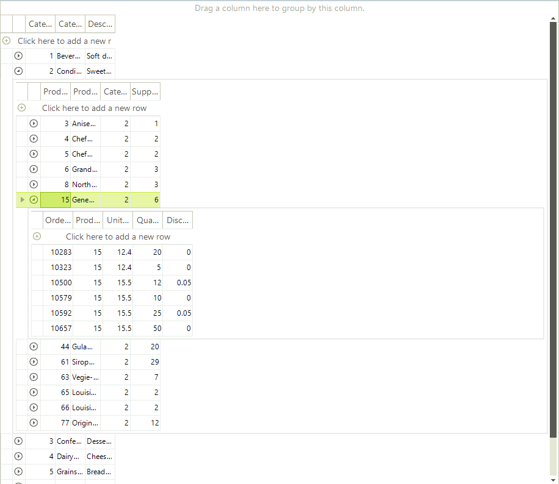

# Binding to Hierarchical Data Programmatically

| RELATED VIDEOS |  |
| ------ | ------ |

|[RadGridView for WinForms Hierarchy Overview](https://www.telerik.com/videos/winforms/radgridview-for-winforms-hierarchy-overview) In this video you will learn the various ways you can display hierarchical data in a RadGridView. (Runtime: 12:13)||

There are many cases when you wouldn't want to include the whole dataset and hierarchy in your application. In such cases you cannot use the automatically mode for hierarchical data binding and you will need to set up the hierarchy in code manually.

## Setting the Hierarchical Grid in Bound Mode

For setting the hierarchy, you will need the special __GridViewRelation__ class, which defines the related field in parent and child tables. Consider the sample below:

<snippet id='gridview-bindingtohierarchicalgridprogramatically-bindingtohierarchicalgridprogramatically-cs' />
<snippet id='gridview-bindingtohierarchicalgridprogramatically-bindingtohierarchicalgridprogramatically-vb' />

>important The column names specified in the relation must be present in the parent and child templates. If you don't want these columns to be shown, just manage their visibility but make sure that they are present in the respective templates. 

You can also set the relation in design-time, using the provided collection editor as in the figure below:

**Design-time collection editor for GridViewRelation setup**

>important If you generate the columns manually either at design time or run time, note that it is necessary the **FieldName** and **Name** properties of the columns participating in the relation to have equal values. 

## Setting the Multi-Level Hierarchy in Bound Mode

It is possible to manually set up the child templates and the relations between them in order to build a multi-level hierarchy as well. The code snippet below demonstrates the approach, which uses three data tables from the Northwind database:

**Multi-level bound hierarchy based on three Northwind data tables**

<snippet id='gridview-bindingtohierarchicalgridprogramatically-creatingmultilevelhierarchicalgridinunboundmode-cs' />
<snippet id='gridview-bindingtohierarchicalgridprogramatically-creatingmultilevelhierarchicalgridinunboundmode-vb' />

**Resulting multi-level hierarchy in bound mode**

## Hierarchical Grid in Unbound mode

Setting the hierarchical grid in unbound mode is quite similar to that for the bound mode with only difference is setting the unbound mode itself. First of all you need to create and add the columns you need. After that set up the relation and finally load the data.

>note Note that the GridViewRelation is created by using the GridViewDataColumn.Name, not the FieldName. As in the example below it is best if you create the column and pass the FieldName in the column's constructor. This will automatically set its Name to the same value.
>

<snippet id='gridview-unboundmode-creatinghierarchicalgridinunboundmode-cs' />
<snippet id='gridview-unboundmode-creatinghierarchicalgridinunboundmode-vb' />

## Multi-Level Hierarchical Grid in Unbound mode

Following the introduced approach in the previous section, the three-level hierarchy can be loaded in unbound mode as follows:

<snippet id='gridview-unboundmode-creatingmultilevelhierarchicalgridinunboundmode-cs' />
<snippet id='gridview-unboundmode-creatingmultilevelhierarchicalgridinunboundmode-vb' />

**Resulting multi-level hierarchy in unbound mode**

# See Also
* [Binding to Hierarchical Data Automatically]()

* [Binding to Hierarchical Data]()

* [Creating hierarchy using an XML data source]()

* [Hierarchy of one to many relations]()

* [Load-On-Demand Hierarchy]()

* [Object Relational Hierarchy Mode]()

* [Self-Referencing Hierarchy]()

* [Tutorial Binding to Hierarchical Data]()

* [How to Change PageViewMode for the Nested Levels in RadGridView]()

* [Build GridView Hierarchy with Multiple Tabs]()

