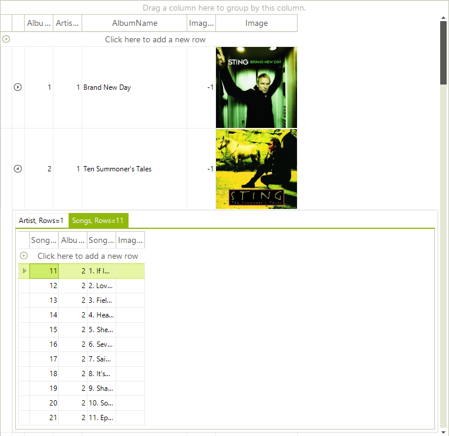
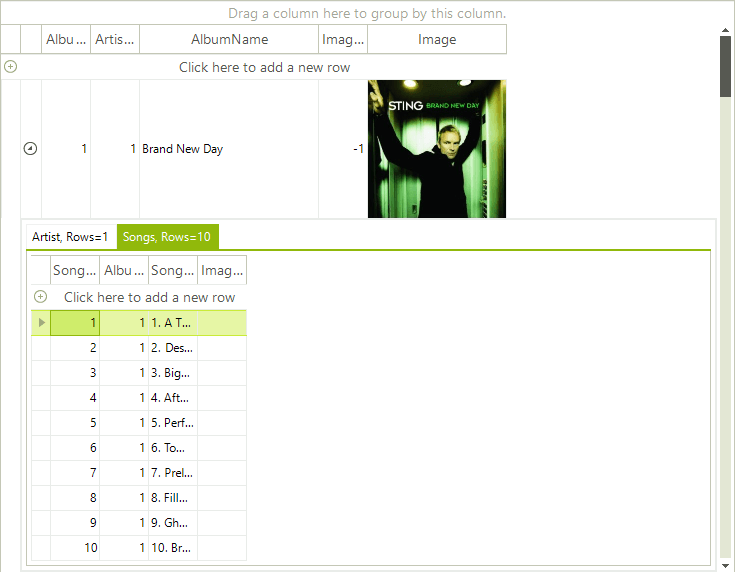

# Hierarchy of one to Many Relations

__RadGridView__ supports binding to a hierarchy containing one to many relations. The result is presented in tabs inside child views.

Follow these steps to setup the hierarchy:

1. Bind to a data source (e.g. DataTable)

2. Add at least two child templates and set their data source.

3. Add relations to connect the child templates with the master template.

4. Run the project.

<snippet id='gridview-hierarchyofonetomanyrelation-hierarchyofonetomanyrelation-cs' />
<snippet id='gridview-hierarchyofonetomanyrelation-hierarchyofonetomanyrelation-vb' />

>note There is an example demonstrating how to build hierarchy containing one-to-many relations in the demo application.
>

## Formatting Tabs

In some cases you may want to set custom text to the tabs of the child views different than the text of the template's caption. In this case, the solution is to use the [Formatting events]() that RadGridView exposes, and more specifically, the __ViewCellFormatting__ event. This event will give you access to the detail cell that contains the whole `RadPageViewElement` and from this element you will be able to set the text of each tab separately. For example, if we need to display the count of the rows in each view, we can use the following code snippet in order to apply our custom text:

<snippet id='gridview-hierarchyofonetomanyrelation-formattingtabs-cs' />
<snippet id='gridview-hierarchyofonetomanyrelation-formattingtabs-vb' />

The result is shown on the image below:

>note The ChildViewTabsPosition property gets or sets the position to place tabs for child views related with this template.
>

## Page View Modes

We can use the __RadGridView.TableElement.PageViewMode__ property to change how the tabs are visualised in the child table.

#### __Strip View Mode__

#### __Stack View Mode__

#### __Outlook View Mode__

#### __Explorer Bar View Mode__

## See Also
* [Binding to Hierarchical Data Automatically]()

* [Binding to Hierarchical Data Programmatically]()

* [Binding to Hierarchical Data]()

* [Creating hierarchy using an XML data source]()

* [Load-On-Demand Hierarchy]()

* [Object Relational Hierarchy Mode]()

* [Self-Referencing Hierarchy]()

* [Tutorial Binding to Hierarchical Data]()

