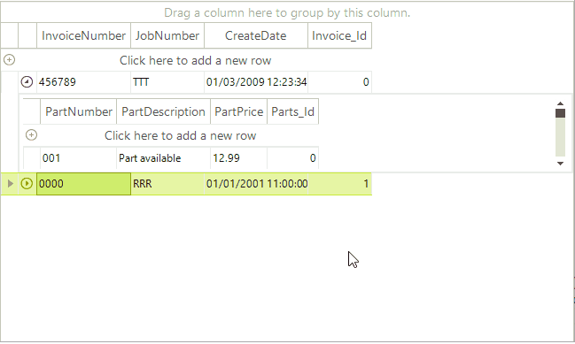

# Resizing Child GridViewInfo

RadGridView supports resizing child GridViewInfos at runtime by a mouse drag operation (only when __UseScrollbarsInHierarchy__ property is *true*). You should simply position your mouse pointer over the left part of the bottom line of the child GridViewInfo and then resize this GridViewInfo by a mouse drag operation:



## Resizing a child GridViewInfo programmatically

Another option for you is to set a custom size for a child GridViewInfo programmatically. In order to do so, subscribe to the ChildViewExpanded event and set the custom size by setting the __Height__ property of the __ChildRow__ to a specific value. Please note that the following code will work only when the __UseScrollbarsInHierarchy__ property is set to *true*.

{{source=..\SamplesCS\GridView\HierarchicalGrid\CreatingHierarchyUsingXmlDataSource.cs region=setChildRowHeight}} 
{{source=..\SamplesVB\GridView\HierarchicalGrid\CreatingHierarchyUsingXmlDataSource.vb region=setChildRowHeight}} 

````C#
void radGridView1_ChildViewExpanded(object sender, ChildViewExpandedEventArgs e)
{
    e.ChildRow.Height = 300;
}

````
````VB.NET
Private Sub RadGridView1_ChildViewExpanded(ByVal sender As Object, ByVal e As Telerik.WinControls.UI.ChildViewExpandedEventArgs) Handles RadGridView1.ChildViewExpanded
    e.ChildRow.Height = 300
End Sub

````

{{endregion}} 


## See Also
* [Accessing Child Templates]()

* [Applying formatting only to cells in a child template]()

* [Expanding all rows]()

* [Iterating the child rows collection of a chosen parent row in hierarchy RadGridView]()

