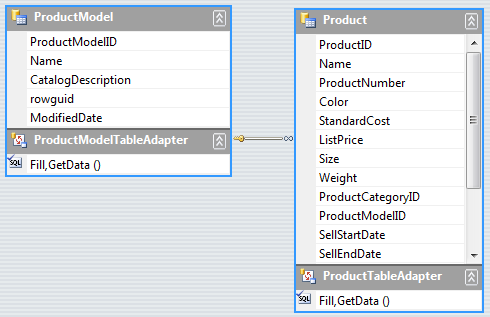

# Load-On-Demand Hierarchy

| RELATED VIDEOS |  |
| ------ | ------ |

|[Event Based Hierarchies with RadGridView for WinForms](https://www.telerik.com/videos/winforms/event-based-hierarchies-with-radgridview-for-winforms) In this video, you will learn how to automatically and manually create object relational hierarchies in RadGridView for WinForms.||

## 

In many cases you may need to load your data not when RadGridView is being initialized, but at a later moment, when you interact with RadGridView or with your application. For example, a child template can be loaded on demand to delay the initialization of a resource-demanding feature of the application until it is required. In order to load a `GridViewTemplate` on demand, you should follow these high-level steps:
        

1. Create and define a columns schema for the presented data at the first level of the hierarchy.

1. Create and define a columns schema for the presented data at the child `GridViewTemplate`.

1. Create and associate a `GridViewEventDataProvider` with the child `GridViewTemplate`.

1. Handle the __RowSourceNeeded__ event to populate the data for each parent row.

>note Calling the the __BestFitColumns__ method may cause the grid to load all the data explicitly. Call this method with the __BestFitColumnMode.DisplayedCells__ parameter for the visual cells only.

## Sample Load-On-Demand Scenario

The following example shows a load-on-demand scenario using a typed DataSet. Let's load the following `Products` data from the AdventureWorks database:

Steps to create a Load-On-Demand hierarchy mode:

1\. First, create a columns schema for the first (parent) level of the hierarchy. If RadGridView is in a data-bound mode and we do not need to set a custom schema, we can just set the __DataSource__ property which will set the schema and will populate the parent level with data. You can also set the __AutoSizeColumnsMode__ to *Fill* to get a better view of the data:

<snippet id='gridview-loadondemandhierarchy-bindingradgridview-cs' />
<snippet id='gridview-loadondemandhierarchy-bindingradgridview-vb' />

2\. Then, create a Child template and a columns schema for the "Product" data:

<snippet id='gridview-loadondemandhierarchy-childtemplate-cs' />
<snippet id='gridview-loadondemandhierarchy-childtemplate-vb' />

3\. Setup the load-on-demand mode by using GridViewEventDataProvider and RowSourceNeeded event:

<snippet id='gridview-loadondemandhierarchy-loadondemandmode-cs' />
<snippet id='gridview-loadondemandhierarchy-loadondemandmode-vb' />

4\. Load the data on demand for an expanded parent row by using the __RowSourceNeeded__ event:

>important You should make sure that there is a relation between the tables in the dataset. In the bellow example the relation name is "ProductModel_Product" and the relation is between the ProductModelID field in both tables.

<snippet id='gridview-loadondemandhierarchy-handlingrowsourceneeded-cs' />
<snippet id='gridview-loadondemandhierarchy-handlingrowsourceneeded-vb' />

This new event based hierarchy mode can be used in different lazy loading scenarios including ORM frameworks, WCF services or complex business objects.

## See Also
* [Binding to Hierarchical Data Automatically]()

* [Binding to Hierarchical Data Programmatically]()

* [Binding to Hierarchical Data]()

* [Creating hierarchy using an XML data source]()

* [Hierarchy of one to many relations]()

* [Object Relational Hierarchy Mode]()

* [Self-Referencing Hierarchy]()

* [Tutorial Binding to Hierarchical Data]()

