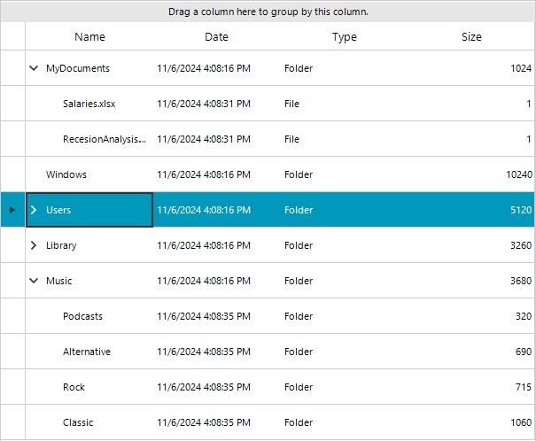

# Load Data on Demand in Self Referencing Hierarchy

###  Load On Demand 

RadGridView currently offers Load On Demand feature in hierarchy mode. Fetching data from the source on demand is a common technique to enhance the performance of applications which use large datasource.In this mode client can handle the RowSourceNeeded event and create manually the child rows for the expanded template. More information about the Load on Demand Hierarchy is available [here]().

### Self Reference 

The self-reference mode allows to build a hierarchy using a flat collection of objects, by defining a relation. In self-reference hierarchy the RadGridView needs all the data and based on the primary and foreign keys, it builds up the hierarchy levels. More information about the Self Reference Hierarchy is available [here]().

## Load on Demand in Self-Reference Hierarchy 

Load on Demand in Self-Reference Hierarchy is a new mehanism that combines the **Load on Demand** and **Self Reference** features. Thus, users can achieve a hierarchy in self referance mode while loading the data on demand, at a later moment when it is requested. The data is populated in the **RowSourceNeeded** event of RadGridView.

### How to use

The following information is required to implement the Load on Demand in Self-Reference grid, in order to visualize the data properly using this approach: 

* Information for rows on the top level(master template) of the self-reference hierarchy should be provided. This feature supporst only unbound mode of RadGridView.
* Information about which of the top level rows can be expanded is also required so that the grid should properly show an expander icon. 
* When this data in the bullets above is provided, then the RowSourceNeeded event will trigger to provide manually the expanded levels with data. 

You need to follow these steps to get the load on demand in self-referencing hierarchy working:

1\. Add desired columns to unbound RadGridView. 

2\. Add relation that represents the hierarchy structure. 

<snippet id='gridview-loadondemandinselfrefgrid-setupselfreferenceloadondemandgrid-cs' />
<snippet id='gridview-loadondemandinselfrefgrid-setupselfreferenceloadondemandgrid-vb' />

3\. Handle the **RowsourceNeeded** event to populate the data for each row.

<snippet id='gridview-loadondemandinselfrefgrid-rowsourceneeded-cs' />
<snippet id='gridview-loadondemandinselfrefgrid-rowsourceneeded-vb' />

4\. Load data that is passed in the RowSourceNeeded event.

<snippet id='gridview-loadondemandinselfrefgrid-getdata-cs' />
<snippet id='gridview-loadondemandinselfrefgrid-getdata-vb' />

>note Full example in C# and VB is available in our ***Demo >> RadGridView >> Hierarchy*** examples.

## See Also
* [Binding to Hierarchical Data Automatically]()

* [Binding to Hierarchical Data Programmatically]()

* [Binding to Hierarchical Data]()

* [Creating hierarchy using an XML data source]()

* [Hierarchy of one to many relations]()

* [Load-On-Demand Hierarchy]()

* [Object Relational Hierarchy Mode]()

* [Tutorial Binding to Hierarchical Data]()

