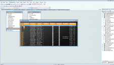
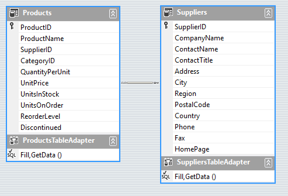
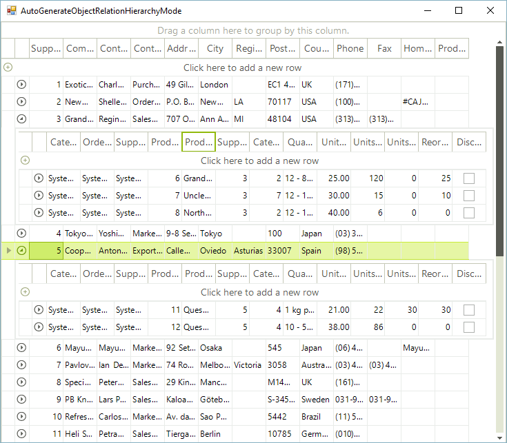
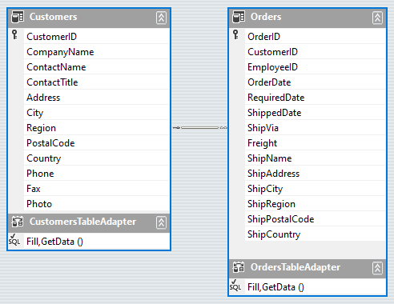
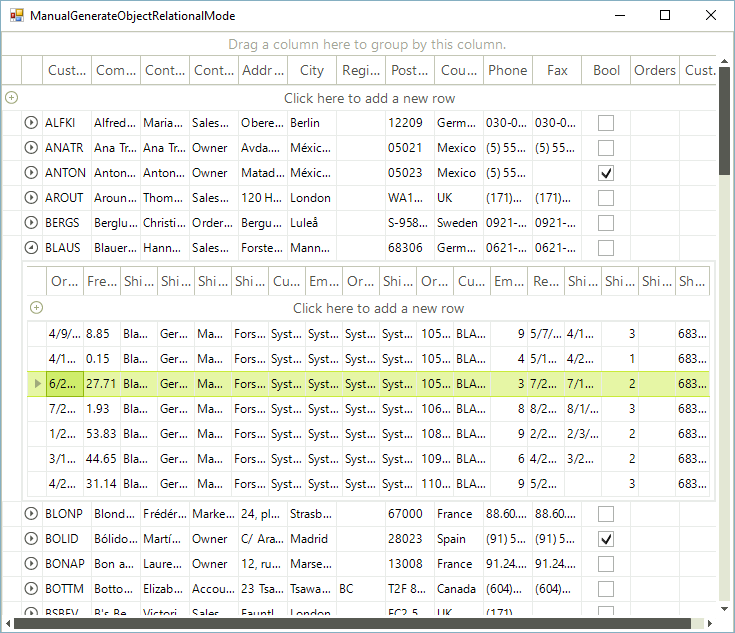

# Object Relational Hierarchy Mode

| RELATED VIDEOS |  |
| ------ | ------ |
|[Creating Object Relational Hierarchies in RadGridView](http://tv.telerik.com/watch/winforms/creating-object-relational-hierarchies-in-radgridview-for-winforms) In this video, you will learn how to automatically and manually create object relational hierarchies in RadGridView for WinForms.||

## Auto Generating Hierarchy Mode 

The Object-Relational Hierarchy mode is used to show hierarchy based on a complex `IList` (IEnumarable) object that contains inner `ILits` (IEnumerable) properties.

In order to create an Object-Relational Hierarchy automatically in this scenario, you must set only the DataSource and the AutoGenerateHierarachy properties of RadGridView.

Here is an example with an entity model using the Northwind database:

<snippet id='gridview-autogenerateobjectrelationhierarchymode-autogenerateobjectrelationhierarchymode-cs' />
<snippet id='gridview-autogenerateobjectrelationhierarchymode-autogenerateobjectrelationhierarchymode-vb' />

## Manually Generating Hierarchy Mode 

The Object-Relational hierarchy mode can be setup manually by creating the child `GridViewTemplate` and adding `GridViewRelation` between `GridViewTemplates`. This special relation should contain the name of the property that belongs to the parent object and that returns an `IList` (IEnumerable) of sub-objects. RadGridView uses the name of the property to load the necessary data for the child `GridViewTemplate` when the user expands a parent row.

>note In this mode only the DataSource of parent GridViewTemplate or RadGridView control must be set to a collection of custom business object or ORM data objects.
>

The following example demonstrates how you can manually build an object-relational hierarchy using the "Customers" entity model from the Northwind database:

<snippet id='gridview-manualgenerateobjectrelationalmode-manualgenerateobjectrelationalmode-cs' />
<snippet id='gridview-manualgenerateobjectrelationalmode-manualgenerateobjectrelationalmode-vb' />

>important As you can notice, we can perform all data operations on the child templates – grouping, sorting and filtering. RadGridView processes only the amount of data required for a particular data operation (lazy data loading). This provides us with better performance and small memory footprint.
>

>note Since the R3 2015 SP1 release __RadGridView__ supports CRUD operations for its inner levels. The __AutoUpdateObjectRelationalSource__ defines whether CRUD should be managed by the API or not, by default its value is set to *true* . In case one needs to handle these operations manually the property needs to be set to *false* .
>

## See Also

* [Binding to Hierarchical Data Automatically]()

* [Binding to Hierarchical Data Programmatically]()

* [Binding to Hierarchical Data]()

* [Creating hierarchy using an XML data source]()

* [Hierarchy of one to many relations]()

* [Load-On-Demand Hierarchy]()

* [Self-Referencing Hierarchy]()

* [Tutorial Binding to Hierarchical Data]()

