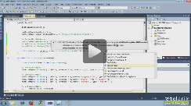
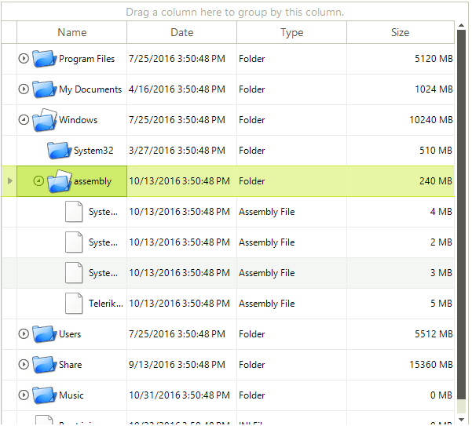
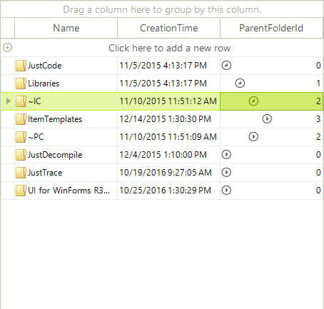

# Self-Referencing Hierarchy

| RELATED VIDEOS |  |
| ------ | ------ |
|[Binding RadGridView to a Self Referencing Hierarchy](http://tv.telerik.com/watch/winforms/binding-radgridview-for-winforms-to-self-referencing-hierarchy)<br>In this video, you will learn how to display a self referencing hierarchy inside of RadGridView for WinForms.||

RadGridView allows you to define a relation that points back to the same table. In the cases when the hierarchical data is build from one type of items you can use a self-referencing RadGridView to display the data. This modes gives you all the functionality a TreeList control would provide, with a lot more.

## Self-Referencing Example

The following example demonstrates how RadGridView displays a hierarchy based on the data provided by the file system where one folder can have files and folders that can have other files and folders, etc.



In order to achieve the look of the RadGridView from the above image, you need to follow these steps:

1\. Create a data source with an appropriate structure where each data record contains `Id` that serves as a unique identifier for the record and `ParentId` that determines the parent of the data record. In our case this is a business object of type `FileSystemItem` that can serve as a folder and as a document.

>important All parent identifiers must be positive numbers.

{{source=..\SamplesCS\GridView\HierarchicalGrid\FileSystemItem.cs region=fileSystemItem}} 
{{source=..\SamplesVB\GridView\HierarchicalGrid\FileSystemItem.vb region=fileSystemItem}} 

````C#
public class FileSystemItem
{
    int id;
    string name;
    DateTime creationTime;
    int parentFolderId;
    private string type;
    public int Id
    {
        get
        {
            return id;
        }
        set
        {
            id = value;
        }
    }
    public string FileSystemInfoType
    {
        get
        {
            return type;
        }
        set
        {
            type = value;
        }
    }
    public string Name
    {
        get
        {
            return name;
        }
        set
        {
            name = value;
        }
    }
    public DateTime CreationTime
    {
        get
        {
            return creationTime;
        }
        set
        {
            creationTime = value;
        }
    }
    public int ParentFolderId
    {
        get
        {
            return parentFolderId;
        }
        set
        {
            parentFolderId = value;
        }
    }
    public FileSystemItem(int id, string type, string name, DateTime creationTime, int parentFolderId)
    {
        this.id = id;
        this.type = type;
        this.name = name;
        this.creationTime = creationTime;
        this.parentFolderId = parentFolderId;
    }
}

````
````VB.NET
Public Class FileSystemItem
    Private id_Renamed As Integer
    Private name_Renamed As String
    Private creationTime_Renamed As Date
    Private parentFolderId_Renamed As Integer
    Private type As String
    Public Property Id() As Integer
        Get
            Return id_Renamed
        End Get
        Set(ByVal value As Integer)
            id_Renamed = value
        End Set
    End Property
    Public Property FileSystemInfoType() As String
        Get
            Return type
        End Get
        Set(ByVal value As String)
            type = value
        End Set
    End Property
    Public Property Name() As String
        Get
            Return name_Renamed
        End Get
        Set(ByVal value As String)
            name_Renamed = value
        End Set
    End Property
    Public Property CreationTime() As Date
        Get
            Return creationTime_Renamed
        End Get
        Set(ByVal value As Date)
            creationTime_Renamed = value
        End Set
    End Property
    Public Property ParentFolderId() As Integer
        Get
            Return parentFolderId_Renamed
        End Get
        Set(ByVal value As Integer)
            parentFolderId_Renamed = value
        End Set
    End Property
    Public Sub New(ByVal id As Integer, ByVal type As String, ByVal name As String, ByVal creationTime As Date, ByVal parentFolderId As Integer)
        Me.id_Renamed = id
        Me.type = type
        Me.name_Renamed = name
        Me.creationTime_Renamed = creationTime
        Me.parentFolderId_Renamed = parentFolderId
    End Sub
End Class

````

{{endregion}} 

2\. Fill a BindingList with objects of type FileSystemItem. The content of the list will depend on the content of the "C:\Program Files (x86)\Telerik" folder:

{{source=..\SamplesCS\GridView\HierarchicalGrid\SelfReferencingHierarchy.cs region=fillingList}} 
{{source=..\SamplesVB\GridView\HierarchicalGrid\SelfReferencingHierarchy.vb region=fillingList}} 

````C#
BindingList<FileSystemItem> list = new BindingList<FileSystemItem>();
int fileFolderIndex = 0;
public void GetFilesAndFolders(string dir, int parentId)
{
    DirectoryInfo di = new DirectoryInfo(dir);
    FileInfo[] rgFiles = di.GetFiles();
    foreach (FileInfo fi in rgFiles)
    {
        fileFolderIndex++;
        list.Add(new FileSystemItem(fileFolderIndex, "File", fi.Name, fi.CreationTime, parentId));
    }
    DirectoryInfo[] dirs = di.GetDirectories();
    foreach (DirectoryInfo d in dirs)
    {
        fileFolderIndex++;
        list.Add(new FileSystemItem(fileFolderIndex, "Folder", d.Name, d.CreationTime, parentId));
        GetFilesAndFolders(d.FullName, fileFolderIndex);
    }
}

````
````VB.NET
Private list As New BindingList(Of FileSystemItem)()
Private fileFolderIndex As Integer = 0
Public Sub GetFilesAndFolders(ByVal dir As String, ByVal parentId As Integer)
    Dim di As New DirectoryInfo(dir)
    Dim rgFiles() As FileInfo = di.GetFiles()
    For Each fi As FileInfo In rgFiles
        fileFolderIndex += 1
        list.Add(New FileSystemItem(fileFolderIndex, "File", fi.Name, fi.CreationTime, parentId))
    Next fi
    Dim dirs() As DirectoryInfo = di.GetDirectories()
    For Each d As DirectoryInfo In dirs
        fileFolderIndex += 1
        list.Add(New FileSystemItem(fileFolderIndex, "Folder", d.Name, d.CreationTime, parentId))
        GetFilesAndFolders(d.FullName, fileFolderIndex)
    Next d
End Sub

````

{{endregion}} 

3\. The most important step of this example - setting up the self-referencing mode of RadGridView. To do this, you should call the __AddSelfReference__ method of the __Relations__ collection passing the template that should reflect the structure of the business object and the properties that should determine the parent-child relation:

{{source=..\SamplesCS\GridView\HierarchicalGrid\SelfReferencingHierarchy.cs region=addSelfReference}} 
{{source=..\SamplesVB\GridView\HierarchicalGrid\SelfReferencingHierarchy.vb region=addSelfReference}} 

````C#
this.radGridView1.Relations.AddSelfReference(this.radGridView1.MasterTemplate, "Id", "ParentFolderId");
this.radGridView1.DataSource = list;

````
````VB.NET
Me.RadGridView1.Relations.AddSelfReference(Me.RadGridView1.MasterTemplate, "Id", "ParentFolderId")
Me.RadGridView1.DataSource = list

````

{{endregion}} 

4\. Hide the columns that are not useful to your clients. These columns in our case are `Id`, `ParentFolderId` and `FileSystemInfoType`:

{{source=..\SamplesCS\GridView\HierarchicalGrid\SelfReferencingHierarchy.cs region=hideColumns}} 
{{source=..\SamplesVB\GridView\HierarchicalGrid\SelfReferencingHierarchy.vb region=hideColumns}} 

````C#
this.radGridView1.Columns["Id"].IsVisible = false;
this.radGridView1.Columns["ParentFolderId"].IsVisible = false;
this.radGridView1.Columns["FileSystemInfoType"].IsVisible = false;

````
````VB.NET
Me.RadGridView1.Columns("Id").IsVisible = False
Me.RadGridView1.Columns("ParentFolderId").IsVisible = False
Me.RadGridView1.Columns("FileSystemInfoType").IsVisible = False

````

{{endregion}} 

5\. Last, but not least, you may want to show different images depending on the actual file system types. To do this, you should handle the __CellFormatting__ event, check if the `FileSystemInfoType` is *File* or *Folder* and set the appropriate image accordingly:

{{source=..\SamplesCS\GridView\HierarchicalGrid\SelfReferencingHierarchy.cs region=settingImagesToCells}} 
{{source=..\SamplesVB\GridView\HierarchicalGrid\SelfReferencingHierarchy.vb region=settingImagesToCells}} 

````C#
// Getting the images from the resources of the project
Image documentImage = SamplesCS.Properties.Resources.Document;
Image folderImage = SamplesCS.Properties.Resources.Folder;
void radGridView1_CellFormatting(object sender, Telerik.WinControls.UI.CellFormattingEventArgs e)
{
    GridDataCellElement dataCell = e.CellElement as GridDataCellElement;
    if (dataCell.ColumnInfo.Name == "Name")
    {
        GridViewDataRowInfo dataRow = dataCell.RowInfo as GridViewDataRowInfo;
        if (dataRow != null)
        {
            dataCell.ImageAlignment = ContentAlignment.MiddleLeft;
            string valueType = Convert.ToString(dataRow.Cells["FileSystemInfoType"].Value).ToUpperInvariant();
            if (valueType.Contains("FILE"))
            {
                dataCell.Image = documentImage;
            }
            else
            {
                dataCell.Image = folderImage;
            }
            dataCell.TextImageRelation = TextImageRelation.ImageBeforeText;
        }
    }
    else
    {
        dataCell.ResetValue(LightVisualElement.ImageProperty, Telerik.WinControls.ValueResetFlags.Local);
        dataCell.ResetValue(LightVisualElement.ImageAlignmentProperty, Telerik.WinControls.ValueResetFlags.Local);
        dataCell.ResetValue(LightVisualElement.TextImageRelationProperty, Telerik.WinControls.ValueResetFlags.Local);
        dataCell.ResetValue(LightVisualElement.ImageLayoutProperty, Telerik.WinControls.ValueResetFlags.Local);
    }
}

````
````VB.NET
' Getting the images from the resources of the project
Private documentImage As Image = SamplesVB.My.Resources.Document
Private folderImage As Image = SamplesVB.My.Resources.Folder
Private Sub radGridView1_CellFormatting(ByVal sender As Object, ByVal e As Telerik.WinControls.UI.CellFormattingEventArgs)
    Dim dataCell As GridDataCellElement = TryCast(e.CellElement, GridDataCellElement)
    If dataCell.ColumnInfo.Name = "Name" Then
        Dim dataRow As GridViewDataRowInfo = TryCast(dataCell.RowInfo, GridViewDataRowInfo)
        If dataRow IsNot Nothing Then
            dataCell.ImageAlignment = ContentAlignment.MiddleLeft
            Dim valueType As String = Convert.ToString(dataRow.Cells("FileSystemInfoType").Value).ToUpperInvariant()
            If valueType.Contains("FILE") Then
                dataCell.Image = documentImage
            Else
                dataCell.Image = folderImage
            End If
            dataCell.TextImageRelation = TextImageRelation.ImageBeforeText
        End If
    Else
        dataCell.ResetValue(LightVisualElement.ImageProperty, Telerik.WinControls.ValueResetFlags.Local)
        dataCell.ResetValue(LightVisualElement.ImageAlignmentProperty, Telerik.WinControls.ValueResetFlags.Local)
        dataCell.ResetValue(LightVisualElement.TextImageRelationProperty, Telerik.WinControls.ValueResetFlags.Local)
        dataCell.ResetValue(LightVisualElement.ImageLayoutProperty, Telerik.WinControls.ValueResetFlags.Local)
    End If
End Sub

````

{{endregion}} 


It is possible to put the self-reference expander in any column by setting the __SelfReferenceExpanderColumn__ property of the __MasterTemplate__: 



{{source=..\SamplesCS\GridView\HierarchicalGrid\SelfReferencingHierarchy.cs region=SelfReferenceExpanderColumn}} 
{{source=..\SamplesVB\GridView\HierarchicalGrid\SelfReferencingHierarchy.vb region=SelfReferenceExpanderColumn}} 

````C#
this.radGridView1.MasterTemplate.SelfReferenceExpanderColumn = this.radGridView1.Columns["ParentFolderId"];

````
````VB.NET
Me.RadGridView1.MasterTemplate.SelfReferenceExpanderColumn = Me.RadGridView1.Columns("ParentFolderId")
'#End Region
End Sub
'#region fillingList
Private list As New BindingList(Of FileSystemItem)()
Private fileFolderIndex As Integer = 0
Public Sub GetFilesAndFolders(ByVal dir As String, ByVal parentId As Integer)
Dim di As New DirectoryInfo(dir)
Dim rgFiles() As FileInfo = di.GetFiles()
For Each fi As FileInfo In rgFiles
    fileFolderIndex += 1
    list.Add(New FileSystemItem(fileFolderIndex, "File", fi.Name, fi.CreationTime, parentId))
Next fi
Dim dirs() As DirectoryInfo = di.GetDirectories()
For Each d As DirectoryInfo In dirs
    fileFolderIndex += 1
    list.Add(New FileSystemItem(fileFolderIndex, "Folder", d.Name, d.CreationTime, parentId))
    GetFilesAndFolders(d.FullName, fileFolderIndex)
Next d
End Sub

````

{{endregion}} 

>note You can use the __TableElement.ShowSelfReferenceLines__ property to show lines that are connecting the parent/child rows.
>


# See Also
* [Binding to Hierarchical Data Automatically]()

* [Binding to Hierarchical Data Programmatically]()

* [Binding to Hierarchical Data]()

* [Creating hierarchy using an XML data source]()

* [Hierarchy of one to many relations]()

* [Load-On-Demand Hierarchy]()

* [Object Relational Hierarchy Mode]()

* [Tutorial Binding to Hierarchical Data]()

