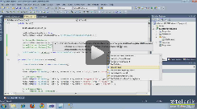
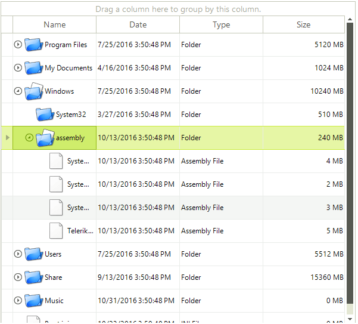
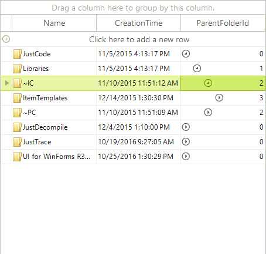

# Self-Referencing Hierarchy

| RELATED VIDEOS |  |
| ------ | ------ |
|[Binding RadGridView to a Self Referencing Hierarchy](http://tv.telerik.com/watch/winforms/binding-radgridview-for-winforms-to-self-referencing-hierarchy) In this video, you will learn how to display a self referencing hierarchy inside of RadGridView for WinForms.||

RadGridView allows you to define a relation that points back to the same table. In the cases when the hierarchical data is build from one type of items you can use a self-referencing RadGridView to display the data. This modes gives you all the functionality a TreeList control would provide, with a lot more.

## Self-Referencing Example

The following example demonstrates how RadGridView displays a hierarchy based on the data provided by the file system where one folder can have files and folders that can have other files and folders, etc.

In order to achieve the look of the RadGridView from the above image, you need to follow these steps:

1\. Create a data source with an appropriate structure where each data record contains `Id` that serves as a unique identifier for the record and `ParentId` that determines the parent of the data record. In our case this is a business object of type `FileSystemItem` that can serve as a folder and as a document.

>important All parent identifiers must be positive numbers.

<snippet id='gridview-filesystemitem-filesystemitem-cs' />
<snippet id='gridview-filesystemitem-filesystemitem-vb' />

2\. Fill a BindingList with objects of type FileSystemItem. The content of the list will depend on the content of the "C:\Program Files (x86)\Telerik" folder:

<snippet id='gridview-selfreferencinghierarchy-fillinglist-cs' />
<snippet id='gridview-selfreferencinghierarchy-fillinglist-vb' />

3\. The most important step of this example - setting up the self-referencing mode of RadGridView. To do this, you should call the __AddSelfReference__ method of the __Relations__ collection passing the template that should reflect the structure of the business object and the properties that should determine the parent-child relation:

<snippet id='gridview-selfreferencinghierarchy-addselfreference-cs' />
<snippet id='gridview-selfreferencinghierarchy-addselfreference-vb' />

4\. Hide the columns that are not useful to your clients. These columns in our case are `Id`, `ParentFolderId` and `FileSystemInfoType`:

<snippet id='gridview-selfreferencinghierarchy-hidecolumns-cs' />
<snippet id='gridview-selfreferencinghierarchy-hidecolumns-vb' />

5\. Last, but not least, you may want to show different images depending on the actual file system types. To do this, you should handle the __CellFormatting__ event, check if the `FileSystemInfoType` is *File* or *Folder* and set the appropriate image accordingly:

<snippet id='gridview-selfreferencinghierarchy-settingimagestocells-cs' />
<snippet id='gridview-selfreferencinghierarchy-settingimagestocells-vb' />

It is possible to put the self-reference expander in any column by setting the __SelfReferenceExpanderColumn__ property of the __MasterTemplate__: 

<snippet id='gridview-selfreferencinghierarchy-selfreferenceexpandercolumn-cs' />
<snippet id='gridview-selfreferencinghierarchy-selfreferenceexpandercolumn-vb' />

>note You can use the __TableElement.ShowSelfReferenceLines__ property to show lines that are connecting the parent/child rows.
>

## See Also
* [Binding to Hierarchical Data Automatically]()

* [Binding to Hierarchical Data Programmatically]()

* [Binding to Hierarchical Data]()

* [Creating hierarchy using an XML data source]()

* [Hierarchy of one to many relations]()

* [Load-On-Demand Hierarchy]()

* [Object Relational Hierarchy Mode]()

* [Tutorial Binding to Hierarchical Data]()

