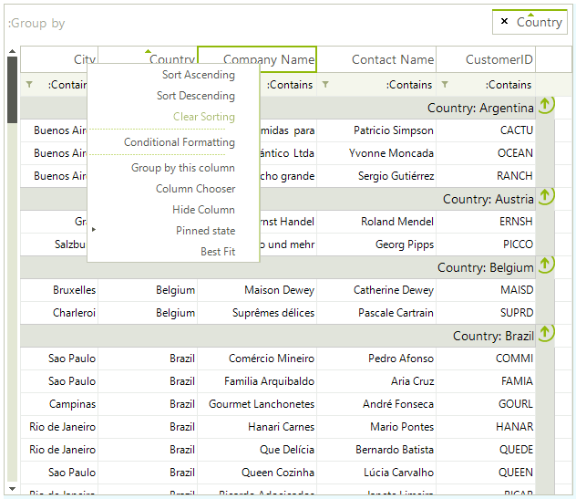

# Right-to-left support

You can present the content of your grid instance in a right-to-left direction by setting the __RightToLeft__ property to *Yes*:

{{source=..\SamplesCS\GridView\Localization\Localization1.cs region=rtl}} 
{{source=..\SamplesVB\GridView\Localization\Localization1.vb region=rtl}} 

````C#
this.radGridView1.RightToLeft = System.Windows.Forms.RightToLeft.Yes;

````
````VB.NET
Me.RadGridView1.RightToLeft = System.Windows.Forms.RightToLeft.Yes

````

{{endregion}} 


# See Also
* [Localization]()

